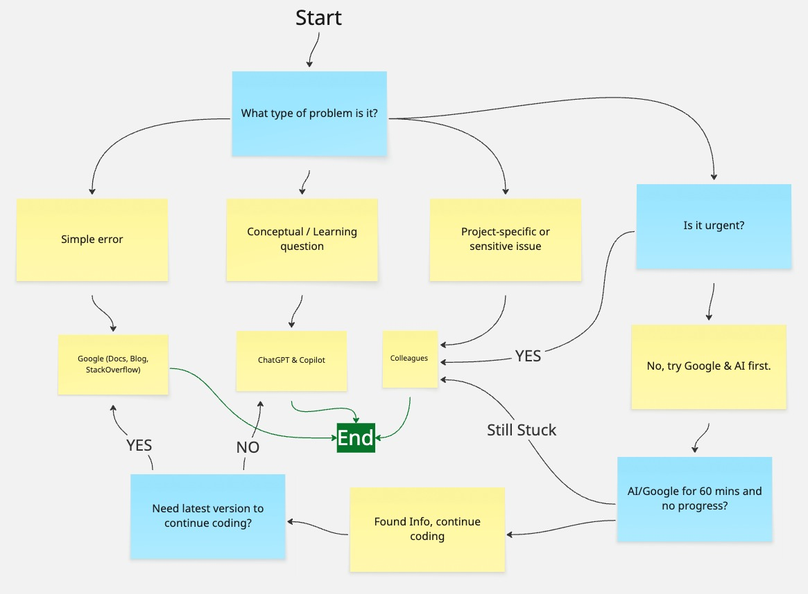

# Help Strategy: When to Use Google, AI Tools, or Ask for Help

## 1. Chatting with ChatGPT

As part of this task, I spent time discussing different perspectives with ChatGPT.  
We explored **when AI is helpful**, **when it is risky**, and how it compares to Google and colleagues.  
The conversation also included a mini-debate between a _Pro-AI Developer_ and a _Skeptical Developer_, which helped highlight both the strengths and limitations of AI in coding.

I captured screenshots of these discussions as evidence:

- 
- 
- 

These chats showed me that AI is useful as a quick, interactive tutor, while Google provides more authoritative, up-to-date information. Colleagues, on the other hand, are best for context-specific or urgent problems.

---

## 2. Flowchart Explanation

I created a flowchart in Miro to represent a **decision-making framework** for choosing between Google, AI tools, and colleagues.  
The flowchart starts with identifying the type of problem:

- **Simple errors** (syntax, library usage) → Use **Google** (Docs, Blogs, StackOverflow).
- **Conceptual or learning questions** → Use **AI tools** (ChatGPT, Copilot).
- **Project-specific or sensitive issues** → Ask a **colleague** directly.

The framework also considers urgency and time spent stuck.  
For example, if the problem is urgent or if I have already tried Google/AI for over an hour with no success, the next step is to escalate and ask a colleague.

Final Flowchart:  

---

## 3. Reflection

Through this activity, I developed a clearer strategy for troubleshooting:

- **When I prefer AI vs. Google**  
  I prefer AI when I want quick explanations, code snippets, or conceptual breakdowns.  
  I prefer Google when I need official syntax, the latest documentation, or to verify that an answer is correct.

- **When to ask a colleague**  
  I decide to ask a colleague when the issue is **project-specific**, **sensitive**, or **time-critical**.  
  I also ask for help after I’ve already tried Google and AI but remain stuck for too long.

- **Challenges developers face when troubleshooting alone**  
  Developers often waste time going in circles, risk applying incorrect fixes, or miss the bigger context of the problem.  
  Without feedback, it’s also harder to identify personal weaknesses or learning opportunities.

Overall, this task helped me realize that problem-solving is not just about “finding the answer” but about **knowing which resource to use in different situations**.  
My final strategy is to start with **independent searching (Google/AI)**, and escalate to **colleagues** when necessary, while always verifying information before applying it.
