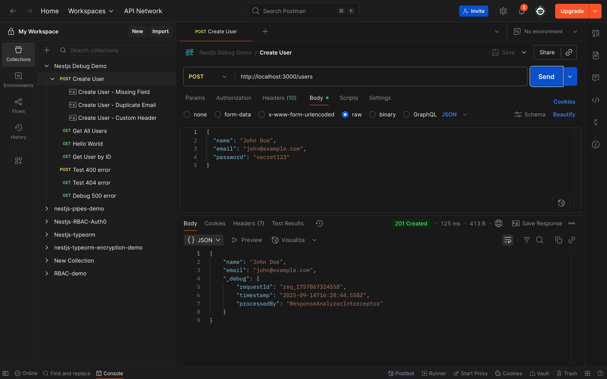
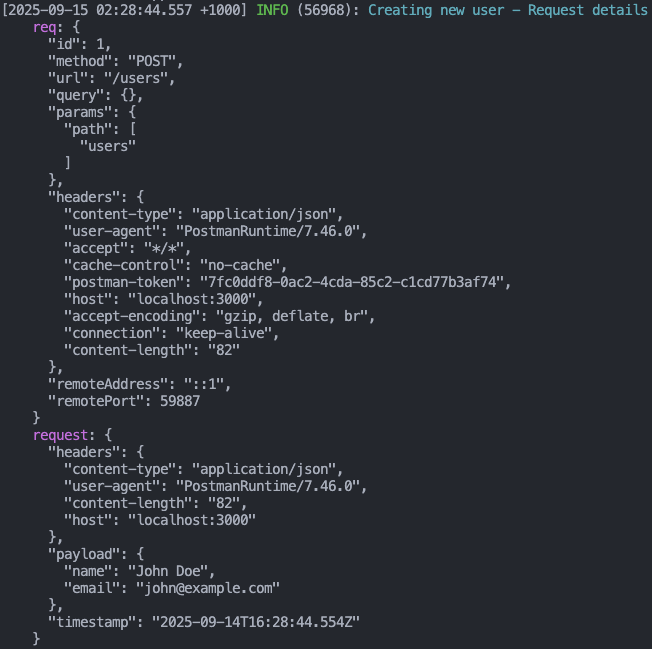
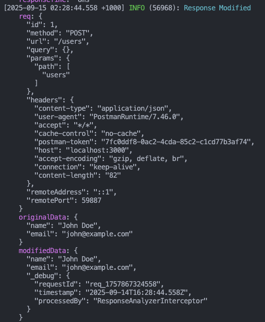
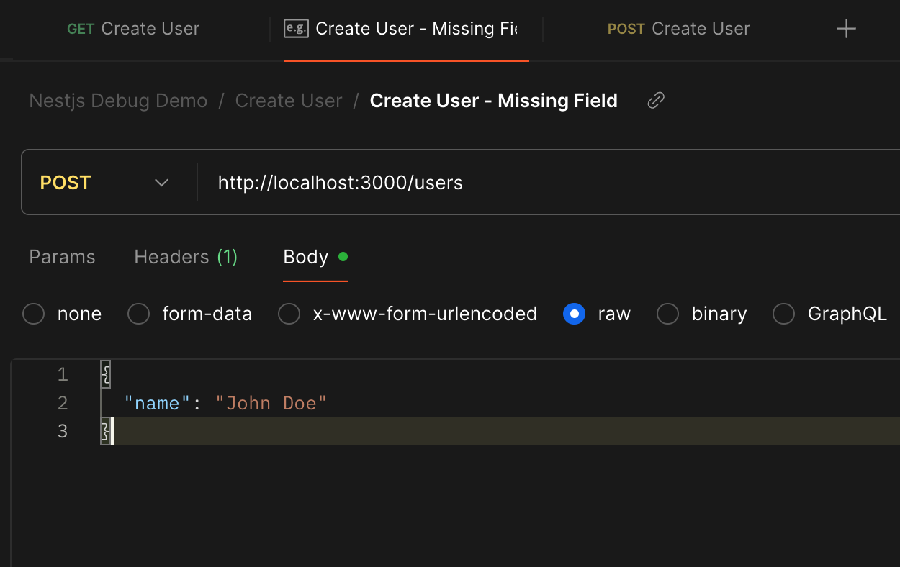
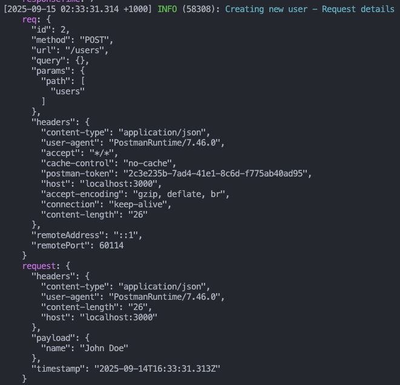
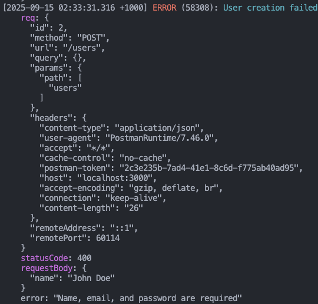
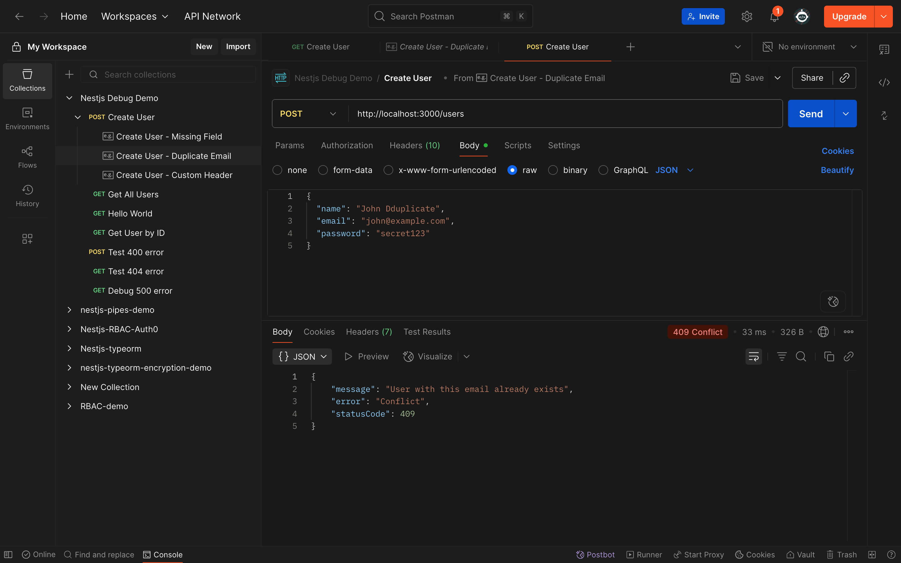
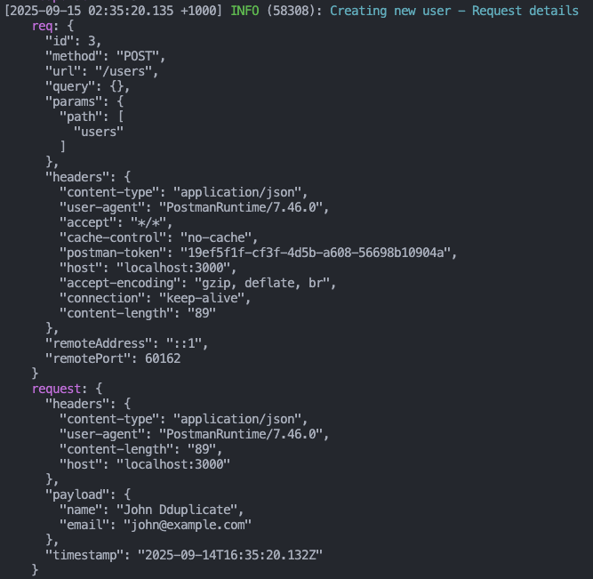
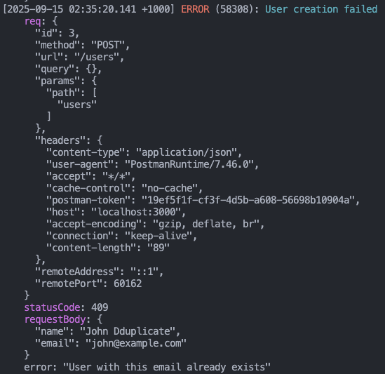

# NestJS API Debugging - Inspecting Requests & Responses

## 🎯 Goal

Learn how to inspect incoming API requests and outgoing responses to debug NestJS applications effectively.

## 📋 Overview

This document demonstrates a comprehensive approach to API debugging in NestJS by implementing request logging, response modification, and error handling using Pino logger and custom interceptors.

---

## 📖 1. Documentation

### What We Implemented

This demo project showcases essential debugging techniques for NestJS applications:

1. **Request Payload & Header Logging** using Pino
2. **Response Modification & Analysis** using custom interceptors
3. **Error Handling** with proper HTTP status codes
4. **Security-conscious Logging** excluding sensitive data

### 🔧 Implementation Details

#### 1.1 Request Logging with Pino

We implemented combined request logging that captures both headers and payload in a single, structured log entry:

```typescript
// app.controller.ts - Combined Request Logging
@Post('users')
@HttpCode(HttpStatus.CREATED)
createUser(@Body() body: reqUserDto, @Req() request: Request): resUserDto {
  // Log request headers and payload together for better readability
  this.logger.info(
    {
      request: {
        headers: {
          'content-type': request.headers['content-type'],
          'user-agent': request.headers['user-agent'],
          'content-length': request.headers['content-length'],
          host: request.headers.host,
        },
        payload: {
          name: body.name,
          email: body.email,
          // Password excluded for security
        },
        timestamp: new Date().toISOString(),
      },
    },
    'Creating new user - Request details',
  );
}
```

**Benefits:**

- Single log entry contains all request context
- Structured JSON format for easy parsing
- Security-conscious (excludes passwords)
- Includes timestamp for debugging

#### 1.2 Response Modification with Interceptors

We created a custom interceptor to analyze and modify responses:

```typescript
// response-analyzer.interceptor.ts
@Injectable()
export class ResponseAnalyzerInterceptor implements NestInterceptor {
  constructor(private readonly logger: PinoLogger) {}

  intercept(context: ExecutionContext, next: CallHandler): Observable<any> {
    const request = context.switchToHttp().getRequest<Request>();
    const response = context.switchToHttp().getResponse<Response>();
    const startTime = Date.now();

    return next.handle().pipe(
      tap(() => {
        // Log response analysis
        const responseTime = Date.now() - startTime;
        this.logger.info(
          {
            method: request.method,
            url: request.url,
            statusCode: response.statusCode,
            responseTime: `${responseTime}ms`,
            timestamp: new Date().toISOString(),
          },
          "Response Analysis"
        );
      }),
      map((data: any) => {
        // Modify response - ensure no password fields are returned
        if (data && typeof data === "object") {
          const { password, ...sanitizedData } = data;

          // Add debug information to response
          const enhancedResponse = {
            ...sanitizedData,
            _debug: {
              requestId: `req_${Date.now()}`,
              timestamp: new Date().toISOString(),
              processedBy: "ResponseAnalyzerInterceptor",
            },
          };

          return enhancedResponse;
        }
        return data;
      })
    );
  }
}
```

**Features:**

- **Response timing** measurement
- **Automatic password removal** for security
- **Debug information injection** for traceability
- **Response structure analysis**

#### 1.3 Error Handling & HTTP Status Codes

Enhanced service with proper validation and meaningful HTTP status codes:

```typescript
// app.service.ts - Error Handling
createUser(name: string, email: string, password: string): resUserDto {
  // Validation
  if (!name || !email || !password) {
    throw new BadRequestException('Name, email, and password are required');
  }

  if (!email.includes('@')) {
    throw new BadRequestException('Invalid email format');
  }

  // Check for duplicate email
  if (this.userDB[email]) {
    throw new ConflictException('User with this email already exists');
  }

  const user = { name: name, email: email, password: password };
  this.userDB[email] = user;

  // Return response without password for security
  return { name: user.name, email: user.email };
}
```

**HTTP Status Codes:**

- `201 Created` - Successful user creation
- `400 Bad Request` - Validation errors
- `409 Conflict` - Duplicate email attempts

#### 1.4 Module Configuration

```typescript
// app.module.ts - Pino & Interceptor Setup
@Module({
  imports: [
    LoggerModule.forRoot({
      pinoHttp: {
        transport: {
          target: "pino-pretty",
          options: { translateTime: "SYS:standard" },
        },
      },
    }),
  ],
  controllers: [AppController],
  providers: [
    AppService,
    {
      provide: APP_INTERCEPTOR,
      useClass: ResponseAnalyzerInterceptor,
    },
  ],
})
export class AppModule {}
```

---

## 🧪 2. Test Results

### Test 1: Successful User Creation

#### Postman Request



#### Server Logs - Request Details



#### Server Logs - Response Modification



**Demonstrates:**

- ✅ Combined request logging (headers + payload)
- ✅ 201 Created status code
- ✅ Response modification (password removed)
- ✅ Debug information injection

---

### Test 2: Validation Error - Missing Fields

#### Postman Request



#### Server Logs - Request Details



#### Server Logs - Error Response



**Demonstrates:**

- ✅ Validation error handling
- ✅ 400 Bad Request status code
- ✅ Security-conscious error logging
- ✅ Clear error messaging

---

### Test 3: Conflict Error - Duplicate Email

#### Postman Request



#### Server Logs - Request Details



#### Server Logs - Conflict Response



**Demonstrates:**

- ✅ Duplicate detection logic
- ✅ 409 Conflict status code
- ✅ Consistent error logging format
- ✅ Business logic validation

---

## 💭 3. Reflection

### How can logging request payloads help with debugging?

From our implementation, request payload logging provides several critical debugging benefits:

1. **Data Verification** - Ensures the backend receives expected data structure and values
2. **Client-Server Contract Validation** - Confirms API contracts are being followed
3. **Input Sanitization Debugging** - Helps identify data transformation issues
4. **Request Correlation** - Combined with headers, provides complete request context
5. **Audit Trail** - Creates traceable records for troubleshooting user-reported issues

**Example from our logs:**

```json
{
  "request": {
    "headers": {
      "content-type": "application/json",
      "user-agent": "PostmanRuntime/7.36.0"
    },
    "payload": {
      "name": "John Doe",
      "email": "john@example.com"
    }
  }
}
```

This structured format immediately reveals what data was sent and how it was received.

### What tools can you use to inspect API requests and responses?

Our demonstration utilized multiple complementary tools:

1. **Postman** - GUI-based API testing with rich response analysis

   - Visual request builder
   - Response time measurement
   - Status code verification
   - Header inspection

2. **Pino Logger** - Structured server-side logging

   - JSON-formatted logs
   - Performance measurement
   - Request/response correlation
   - Security-conscious logging

3. **Custom Interceptors** - Real-time response modification

   - Automatic data sanitization
   - Debug information injection
   - Response timing analysis

4. **curl** (Alternative) - Command-line testing for automation
   - Scriptable testing
   - CI/CD integration
   - Simple debugging scenarios

### How would you debug an issue where an API returns the wrong status code?

Based on our implementation, here's a systematic approach:

1. **Check Request Logging** - Verify the input data structure

   ```typescript
   // Our combined logging shows both input and processing context
   this.logger.info({ request: { headers, payload, timestamp } });
   ```

2. **Trace Business Logic** - Follow the execution path through service methods

   ```typescript
   // Our service includes validation checkpoints
   if (!email.includes("@")) {
     throw new BadRequestException("Invalid email format"); // 400
   }
   if (this.userDB[email]) {
     throw new ConflictException("User already exists"); // 409
   }
   ```

3. **Monitor Response Interceptors** - Check if middleware is modifying responses

   ```typescript
   // Our interceptor logs the actual status codes being returned
   this.logger.info({
     statusCode: response.statusCode,
     responseTime: `${responseTime}ms`,
   });
   ```

4. **Error Handling Analysis** - Verify exception-to-status-code mapping
   ```typescript
   // Our error logging includes both error details and status codes
   this.logger.error({
     error: error.message,
     statusCode: error.status,
   });
   ```

### What are some security concerns when logging request data?

Our implementation addresses several critical security concerns:

1. **Sensitive Data Exclusion**

   ```typescript
   // ✅ Password excluded from payload logs
   payload: {
     name: body.name,
     email: body.email,
     // Password excluded for security
   }

   // ✅ Password excluded from error logs
   requestBody: { name: body.name, email: body.email } // No password in error logs
   ```

2. **Response Sanitization**

   ```typescript
   // ✅ Automatic password removal from responses
   const { password, ...sanitizedData } = data;
   return enhancedResponse; // No password included
   ```

3. **Header Security**

   ```typescript
   // ✅ Only log safe headers, avoid authorization tokens
   headers: {
     'content-type': request.headers['content-type'],
     'user-agent': request.headers['user-agent'],
     // Authorization headers deliberately excluded
   }
   ```

4. **Log Level Management**

   - Use different log levels for sensitive vs. non-sensitive data
   - Implement log rotation and secure storage
   - Consider data retention policies for compliance

5. **Production Considerations**
   - Implement log redaction for PII
   - Use environment-specific logging configurations
   - Monitor log access and implement proper access controls

### Conclusion

This debugging implementation demonstrates a production-ready approach to API inspection that balances debugging effectiveness with security consciousness. The combination of structured logging, response modification, and proper error handling provides comprehensive visibility into API behavior while protecting sensitive information.

The techniques implemented here would be directly applicable to debugging Focus Bear's backend, enabling rapid identification and resolution of issues related to request processing, response formatting, and client-server communication problems.
