# NestJS API Debugging with Bruno - Reflection

## Overview

This reflection covers the learning experience of using Bruno as an API testing tool for a NestJS application. The goal was to understand Bruno's capabilities and how it compares to other API testing tools like Postman, while testing existing endpoints without modifying the application code.

## What We Did - Documentation

### 1. Bruno Installation and Setup

I downloaded and installed Bruno, an open-source API client that serves as a lightweight alternative to Postman. Bruno was chosen for this exercise because:

- It's completely free and open-source
- Collections are stored as plain text files (Git-friendly)
- Works offline without cloud dependencies
- Lightweight with minimal resource usage

### 2. Collection Structure and Organization

The Bruno collection was created within the NestJS demo project folder structure:

```
nestjs-debug-demo/
├── src/                          # NestJS application source code
├── NestJS Debug Demo/            # Bruno collection folder
│   ├── bruno.json               # Collection configuration
│   ├── collection.bru           # Environment variables
│   ├── Hello-World.bru          # Basic GET endpoint test
│   ├── Create-User.bru          # Successful user creation
│   ├── Create-User-Email-Conflict.bru  # Email conflict error test
│   └── Create-User-Missing-Field.bru   # Validation error test
└── screenshots/bruno/           # UI and result screenshots
```

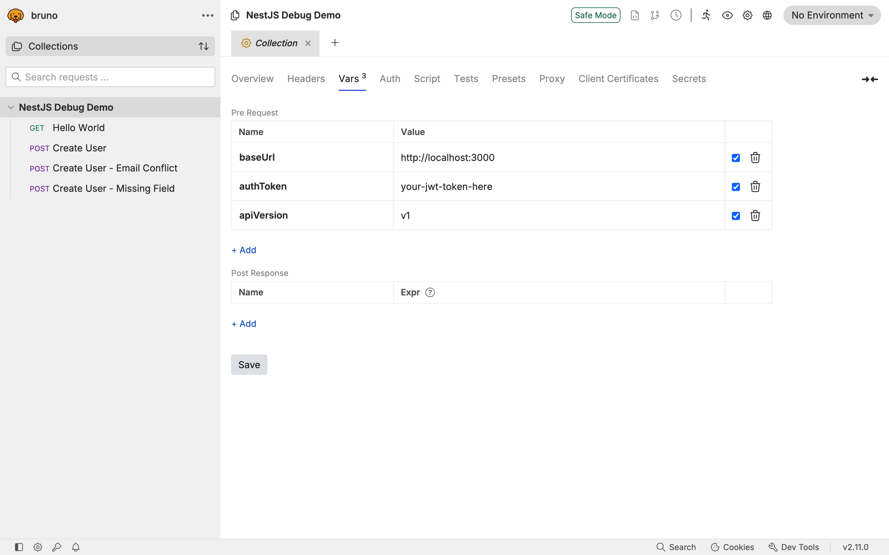

_Collection overview showing all organized API requests_

The collection configuration (`bruno.json`) defines the collection metadata:

```json
{
  "version": "1",
  "name": "NestJS Debug Demo",
  "type": "collection",
  "ignore": ["node_modules", ".git"]
}
```

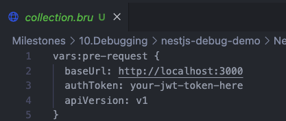

_Bruno collection configuration and environment variables_

### 3. Environment Variables Setup

Environment variables were configured in `collection.bru` to make requests reusable across different environments:

```javascript
vars:pre-request {
  baseUrl: http://localhost:3000
  authToken: your-jwt-token-here
  apiVersion: v1
}
```

This approach allows easy switching between development, staging, and production environments.

### 4. API Endpoint Testing

#### Hello World Endpoint (GET /)

The simplest endpoint to verify the NestJS application is running:

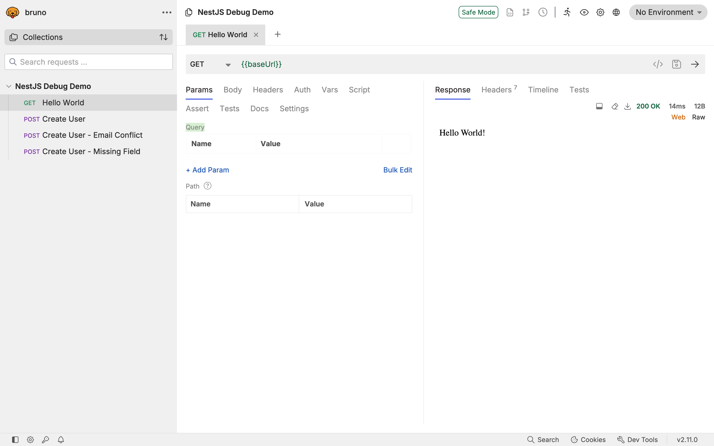

_Basic GET request to the root endpoint_

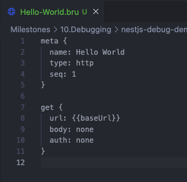

_Hello World request configuration showing the simple GET setup_

#### Create User Endpoint (POST /users)

The main endpoint for testing user creation with proper validation:

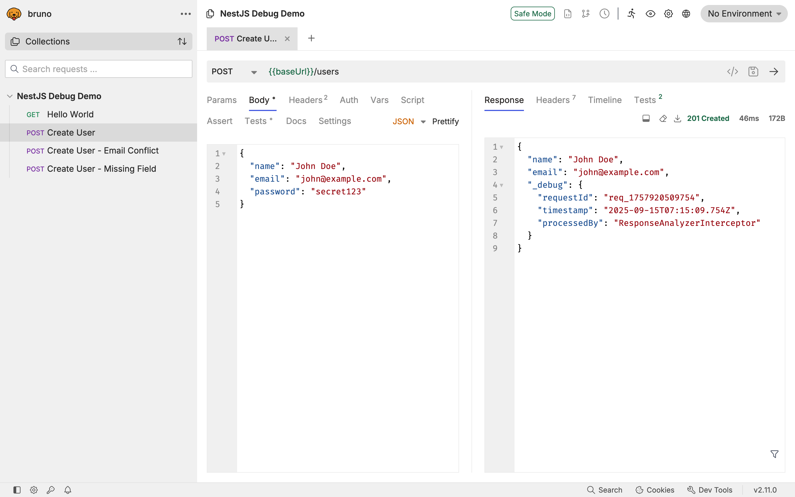

_User creation request with headers and JSON payload_

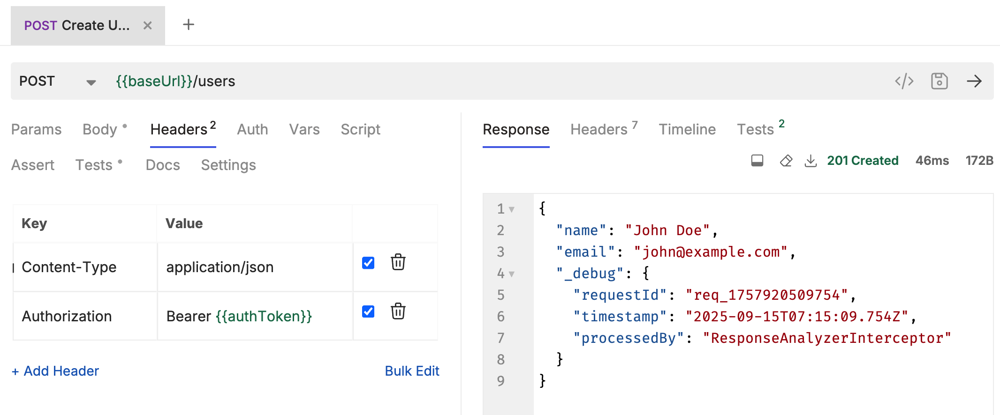

_Request headers showing Content-Type and Authorization bearer token setup_

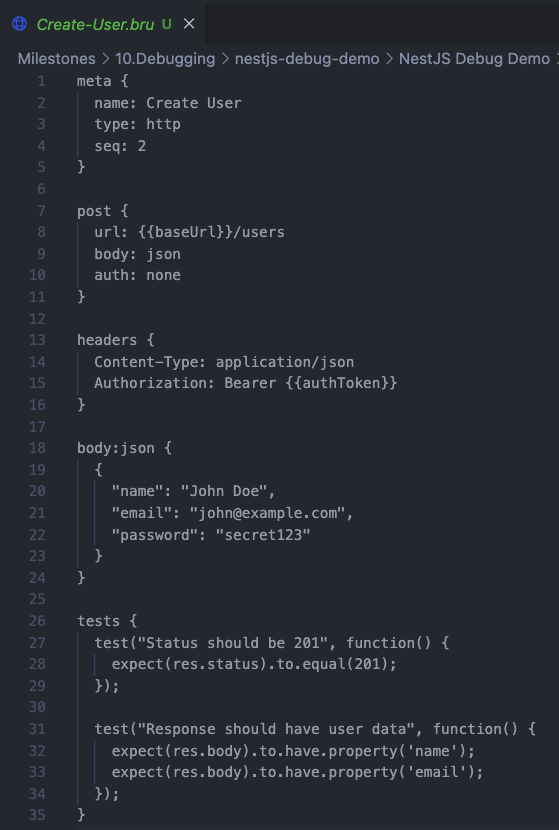

_Complete request configuration including test assertions_

The request includes automated tests to verify:

- HTTP status code (201 for successful creation)
- Response contains expected user data properties
- Response structure validation

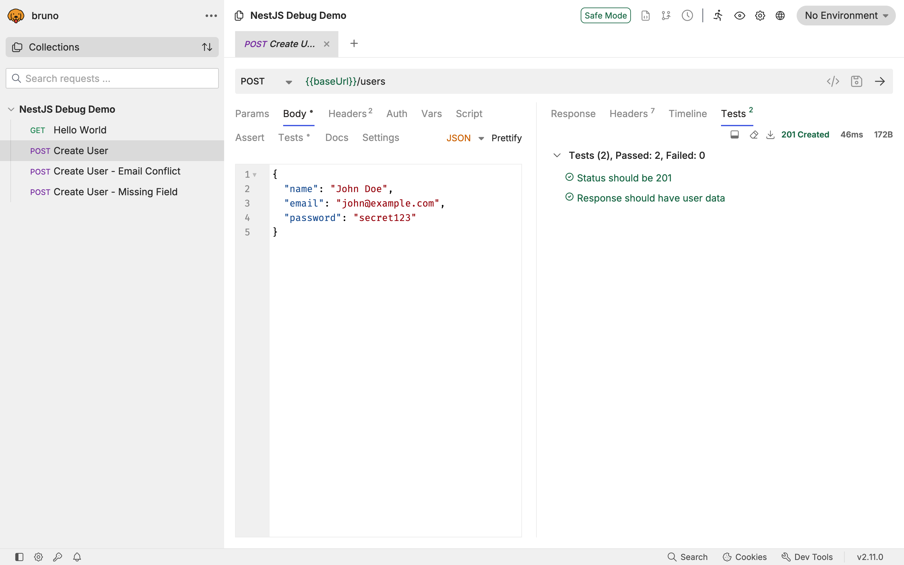

_Test execution results showing successful assertions_

#### Email Conflict Testing (POST /users)

Testing duplicate email validation:

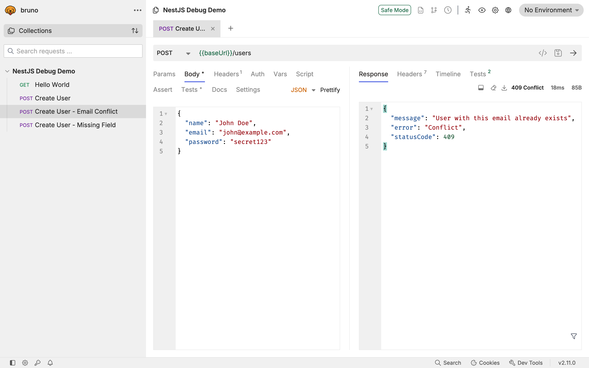

_Request attempting to create user with existing email_

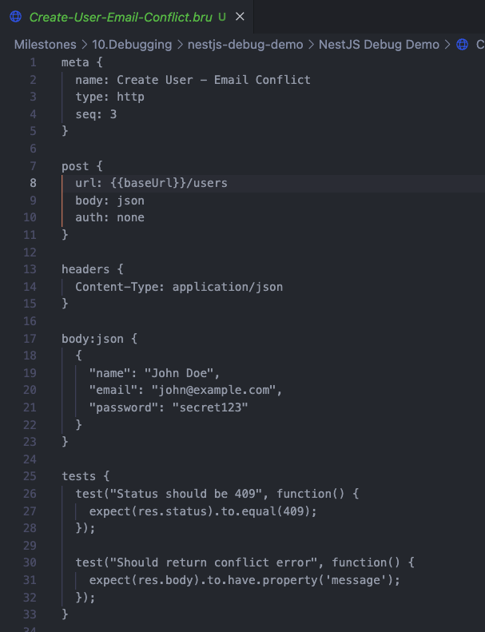

_Request configuration for testing email conflict scenario_

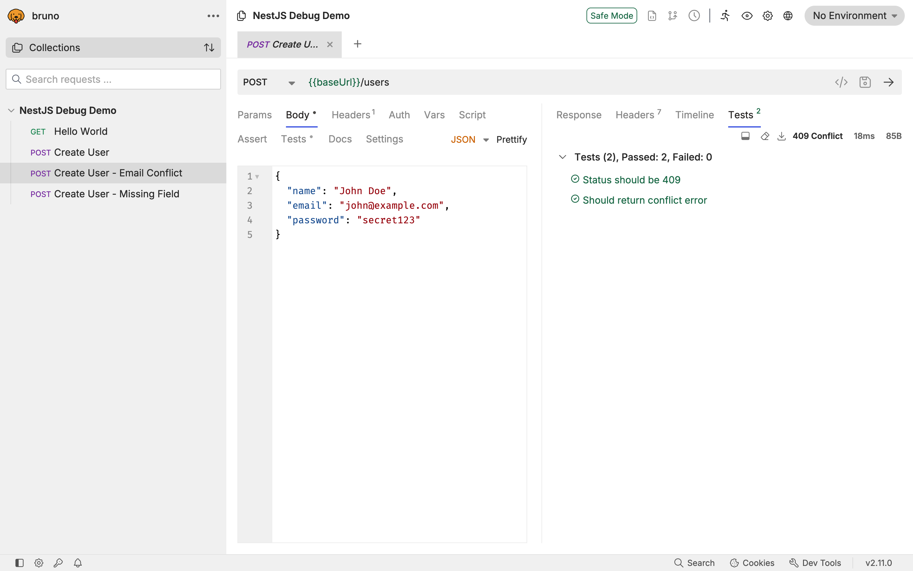

_Test results showing expected 409 Conflict status and error message validation_

#### Missing Field Validation (POST /users)

Testing required field validation:

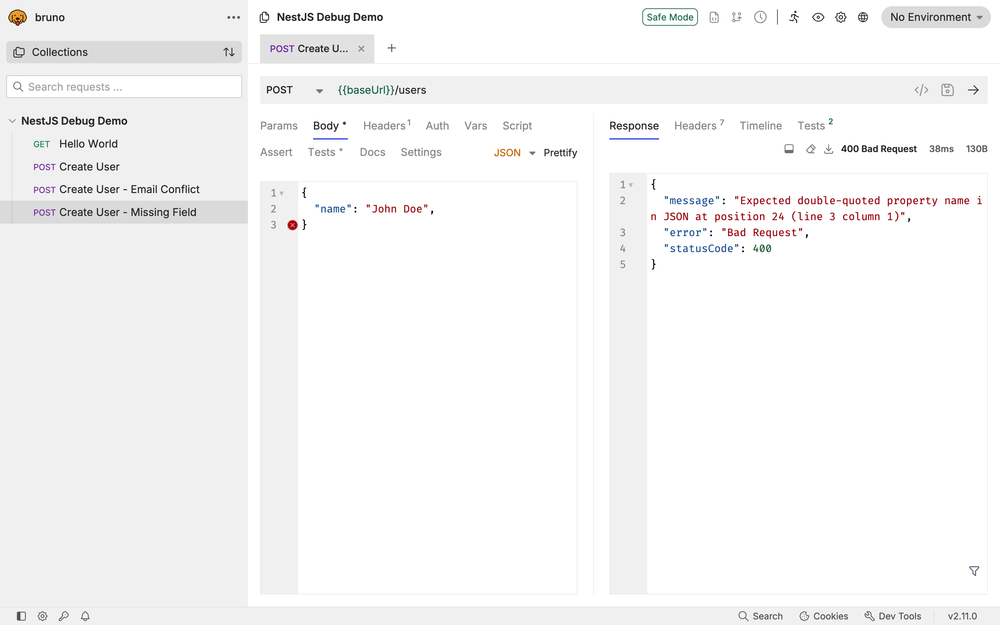

_Request with incomplete user data to test validation_

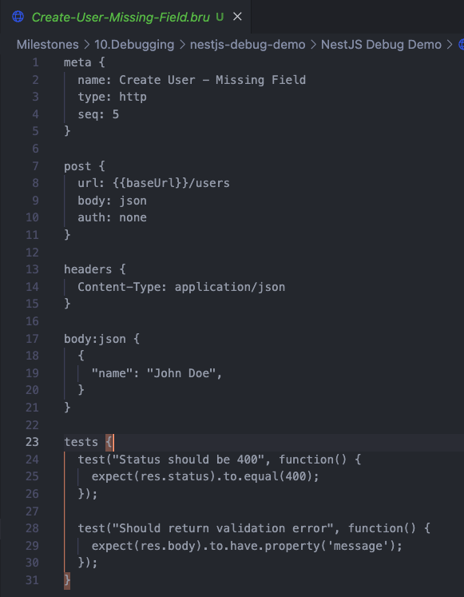

_Request configuration with intentionally missing required fields_

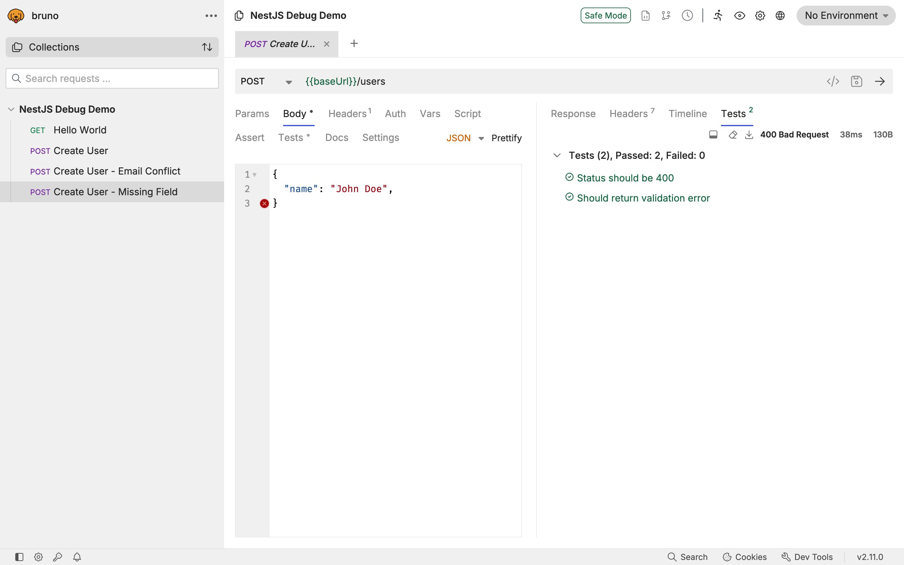

_Test results confirming 400 Bad Request status for validation errors_

### 5. Testing Workflow

The testing approach followed this pattern:

1. **Setup**: Configure environment variables and base URL
2. **Create Request**: Define HTTP method, endpoint, headers, and body
3. **Add Tests**: Write JavaScript assertions to validate responses
4. **Execute**: Run requests and verify test results
5. **Document**: Capture screenshots and analyze results

Each request includes comprehensive test assertions that validate:

- HTTP status codes
- Response structure and properties
- Error messages and validation
- Response times (where applicable)

## Reflection Questions

### 1. How does Bruno help with API testing compared to Postman or cURL?

**Bruno vs Postman:**

- **Version Control**: Bruno stores collections as plain text files that can be committed to Git, making them part of the codebase. Postman requires cloud sync or export/import processes.
- **Collaboration**: Bruno collections travel with the code repository, ensuring all team members have the same API tests. Postman requires separate sharing mechanisms.
- **Privacy**: Bruno works completely offline without sending data to external servers, while Postman syncs to their cloud.
- **Cost**: Bruno is completely free and open-source, while Postman has limitations in the free tier.
- **Integration**: Bruno collections can be easily integrated into CI/CD pipelines as part of the repository.

**Bruno vs cURL:**

- **User Interface**: Bruno provides a graphical interface making it more accessible than command-line cURL.
- **Organization**: Collections allow logical grouping of related requests, unlike individual cURL commands.
- **Environment Management**: Variables and environments make Bruno more flexible for different testing scenarios.
- **Test Automation**: Built-in JavaScript testing capabilities vs manual result verification with cURL.
- **Documentation**: Bruno requests serve as living documentation, while cURL commands require separate documentation.

### 2. How do you send an authenticated request in Bruno?

Authentication in Bruno can be handled in several ways:

**Bearer Token Authentication:**

```javascript
headers {
  Authorization: Bearer {{authToken}}
  Content-Type: application/json
}
```

**Environment Variable Setup:**

```javascript
vars:pre-request {
  authToken: your-jwt-token-here
}
```

**Dynamic Token Retrieval:**
For more advanced scenarios, pre-request scripts can fetch tokens:

```javascript
// Pre-request script to get auth token
const loginResponse = await api.post("/auth/login", {
  username: "user@example.com",
  password: "password",
});

bru.setVar("authToken", loginResponse.data.token);
```

**Other Authentication Methods:**

- Basic Auth: Built-in auth section support
- API Keys: Headers or query parameters
- OAuth: Custom implementation using pre-request scripts

### 3. What are the advantages of organizing API requests in collections?

**Logical Grouping:**

- Related endpoints grouped together (e.g., all user operations)
- Feature-based organization (authentication, CRUD operations, reporting)
- Environment-specific collections (development, staging, production)

**Shared Configuration:**

- Common headers applied across all requests
- Environment variables shared within the collection
- Base URLs and authentication tokens centralized

**Team Collaboration:**

- Consistent API testing across team members
- Shared understanding of API contract and behavior
- Easier onboarding for new developers

**Documentation Benefits:**

- Collections serve as executable documentation
- API examples with real request/response data
- Test cases demonstrate expected behavior and edge cases

**Maintenance Efficiency:**

- Bulk updates to authentication or base URLs
- Consistent naming conventions and organization
- Version control tracks changes to API contracts

**Testing Workflows:**

- Sequential execution of related tests
- Dependencies between requests (e.g., create before update)
- Comprehensive test coverage organization

### 4. How would you structure a Bruno collection for a NestJS backend project?

**Recommended Structure:**

```
api-tests/
├── bruno.json                    # Collection configuration
├── environments/
│   ├── local.json               # Development environment
│   ├── staging.json             # Staging environment
│   └── production.json          # Production environment
├── auth/
│   ├── login.bru               # Authentication endpoints
│   ├── register.bru
│   └── refresh-token.bru
├── users/
│   ├── create-user.bru         # User CRUD operations
│   ├── get-user.bru
│   ├── update-user.bru
│   ├── delete-user.bru
│   └── user-validation-tests.bru
├── products/
│   ├── create-product.bru      # Product management
│   ├── get-products.bru
│   └── product-search.bru
├── admin/
│   ├── admin-dashboard.bru     # Admin-specific endpoints
│   └── user-management.bru
└── health/
    ├── health-check.bru        # System health endpoints
    └── database-status.bru
```

**Organization Principles:**

1. **Feature-Based Folders**: Group by business domain or feature area
2. **Environment Separation**: Different configurations for each deployment environment
3. **Sequential Naming**: Use prefixes for execution order when needed
4. **Descriptive Names**: Clear, self-documenting request names
5. **Shared Variables**: Common configuration in collection-level variables
6. **Error Scenarios**: Include both success and failure test cases

**Collection-Level Configuration:**

```javascript
// collection.bru
vars:pre-request {
  baseUrl: {{envBaseUrl}}
  authToken: {{envAuthToken}}
  apiVersion: v1
  timeout: 5000
}
```

**Environment-Specific Variables:**

```json
// environments/local.json
{
  "envBaseUrl": "http://localhost:3000",
  "envAuthToken": "",
  "dbHost": "localhost",
  "debugMode": true
}
```

**Best Practices:**

- Include comprehensive test assertions for each request
- Use descriptive names that explain the test scenario
- Add documentation in request descriptions
- Implement proper error handling and validation tests
- Maintain consistency in request structure across the collection
- Regular cleanup and maintenance of outdated requests

This structure ensures maintainability, scalability, and ease of use for both individual developers and team collaboration in a NestJS backend project.

## Conclusion

Bruno proved to be an excellent tool for API testing in the NestJS environment. Its file-based approach, offline capabilities, and Git integration make it particularly suitable for development teams who want to version control their API tests alongside their code. The ability to organize requests in collections, use environment variables, and write automated test assertions provides a comprehensive solution for API development and debugging workflows.

The hands-on experience with the NestJS demo project demonstrated how Bruno can effectively test various scenarios including successful operations, validation errors, and conflict handling, making it a valuable tool for ensuring API reliability and correctness.
