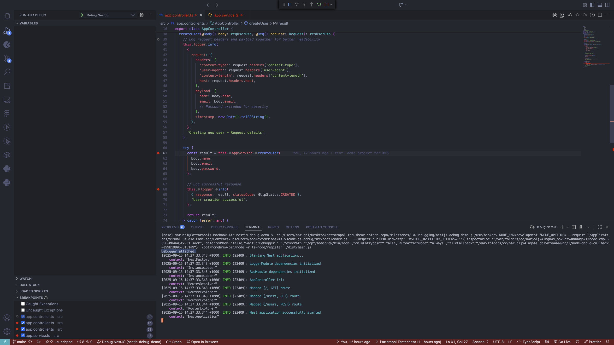
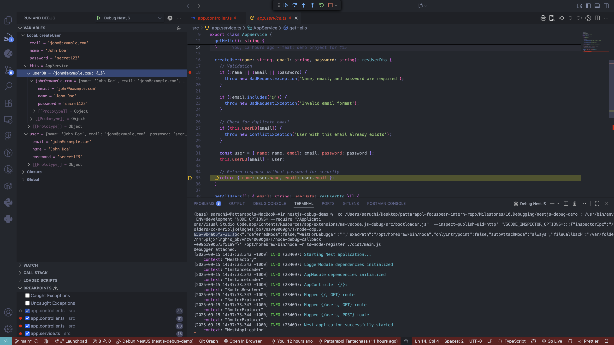
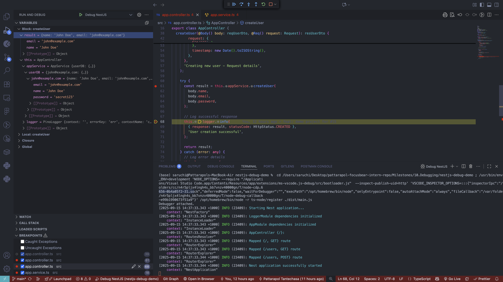

# NestJS Debugging with VS Code & Breakpoints

## 🎯 Goal

Learn how to use VS Code's debugger to step through NestJS code and inspect application state for better debugging compared to console logs.

## 📋 Table of Contents

1. [Setting up VS Code Debugging](#setting-up-vs-code-debugging)
2. [Launch Configuration Explained](#launch-configuration-explained)
3. [Testing with Screenshots](#testing-with-screenshots)
4. [Reflection](#reflection)

---

## Setting up VS Code Debugging

### 1. Project Structure

The `.vscode/launch.json` file should be placed at the root level of your NestJS project, at the same level as your `package.json`:

```
nestjs-debug-demo/
├── .vscode/
│   └── launch.json          ← Debug configuration file
├── src/
│   ├── app.controller.ts
│   ├── app.service.ts
│   └── main.ts
├── package.json
└── ...
```

### 2. Launch Configuration Setup

Create `.vscode/launch.json` with the following configuration:

```json
{
  "version": "0.2.0",
  "configurations": [
    {
      "name": "Debug NestJS",
      "type": "node",
      "request": "launch",
      "program": "${workspaceFolder}/src/main.ts",
      "runtimeArgs": ["-r", "ts-node/register"],
      "env": {
        "NODE_ENV": "development"
      },
      "console": "integratedTerminal",
      "restart": true,
      "protocol": "inspector",
      "skipFiles": ["<node_internals>/**", "node_modules/**"]
    },
    {
      "name": "Debug NestJS (Watch Mode)",
      "type": "node",
      "request": "launch",
      "program": "${workspaceFolder}/node_modules/@nestjs/cli/bin/nest.js",
      "args": ["start", "--debug", "--watch"],
      "env": {
        "NODE_ENV": "development"
      },
      "console": "integratedTerminal",
      "restart": true,
      "protocol": "inspector",
      "skipFiles": ["<node_internals>/**", "node_modules/**"]
    }
  ]
}
```

## Launch Configuration Explained

### Configuration Properties

| Property        | Purpose                                  | Example Value                                |
| --------------- | ---------------------------------------- | -------------------------------------------- |
| `"name"`        | Display name in VS Code debug dropdown   | `"Debug NestJS"`                             |
| `"type"`        | Debugger type (Node.js applications)     | `"node"`                                     |
| `"request"`     | Launch new process vs attach to existing | `"launch"`                                   |
| `"program"`     | Entry point of your application          | `"${workspaceFolder}/src/main.ts"`           |
| `"runtimeArgs"` | Arguments passed to Node.js runtime      | `["-r", "ts-node/register"]`                 |
| `"env"`         | Environment variables for the process    | `{"NODE_ENV": "development"}`                |
| `"console"`     | Where to display application output      | `"integratedTerminal"`                       |
| `"restart"`     | Auto-restart on unexpected termination   | `true`                                       |
| `"protocol"`    | Node.js debugging protocol version       | `"inspector"`                                |
| `"skipFiles"`   | Files to skip during step debugging      | `["<node_internals>/**", "node_modules/**"]` |

### Key Configurations Breakdown

**TypeScript Support:**

```json
"runtimeArgs": ["-r", "ts-node/register"]
```

- Enables direct TypeScript execution without pre-compilation
- `-r` flag preloads the `ts-node/register` module

**Watch Mode Configuration:**

```json
"program": "${workspaceFolder}/node_modules/@nestjs/cli/bin/nest.js",
"args": ["start", "--debug", "--watch"]
```

- Uses NestJS CLI for automatic file watching and restart
- `--debug` enables debugging mode
- `--watch` restarts server when files change

**Performance Optimization:**

```json
"skipFiles": ["<node_internals>/**", "node_modules/**"]
```

- Prevents stepping into Node.js internal files and third-party packages
- Improves debugging performance and focus

---

## Testing with Screenshots

### 1. Starting the Debugger



**What this shows:**

- VS Code debugger successfully attached to the NestJS application
- Debug console showing application startup logs
- Debug toolbar with step controls (Continue, Step Over, Step Into, etc.)
- Application running on port 3000 and ready to receive requests

### 2. Inspecting AppService Variables



**Key observations:**

- Breakpoint hit in `AppService.createUser()` method
- **Variables panel** showing:
  - Input parameters: `name`, `email`, `password`
  - Service state: `userDB` object (initially empty)
- **Call stack** showing execution flow from controller to service
- Ability to inspect method arguments in real-time

### 3. Inspecting AppController Result



**Key observations:**

- Breakpoint hit in `AppController.createUser()` after service call
- **Result variable** contains only `name` and `email` (password excluded for security)
- **AppService userDB** now contains the newly created user data
- Demonstrates data flow from service back to controller
- Shows how sensitive data (password) is filtered from response

---

## Reflection

### How do breakpoints help in debugging compared to console logs?

**Breakpoints provide several advantages over console logs:**

1. **Real-time State Inspection**

   - In our demo, we could inspect the `userDB` state before and after user creation
   - Variables panel showed exact values at the moment of execution
   - No need to modify code with temporary console.log statements

2. **Interactive Debugging**

   - Ability to step through code line by line
   - Examine the exact flow from `AppController.createUser()` → `AppService.createUser()` → back to controller
   - Watch how the `result` variable transforms from service response to controller response

3. **Complete Context Access**

   - Access to entire call stack and scope
   - Could inspect `request.headers`, `body` parameters, and service state simultaneously
   - No risk of missing important context that console logs might not capture

4. **Non-intrusive**
   - No code modification required
   - Can add/remove breakpoints without changing application logic
   - Clean debugging without polluting logs

### What is the purpose of launch.json, and how does it configure debugging?

**launch.json serves as the configuration blueprint for VS Code's debugging environment:**

1. **Environment Setup**

   - Configures Node.js to run with TypeScript support via `ts-node/register`
   - Sets environment variables like `NODE_ENV=development`
   - Defines where application output should be displayed

2. **Debugging Behavior**

   - `"restart": true` ensures debugging sessions restart automatically
   - `"skipFiles"` prevents stepping into irrelevant code (node_modules, Node.js internals)
   - `"protocol": "inspector"` uses modern Node.js debugging capabilities

3. **Multiple Configurations**
   - Basic mode: Direct TypeScript execution
   - Watch mode: Automatic restart with NestJS CLI for development workflow

### How can you inspect request parameters and responses while debugging?

**From our demo project experience:**

1. **Request Inspection**

   - Set breakpoint at method entry in `AppController.createUser()`
   - Inspect `@Body() body` parameter to see `{name, email, password}`
   - Examine `@Req() request` object for headers and metadata
   - Use Variables panel to drill down into object properties

2. **Response Inspection**

   - Set breakpoint after service call to inspect `result` variable
   - Observed that response contains only `{name, email}` - password filtered out
   - Compare input vs output to verify data transformation

3. **Service State Inspection**
   - Breakpoint in `AppService.createUser()` showed `userDB` before modification
   - Second breakpoint showed `userDB` after user addition
   - Verified data persistence and state changes

### How can you debug background jobs that don't run in a typical request-response cycle?

**Strategies for debugging background processes:**

1. **Attach Debugger Configuration**

   ```json
   {
     "name": "Attach to Background Process",
     "type": "node",
     "request": "attach",
     "port": 9229,
     "restart": false
   }
   ```

2. **Process Identification**

   - Start background job with debug flag: `node --inspect=9229 background-job.js`
   - Use "attach" instead of "launch" in configuration
   - Connect to running process via debug port

3. **Debugging Queue Systems (like BullMQ)**

   - Set breakpoints in job processors
   - Inspect job data and queue state
   - Debug job retry logic and error handling

4. **Scheduled Tasks/Cron Jobs**
   - Add breakpoints in scheduled task handlers
   - Use conditional breakpoints for specific conditions
   - Inspect task execution context and timing

**Example for our NestJS project:**
If we had background user processing, we could:

- Set breakpoints in queue processors
- Inspect job payloads and user data
- Debug async operations that don't have HTTP context
- Monitor background task state and error conditions

---

## 🎯 Key Takeaways

1. **Setup is straightforward** - Single `launch.json` file enables powerful debugging
2. **Real-time inspection** beats console logging for complex debugging scenarios
3. **Non-intrusive debugging** allows thorough investigation without code changes
4. **Multiple debugging modes** support different development workflows
5. **Background process debugging** requires attach configuration instead of launch

The VS Code debugger transforms debugging from guesswork with console logs into systematic investigation with complete visibility into application state and execution flow.
