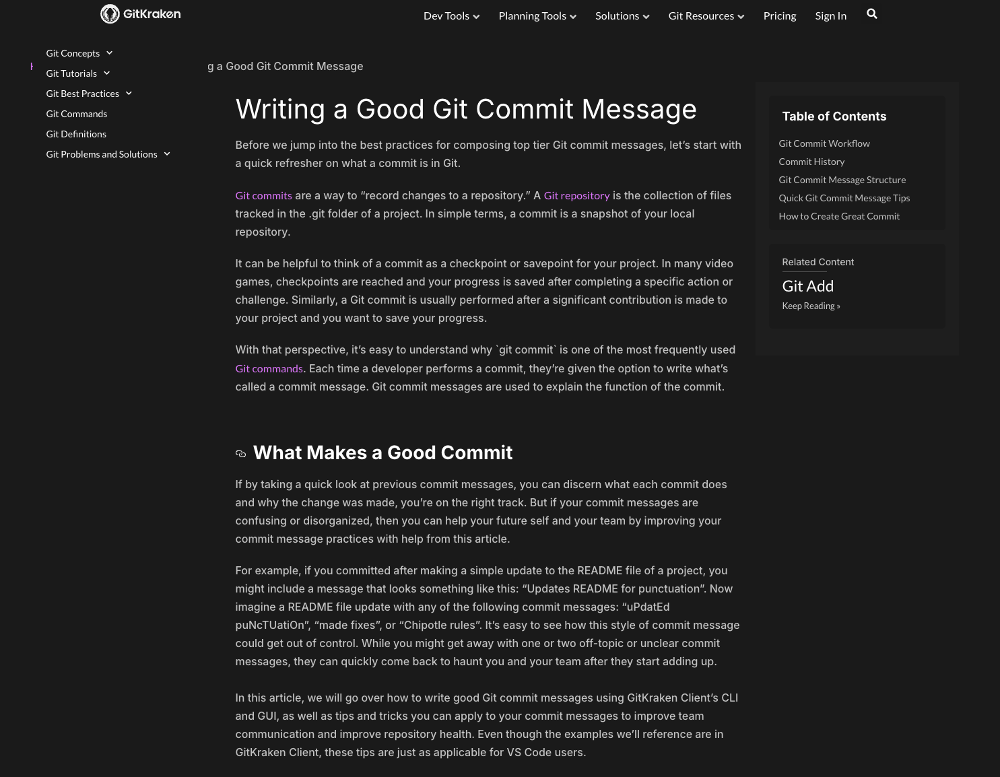

# Understanding Good Commit Messages #60

## 1) Best Practices

- Write in the **imperative** mood: “Add…”, “Fix…”, “Refactor…”
- Keep the **subject ≤ 50 chars**; capitalize, **no period** at the end
- Add a **blank line** after the subject
- Provide a **body (wrap at ~72 chars)** explaining _what_ and _why_ (not just how)
- Reference **issues/PRs** when relevant (e.g., “Refs #123”, “Fixes #45”)
- Commit **one logical change** per commit
- Prefer **Conventional Commits** when teams agree:  
  `feat:`, `fix:`, `docs:`, `refactor:`, `test:`, `chore:`, `perf:`, `ci:` etc.

### Conventional Commits examples

- `feat: add pagination to task list`
- `fix: handle null userId in auth middleware`
- `docs: clarify API rate limits`
- `refactor: extract validation into helper`

---

## 2) Good vs Bad in the Wild (What to Look For)

When browsing an open‑source project’s history (e.g., React or Node.js), notice:

**Good**

- Clear subject + body
- Mentions the problem and the approach
- Links to issues/PRs and breaking changes callouts

**Bad**

- Vague: `update`, `fix stuff`, `changes`
- No context in the body
- Multiple unrelated changes in one commit

---

## 3) Three Example Commits (you will create in your repo)

> Feel free to copy these exact messages when you commit.

### A) Vague commit (bad on purpose)

- **Subject:** modified content
- **Body:** file content had been modified

### B) Overly detailed commit (too much “how”)

- **Subject:** docs: added overly detailed commit example 3.B
- **Body:** Content had been added to section 3.B, starting at line 50. This is an example for overly detailed commit. The section contain Heading with two dot point of Subject and Body with its content.

### C) Well‑structured commit (good)

- **Subject:** docs: add final example of well structured commit (#60)
- **Body:**  
  Adds a final example for well structured commit message.  
  This finalise all example for this file.  
  - All example commit are done.  
    Refs #60

---

## 4) Why Good Commit Messages Matter (Reflections)

### What makes a good commit message?

- **Clarity**: A concise subject line in imperative mood summarizing the change.
- **Context**: A short body explaining the _why_ and any trade‑offs or impacts.
- **Traceability**: References to issues/PRs and breaking changes when relevant.
- **Scope**: One logical change per commit → easier reviews and rollbacks.

### How does a clear commit message help team collaboration?

- Reviewers understand intent quickly → **faster reviews**
- Future devs (including you) can reconstruct decisions → **better maintainability**
- Easier **blame/annotate** and selective cherry‑picks or rollbacks
- Cleaner **release notes** and changelogs (especially with Conventional Commits)

### How can poor commit messages cause issues later?

- Ambiguity hides the _why_ → harder debugging and knowledge loss
- Time wasted reading code diffs to infer meaning
- Risky releases: unclear if a commit is a **fix**, **feature**, or **breaking**
- Hard to automate **changelogs** or link work to issues

---

## Update from feedback

### 1. Show evidence that you researched best practices for commit messages

- I research from this blog post : [Writing a Good Git Commit Message](https://www.gitkraken.com/learn/git/best-practices/git-commit-message)

### 2. explore and analyze good vs. bad commit messages in an open-source project (ideally with examples or links)

- [React fix commit](https://github.com/facebook/react/commit/92d7ad5dd976f4b7bc22abc507569b30609b1579)
- This is good since its easy to idenfy what is this commit is for. I could easily understand this commit is about fixing URL validation for DevTools. It have 'fix:', which is a good convention. It have the product or service in front to show what product is this commit is fixing. It also attached issue number to know which issue had been fix with this commit.

### 3. make three different styles of commits in your repo as listed

These are screenshots of some example of what I wrote commit message for this onboarding repo when I made progress or complete issues.

>     

### 4. reflect on what makes a good commit message, how it helps collaboration, and risks of poor messages, all in your git_understanding.md.

- What makes a good commit message

  - Clear, imperative subject ≤ 50 chars (no trailing period): e.g., `fix: handle null userId`
  - Blank line, then a body wrapped at ~72 chars that explains _what_ changed and _why_ (not the step‑by‑step how)
  - Reference related issues/PRs (e.g., `Refs #60`, `Fixes #123`) and call out breaking changes
  - One logical change per commit so commits are small and reviewable
  - Use conventional prefixes (`feat:`, `fix:`, `docs:`, `chore:`) when the team agrees

- How good commit messages help collaboration

  - Speed up reviews: reviewers understand intent without reading full diffs
  - Improve traceability: link code changes to issues, decisions and release notes
  - Make bisecting and cherry‑picking easier and safer
  - Help new teammates and future you quickly understand past decisions
  - Enable reliable automation (changelogs, release tooling, semantic versioning)

- Risks of poor commit messages
  - Wasted time: reviewers and future maintainers must read diffs to infer intent
  - Lost context: the "why" disappears and debugging or reverting becomes harder
  - Release risk: unclear whether change is a bugfix, feature, or breaking change
  - Poor automation: inaccurate or missing changelogs and release notes

---

# Git Concepts: Staging vs. Committing

## 1. Difference Between Staging and Committing

- **Staging (`git add`)**:  
  Staging is the step where you prepare specific changes to be included in your next commit. Think of it like a "shopping cart" — you pick which files/changes you want to include before finalizing them.
- **Committing (`git commit`)**:  
  Committing takes everything that’s staged and records it permanently in the Git history. Each commit has a unique ID (hash) and usually includes a commit message that describes the changes.

---

## 2. Why Git Separates Staging and Committing

Git separates these steps to give developers **flexibility and control**:

- You can stage only part of your changes (e.g., a single function or line) while leaving others unstaged.
- It allows you to organize your commits into meaningful chunks instead of dumping everything at once.
- It helps create a cleaner commit history that is easier to review and understand.

---

## 3. When You Would Stage Without Committing

- When you want to **group related changes** together before committing.
- When you’re **still working** but want to prepare certain files in advance.
- When you need to **commit only some changes** from a file but not the entire file. (e.g., `git add -p` lets you stage line-by-line).

---

## 4. Experiment Results

1. Modified a file.
2. Ran `git add <file>` → File moved to staging.
3. Checked `git status` → File showed as staged, ready to commit.
4. Ran `git reset HEAD <file>` → File removed from staging, changes still in working directory.
5. Ran `git commit -m "Update file"` → Changes saved to repository history.

This confirmed the difference between staging (temporary prep area) and committing (permanent history).

---

# Branching & Team Collaboration

## 1) Why not push directly to `main`?

Pushing straight to `main` is risky because:

- **Breaks production**: A bad change can immediately affect everyone (and CI/CD).
- **No review**: Skips code review, linters, tests, and quality gates.
- **History pollution**: Mixed, unreviewed commits make debugging and rollback harder.
- **Coordination pain**: Teammates can be forced to rebase/fix conflicts on a moving `main`.

From my personal experience working on this internship project, I created a branch called `learning-branch` to practice Git concepts. If I had pushed experimental changes directly to `main`, it would have polluted the main branch with incomplete work and potentially broken the repository for other contributors. Using branches allowed me to safely experiment with different commits and Git commands without affecting the stable `main` branch.

---

## 2) How branches help with reviewing code

- **Isolated work**: Each feature/bugfix happens on its own branch—safe to experiment.
- **Pull Requests (PRs)**: A branch becomes a PR where teammates review, comment, and run checks.
- **Atomic history**: Squash/merge keeps `main` tidy, with descriptive messages.
- **Automations**: CI runs tests and security scans on the branch before merge.

In my recent work, I used branches to organize different types of commits (good vs bad examples). This separation made it easy to review each commit individually and understand the purpose of each change. When creating pull requests from branches, reviewers can see exactly what changed, provide feedback on specific lines, and ensure the code meets quality standards before it reaches the main codebase.

---

## 3) If two people edit the same file on different branches

- **Parallel progress**: Both branches can move forward independently.
- **On merge**: Git auto-merges when possible; if not, you get a **merge conflict** on the overlapping lines.
- **Conflict resolution**: A human chooses the correct final content, then commits the resolution.
- **Protection**: Because it happens in a PR, conflicts are caught before `main` changes.

During my Git learning process, I experienced this scenario when I had made changes to `testConflict.txt` on my `learning-branch` while the same file was modified on `main`. When I attempted to merge, Git detected the conflict in lines 2-4 where both branches had different content. The conflict markers (`<<<<<<<`, `=======`, `>>>>>>>`) clearly showed me both versions, allowing me to manually choose which changes to keep. This process ensures that no work is lost and that the final merged version represents the intended state of the code.

---

## Reflection on Advanced Git Commands

### What does each command do?

- **`git checkout main -- <file>`**: Restores a file to its version on `main`, discarding local edits for that file only. Tested when on a different branch, edit content in existing file and run this command to bring main version of the file to the current branch.
- **`git cherry-pick <commit>`**: Applies a specific commit from another branch onto the current branch without merging the entire branch. Tested by creates a new file on different branch and commit, modified content in other existed file and commit. Then using GitHub Desktop to Cherrypick the commit where new file is created to Main.
- **`git log`**: Shows commit history with details like authors, dates, messages, and diffs. Tested with terminal, this show me lots of information on time, commit hash, who commit. Interesting in command like `git log --oneline --decorate --graph --all` show graph as well.
- **`git blame <file>`**: Annotates each line of a file with the commit and author that last changed it. Tested in terminal to see more detail of who modify line in a file.

### When would you use them in a real project?

- **Checkout (restore)**: To undo local mistakes or bring in a stable version of a file from `main` during debugging.
- **Cherry-pick**: To apply hotfixes, backport specific fixes, or pull in a teammate’s commit without taking unrelated work.
- **Log**: To review project history, generate release notes, or investigate when a bug was introduced.
- **Blame**: To find the author of a specific change and understand the reasoning before modifying code.

### What surprised me while testing?

- I didn’t expect `git checkout main -- <file>` to also stage the restored file automatically.
- Cherry-picking felt very precise, but I was surprised how quickly conflicts can arise if branches have drifted.
- `git log --graph --oneline --all` gave me a much clearer visualization of branches than I expected.
- `git blame` initially seemed harsh, but I realized it’s really a tool for understanding context and collaboration rather than finger-pointing.

---

# Debugging with `git bisect`

## 1) What `git bisect` does

`git bisect` performs a **binary search** on your commit history to find the **first commit** that introduced a bug. You mark one revision as **good** (bug not present) and one as **bad** (bug present), and Git automatically checks out midway commits until it narrows down the exact culprit.

---

## 2) When to use it (real world)

- A regression appeared “somewhere” in the last N commits and you don’t know where.
- Logs/diffs are too noisy or too large to eyeball.
- You have (or can write) a **repeatable test** that returns pass/fail.

---

## 3) Why it beats manual review

- **O(log N)** steps vs reading every commit (O(N)).
- Works great with an automated test command (zero guesswork).
- Reduces human bias (“I’m sure that commit can’t be it…”).

## 4) Tested on CLI

- See commit log : `git log --oneline`
- Start : `git bisect start`
- try marking the current one as Bad : `git bisect bad`
- try marking previous commit as Good : `git bisect good <commit hash>`
- reset : `git bisect reset`

---

# Creating & Reviewing Pull Requests (PRs)

## What is a PR & why use it?

A **Pull Request** proposes merging changes from one branch into another (usually into `main`). It lets teammates review diffs, discuss, run CI, and only then integrate the work—keeping the default branch stable.

---

## Why are PRs important in a team workflow?

- Quality gate: enables code review, CI, and policy checks before merge.

- Knowledge sharing: discussions document context/decisions for future readers.

- Stable main: unfinished work stays on branches until reviewed/approved.

## What makes a well-structured PR?

- Small, focused scope with clear title & rationale.

- Good description: what/why, test plan, screenshots/logs if relevant.
- Linked issue (e.g., Fixes #123) and passing CI.

## What I learned from reviewing an open-source PR

### Key Observations from React Repository PRs

I studied several recent React pull requests to understand how open-source PR discussions work in practice. Here are my main takeaways:

**Technical Depth and Context**

- PR descriptions are extremely detailed, explaining not just **what** changed but **why** the change was necessary
- Authors provide technical background about the problem, including edge cases and reproduction scenarios
- Example: In [PR #34376](https://github.com/facebook/react/pull/34376), the author explained how `useDeferredValue`'s `initialValue` was being skipped due to transition lane entanglement, and detailed the technical solution approach

**Review Process and Feedback Quality**

- Reviewers provide constructive, specific feedback rather than just approval/rejection
- Comments focus on architectural decisions, performance implications, and alternative approaches
- Reviewers often suggest conceptual improvements (e.g., "It's probably worth just making this use the Retry lane like we initially thought since they're conceptually very similar")
- Code review discussions happen at both high-level design and implementation detail levels

**Automated Quality Gates**

- Extensive CI/CD pipeline with 240+ checks covering tests, size analysis, and compatibility
- **react-sizebot** automatically reports bundle size changes with detailed breakdowns
- Multiple build configurations tested (stable, experimental, production, development)
- Size impact analysis helps reviewers understand performance implications

**Collaboration Patterns**

- Core team members review each other's work, showing that even experienced developers benefit from peer review
- PRs often reference related issues and link to follow-up work
- Quick feedback loops - reviews often happen within hours, showing active maintainer engagement
- Use of conventional commit messages and PR linking for traceability

**Professional Communication**

- Respectful, technical discussions focused on code quality
- Reviewers acknowledge good work ("Sick find") while providing constructive feedback
- Clear approval/request changes workflow with specific reasoning
- Documentation of decisions for future reference

This experience showed me how professional open-source development relies heavily on thorough documentation, automated quality checks, and collaborative review processes to maintain code quality at scale.
