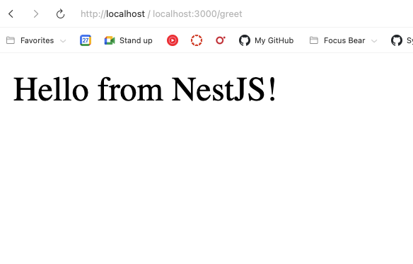

# NestJS Setup Reflection (nestjs-setup.md)

### What files are included in a default NestJS project?

- **main.ts** → Entry point that bootstraps the NestJS app.
- **app.module.ts** → Root module that registers controllers and services.
- **app.controller.ts** → Handles incoming HTTP requests and defines routes.
- **app.service.ts** → Contains business logic used by the controller.
- **app.controller.spec.ts** → Unit test for the controller.
- **package.json, tsconfig.json, nest-cli.json** → Configuration and dependencies.

---

### How does main.ts bootstrap a NestJS application?

- `main.ts` calls `NestFactory.create(AppModule)` to create an application instance.
- It listens on a port (default `3000`).
- This process initializes the dependency injection container, loads modules, and starts the HTTP server.

---

### What is the role of AppModule in the project?

- `AppModule` is the **root module** of the application.
- It brings together controllers, services, and other modules.
- Every NestJS app has at least one module (`AppModule`) as the entry point for the app structure.

---

### How does NestJS structure help with scalability?

- **Modular architecture** → each feature (e.g., Auth, User, Payments) can be placed in its own module.
- **Separation of concerns** → controllers handle routes, services handle business logic, modules organize features.
- **Maintainability** → easy to test, extend, and refactor.
- **Team scalability** → different teams can work on separate modules without interfering with each other.

---

### Screenshots

