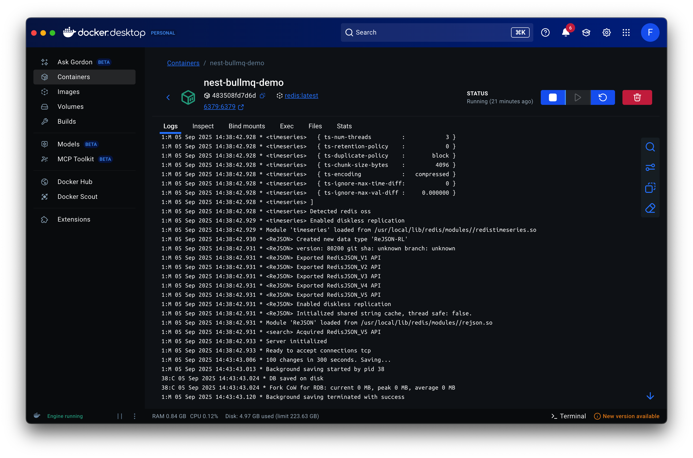
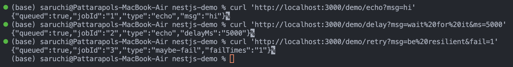
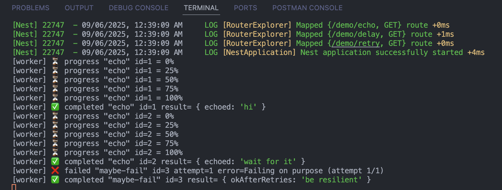

# Background Jobs with BullMQ & Redis (NestJS Demo)

## What we built (high level)

- A **Queue** named `demo` backed by **Redis**.
- A **Producer** that enqueues jobs (fast, non-blocking).
- A **Worker** that processes jobs in the background (with progress, delay, retries).
- Three tiny endpoints to trigger and observe behavior: `/demo/echo`, `/demo/delay`, `/demo/retry`.

---

## 1) Setup

**Install**

```bash
nest new nest-bullmq-demo
cd nest-bullmq-demo
npm i @nestjs/bullmq bullmq ioredis @nestjs/config
```

**.env**

```dotenv
REDIS_HOST=127.0.0.1
REDIS_PORT=6379
```

**Run Redis on Docker Desktop**



---

## 2) App wiring (where’s Redis? which queues exist?)

### `src/app.module.ts`

```ts
import { Module } from "@nestjs/common";
import { ConfigModule, ConfigService } from "@nestjs/config";
import { BullModule } from "@nestjs/bullmq";
import { DemoModule } from "./demo/demo.module";

@Module({
  imports: [
    // Loads .env and makes ConfigService available everywhere
    ConfigModule.forRoot({ isGlobal: true }),

    // One-time BullMQ bootstrap: how to connect to Redis
    BullModule.forRootAsync({
      inject: [ConfigService],
      useFactory: (cfg: ConfigService) => ({
        connection: {
          host: cfg.get("REDIS_HOST", "127.0.0.1"),
          port: parseInt(cfg.get("REDIS_PORT") ?? "6379", 10),
        },
        // prefix: 'bull', // optional Redis key namespace
      }),
    }),

    // Our demo feature module (queue + producer + worker + endpoints)
    DemoModule,
  ],
})
export class AppModule {}
```

**Why this matters**

- `ConfigModule` reads envs so we can configure Redis without hardcoding.
- `BullModule.forRootAsync` creates a single Redis connection BullMQ uses app-wide.

---

## 3) Feature module (declare the queue + hook up providers)

### `src/demo/demo.module.ts`

```ts
import { Module } from "@nestjs/common";
import { BullModule } from "@nestjs/bullmq";
import { DemoController } from "./demo.controller";
import { DemoService } from "./demo.service";
import { DemoProcessor } from "./demo.processor";

@Module({
  imports: [
    // This creates/declares a queue named "demo" in DI
    BullModule.registerQueue({ name: "demo" }),
  ],
  controllers: [DemoController],
  providers: [DemoService, DemoProcessor],
})
export class DemoModule {}
```

**Why this matters**

- Registering the queue by **name** (“demo”) lets you inject it (`@InjectQueue('demo')`) and attach a worker (`@Processor('demo')`).

---

## 4) Producer (enqueue jobs quickly; HTTP stays fast)

### `src/demo/demo.service.ts`

```ts
import { Injectable } from "@nestjs/common";
import { InjectQueue } from "@nestjs/bullmq";
import { Queue } from "bullmq";

@Injectable()
export class DemoService {
  constructor(@InjectQueue("demo") private readonly demoQueue: Queue) {}

  // Basic job (no retries)
  enqueueEcho(message: string) {
    return this.demoQueue.add("echo", { message }, { attempts: 1 });
  }

  // Delayed job (runs after delayMs)
  enqueueDelayed(message: string, delayMs = 5000) {
    return this.demoQueue.add(
      "echo",
      { message },
      { delay: delayMs, attempts: 1 }
    );
  }

  // Intentionally fail N times to demonstrate retries/backoff
  enqueueMaybeFail(message: string, failTimes = 1) {
    return this.demoQueue.add(
      "maybe-fail",
      { message, failTimes },
      {
        attempts: failTimes + 1, // total tries
        backoff: { type: "exponential", delay: 1000 }, // wait between retries
      }
    );
  }
}
```

**Key takeaways**

- `queue.add(name, data, opts)` is the core API to submit work.
- Options like `delay`, `attempts`, `backoff` give you scheduling/retries without custom code.

---

## 5) Worker (do the real work off the request thread)

### `src/demo/demo.processor.ts`

```ts
import { Processor, WorkerHost, OnWorkerEvent } from "@nestjs/bullmq";
import { Job } from "bullmq";

const sleep = (ms: number) => new Promise((res) => setTimeout(res, ms));

@Processor("demo", { concurrency: 5 })
export class DemoProcessor extends WorkerHost {
  // Called for each job pulled from Redis
  async process(job: Job<any, any, string>): Promise<any> {
    if (job.name === "echo") {
      // Simulate work & report progress
      for (let p = 0; p <= 100; p += 25) {
        await sleep(200);
        await job.updateProgress(p);
      }
      return { echoed: job.data.message };
    }

    if (job.name === "maybe-fail") {
      const { message, failTimes } = job.data;
      if (job.attemptsMade < failTimes) {
        throw new Error(
          `Failing on purpose (attempt ${job.attemptsMade + 1}/${failTimes})`
        );
      }
      return { okAfterRetries: message };
    }

    return null;
  }

  @OnWorkerEvent("completed")
  onCompleted(job: Job, result: any) {
    console.log(
      `[worker] ✅ completed "${job.name}" id=${job.id} result=`,
      result
    );
  }

  @OnWorkerEvent("failed")
  onFailed(job: Job | undefined, err: Error) {
    if (!job) return;
    console.log(
      `[worker] ❌ failed "${job.name}" id=${job.id} attempt=${job.attemptsMade} error=${err.message}`
    );
  }

  @OnWorkerEvent("progress")
  onProgress(job: Job, progress: number) {
    console.log(
      `[worker] ⏳ progress "${job.name}" id=${job.id} = ${progress}%`
    );
  }
}
```

**Key takeaways**

- `@Processor('demo')` binds this worker to the `demo` queue.
- Throwing an error marks the job **failed**; if attempts remain, BullMQ will **retry** later.
- You can log **progress**, **completed**, and **failed** events for visibility/metrics.

---

## 6) Tiny endpoints (just to trigger jobs during learning)

### `src/demo/demo.controller.ts`

```ts
import { Controller, Get, Query } from "@nestjs/common";
import { DemoService } from "./demo.service";

@Controller("demo")
export class DemoController {
  constructor(private readonly demo: DemoService) {}

  @Get("echo")
  async echo(@Query("msg") msg = "hello") {
    const job = await this.demo.enqueueEcho(msg);
    return { queued: true, jobId: job.id, type: job.name, msg };
  }

  @Get("delay")
  async delay(@Query("msg") msg = "delayed hello", @Query("ms") ms = "5000") {
    const job = await this.demo.enqueueDelayed(msg, parseInt(ms, 10));
    return { queued: true, jobId: job.id, type: job.name, delayMs: ms };
  }

  @Get("retry")
  async retry(@Query("msg") msg = "retry me", @Query("fail") fail = "1") {
    const job = await this.demo.enqueueMaybeFail(msg, parseInt(fail, 10));
    return { queued: true, jobId: job.id, type: job.name, failTimes: fail };
  }
}
```

**Why these endpoints**

- Keep API surface **minimal** while proving queue behaviors:

  - `/demo/echo` → instant processing + progress
  - `/demo/delay` → scheduling/delays
  - `/demo/retry` → failure + automatic retries/backoff

---

## 7) Run & test

```bash
npm run start:dev
```

```bash
# Watch worker logs in your Nest console
curl 'http://localhost:3000/demo/echo?msg=hi'
curl 'http://localhost:3000/demo/delay?msg=wait&ms=3000'
curl 'http://localhost:3000/demo/retry?msg=resilient&fail=2'
```

---

# Test Command with URL



# Test Output in NestJS Console



---

# Reflection

## Why is BullMQ used instead of handling tasks directly in API requests?

- **Latency**: Heavy work (emails, notifications, analytics) would slow/timeout HTTP requests. Enqueuing returns fast; work runs in the background.
- **Reliability**: Jobs are **durably stored** in Redis. If the app restarts, the work isn’t lost.
- **Retries & Backoff**: Transient failures (network, rate limits) are handled automatically without writing retry loops.
- **Control**: You get **delays**, **scheduling**, **concurrency**, **rate limiting**, and **progress** with a few options.

## How does Redis help manage job queues in BullMQ?

- Redis is the **mailroom**: it persists job payloads and metadata (state = waiting, active, delayed, completed, failed).
- It coordinates **locks** (so a job isn’t processed by two workers at once), **delays**/**scheduling** (sorted sets), and **rate-limiting**.
- Multiple app instances/workers can safely share the same queue because Redis is the single source of truth.

## What happens if a job fails? How can failed jobs be retried?

- If the worker throws, BullMQ marks the job **failed** and increments `attemptsMade`.
- If `attempts` remain, the job is **automatically retried** after the configured **backoff** (fixed or exponential).
- If attempts are exhausted, the job stays in the **failed** set. You can:

  - Re-enqueue a new job, or
  - Programmatically retry a failed job (e.g., via job APIs/UI tools), ideally after fixing the underlying issue.

- Tip: make handlers **idempotent** (safe to run again) because retries can execute the same logical action twice.

## How does Focus Bear use BullMQ for background tasks?

- **Notifications & Reminders**: queue push/email sends so the API remains responsive; use delays/cron for scheduled reminders.
- **Analytics & Aggregations**: process tracking events and rollups asynchronously instead of blocking user requests.
- **Data Syncs / Webhooks**: handle third-party calls (rate-limited, flaky) with retries/backoff to improve reliability.
- **Periodic Jobs**: housekeeping (e.g., cleanups, health checks) as **repeatable** jobs.

**My takeaway:** BullMQ + Redis gives a simple, production-friendly way to offload slow/fragile work. In NestJS, the mental model is clear: **controller/service enqueues**, **worker processes**, **Redis persists & orchestrates**. For real projects, I’d keep workers in a **separate process**, add **observability** (logs/metrics/UI), and make all side-effecting handlers **idempotent**.
