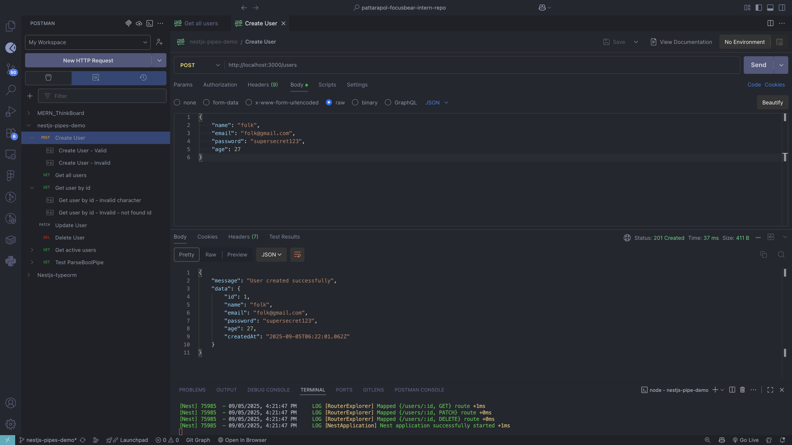
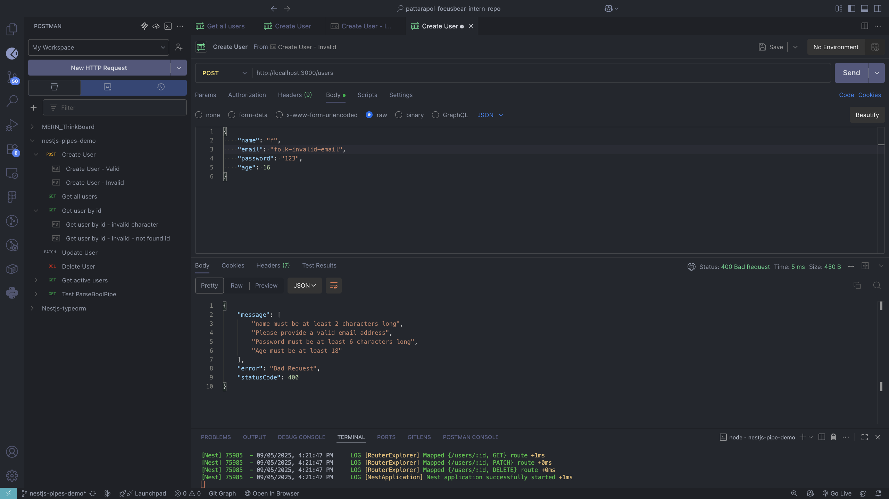
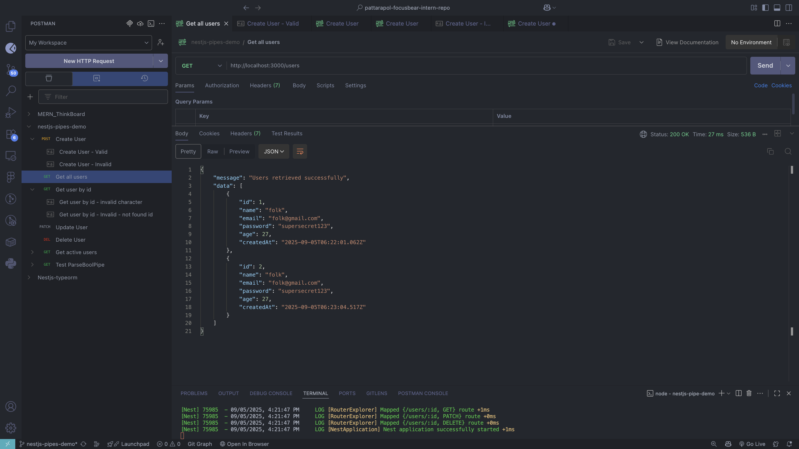
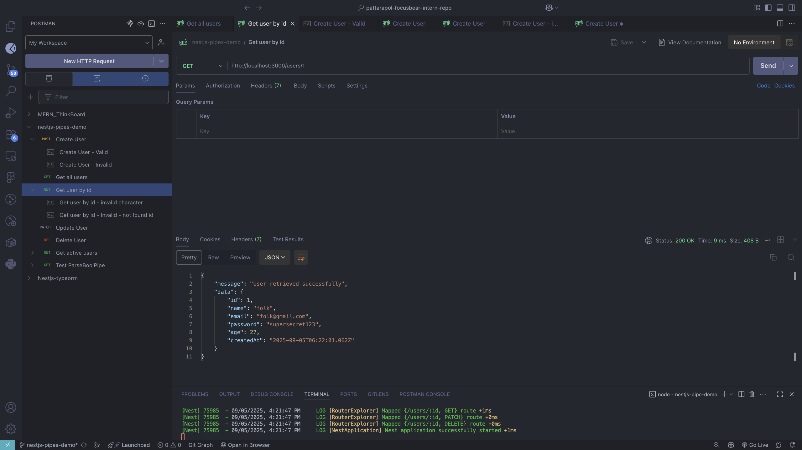
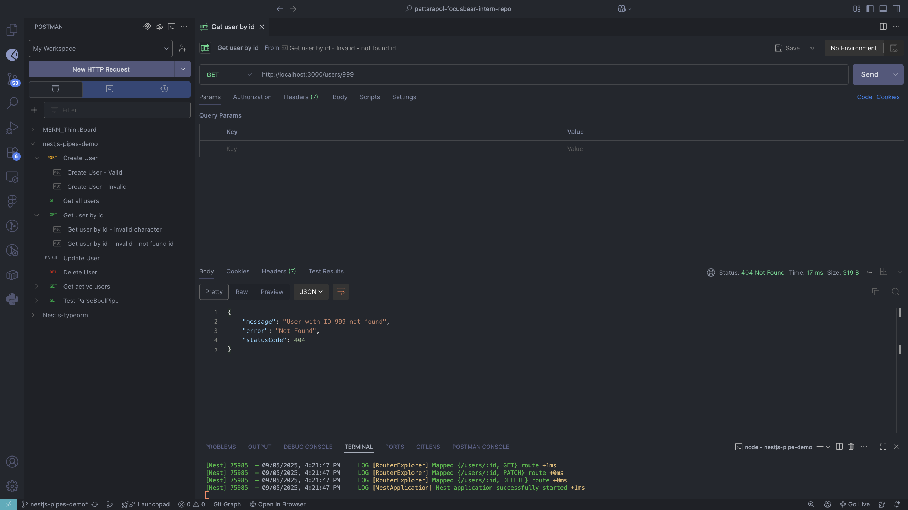
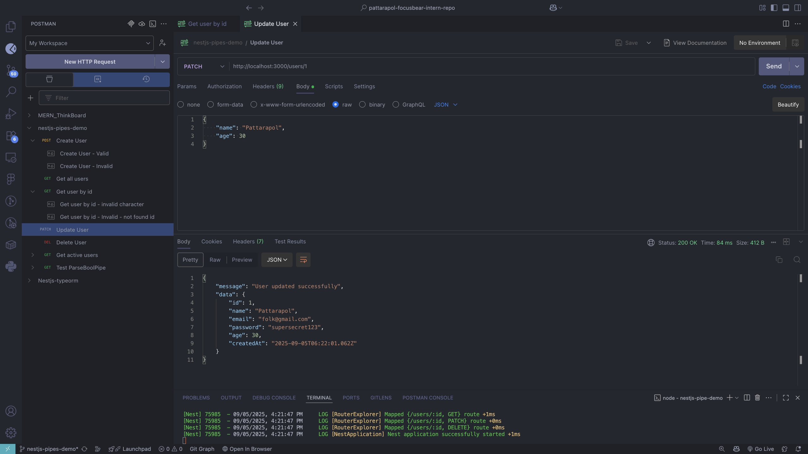
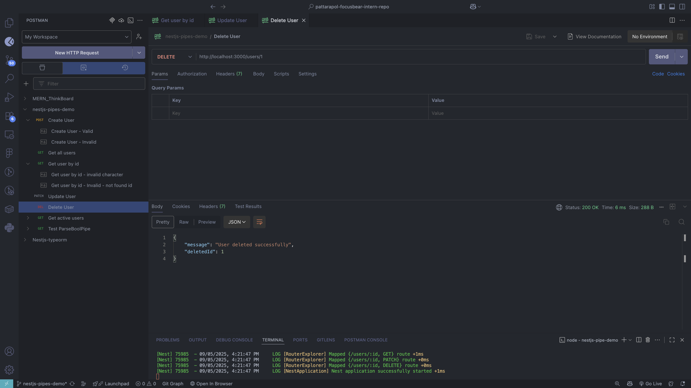

# NestJS Pipes and Validation Demo

## 📋 Project Overview

This project demonstrates the implementation and usage of **pipes** in NestJS for request validation and data transformation. It covers the core concepts of how pipes work in the NestJS request lifecycle to ensure data consistency and security.

### 🎯 Task Requirements Covered

✅ **Research what pipes are in NestJS and how they work**  
✅ **Explore built-in pipes like ValidationPipe and ParseIntPipe**  
✅ **Create a custom DTO (Data Transfer Object) and apply class-validator decorators**  
✅ **Use a global validation pipe to enforce DTO validation across the app**

---

## 🚀 Setup & Installation

```bash
# Clone and navigate to project
cd nestjs-pipe-demo

# Install dependencies
npm install

# Start development server
npm run start:dev
```

The server will run on `http://localhost:3000`

---

## 📁 Project Structure

```
src/
├── main.ts                 # Global ValidationPipe configuration
├── users/
│   ├── dto/
│   │   ├── create-user.dto.ts    # DTO with validation decorators
│   │   └── update-user.dto.ts    # Partial DTO for updates
│   ├── users.controller.ts       # Controller demonstrating pipe usage
│   ├── users.service.ts          # Service with in-memory data storage
│   └── users.module.ts           # Users module
└── app.module.ts                 # Root application module
```

---

## 🔧 Core Implementation

### 1. Global ValidationPipe Setup

In `main.ts`, we configure a global ValidationPipe that applies to all endpoints:

```typescript
import { ValidationPipe } from "@nestjs/common";

async function bootstrap() {
  const app = await NestFactory.create(AppModule);

  // Global ValidationPipe configuration
  app.useGlobalPipes(
    new ValidationPipe({
      whitelist: true, // Strip properties without decorators
      forbidNonWhitelisted: true, // Throw error for extra properties
      transform: true, // Auto-transform payloads to DTO instances
      disableErrorMessages: false, // Show detailed validation errors
    })
  );

  await app.listen(process.env.PORT ?? 3000);
}
```

### 2. DTO with Class-Validator Decorators

Our `CreateUserDto` demonstrates various validation decorators:

```typescript
import {
  IsEmail,
  IsString,
  MinLength,
  IsOptional,
  IsInt,
  Min,
} from "class-validator";

export class CreateUserDto {
  @IsString()
  @MinLength(2, { message: "Name must be at least 2 characters long" })
  name: string;

  @IsEmail({}, { message: "Please provide a valid email address" })
  email: string;

  @IsString()
  @MinLength(6, { message: "Password must be at least 6 characters long" })
  password: string;

  @IsOptional()
  @IsInt()
  @Min(18, { message: "Age must be at least 18" })
  age?: number;
}
```

### 3. Controller with Built-in Pipes

The controller demonstrates different types of pipe usage:

```typescript
@Controller("users")
export class UsersController {
  // ValidationPipe automatically validates CreateUserDto
  @Post()
  create(@Body() createUserDto: CreateUserDto) {
    return {
      message: "User created successfully",
      data: this.usersService.create(createUserDto),
    };
  }

  // ParseIntPipe converts string ID to number
  @Get(":id")
  findOne(@Param("id", ParseIntPipe) id: number) {
    return {
      message: "User retrieved successfully",
      data: this.usersService.findOne(id),
    };
  }

  // Combines both ParseIntPipe and ValidationPipe
  @Patch(":id")
  update(
    @Param("id", ParseIntPipe) id: number,
    @Body() updateUserDto: UpdateUserDto
  ) {
    return {
      message: "User updated successfully",
      data: this.usersService.update(id, updateUserDto),
    };
  }
}
```

---

## 🌐 API Endpoints

| Method   | Endpoint     | Description       | Pipes Used                    |
| -------- | ------------ | ----------------- | ----------------------------- |
| `POST`   | `/users`     | Create a new user | ValidationPipe                |
| `GET`    | `/users`     | Get all users     | None                          |
| `GET`    | `/users/:id` | Get user by ID    | ParseIntPipe                  |
| `PATCH`  | `/users/:id` | Update user       | ParseIntPipe + ValidationPipe |
| `DELETE` | `/users/:id` | Delete user       | ParseIntPipe                  |

---

## 📸 Testing Results

### Create User - Valid Request



**Test:** `POST /users` with valid user data  
**Result:** ✅ Success - User created with ValidationPipe ensuring data integrity

### Create User - Invalid Request



**Test:** `POST /users` with invalid data (short name, invalid email, weak password, underage)  
**Result:** ❌ ValidationPipe catches all validation errors and returns detailed messages

### Get All Users



**Test:** `GET /users` to retrieve all users  
**Result:** ✅ Success - No pipes needed, returns all stored users

### Get User by ID - Valid



**Test:** `GET /users/1` with valid numeric ID  
**Result:** ✅ Success - ParseIntPipe converts "1" to number and finds user

### Get User by ID - Invalid Character


**Test:** `GET /users/abc` with non-numeric ID  
**Result:** ❌ ParseIntPipe validation error - "numeric string is expected"

### Get User by ID - Invalid Not Found



**Test:** `GET /users/999` with non-existent ID  
**Result:** ❌ Service-level error - User not found (pipe worked, but user doesn't exist)

### Update User



**Test:** `PATCH /users/1` updating user name and age  
**Result:** ✅ Success - Both ParseIntPipe and ValidationPipe working together

### Delete User



**Test:** `DELETE /users/1` to remove a user  
**Result:** ✅ Success - ParseIntPipe validates ID parameter

---

## 💭 Reflection

### What is the purpose of pipes in NestJS?

Pipes in NestJS serve two main purposes in the request lifecycle:

1. **Transformation** - Convert input data from one type to another (e.g., string "123" → number 123)
2. **Validation** - Validate input data and throw exceptions for invalid data

Pipes operate **before** your controller method executes, ensuring clean, validated data reaches your business logic. This creates a clear separation of concerns where controllers focus on business logic while pipes handle data validation and transformation.

### How does ValidationPipe improve API security and data integrity?

ValidationPipe acts as a **security gatekeeper** for your API:

- **Prevents malformed data** from reaching your database or business logic
- **Enforces data consistency** by ensuring all inputs follow expected formats
- **Strips unauthorized properties** (whitelist: true) preventing mass assignment attacks
- **Provides clear error messages** helping clients understand what went wrong
- **Auto-transforms data types** ensuring your handlers receive correctly typed data

In our demo, ValidationPipe prevented users with invalid emails, weak passwords, or underage users from being created, maintaining data integrity.

### What is the difference between built-in and custom pipes?

**Built-in Pipes:**

- Pre-implemented by NestJS framework
- Handle common use cases (ValidationPipe, ParseIntPipe, ParseBoolPipe)
- Ready to use out-of-the-box
- Examples in our demo: `ParseIntPipe` (string → number), `ValidationPipe` (DTO validation)

**Custom Pipes:**

- Created by developers for specific business requirements
- Implement the `PipeTransform` interface
- Reusable across different endpoints
- Handle unique transformation or validation logic

### How do decorators like @IsString() and @IsNumber() work with DTOs?

Class-validator decorators work through **metadata reflection**:

1. **Decoration Phase:** Decorators attach validation metadata to DTO properties
2. **Validation Phase:** ValidationPipe reads this metadata and applies corresponding validators
3. **Error Collection:** Multiple validation failures are collected and returned together
4. **Type Safety:** TypeScript ensures compile-time type checking while decorators handle runtime validation

Example from our CreateUserDto:

```typescript
@IsString()                    // Runtime: Ensures value is a string
@MinLength(2, { message: '...' }) // Runtime: Ensures minimum length with custom message
name: string;                  // Compile-time: TypeScript type checking
```

### Custom Pipes Deep Dive

Even though we implemented a simple demo, understanding custom pipes is crucial for real-world applications. Here's how we could add a **CapitalizeNamePipe** to our user system:

#### Implementation Example:

```typescript
import { PipeTransform, Injectable, ArgumentMetadata } from "@nestjs/common";

@Injectable()
export class CapitalizeNamePipe implements PipeTransform {
  transform(value: any, metadata: ArgumentMetadata) {
    if (typeof value === "string") {
      // Convert "john doe" → "John Doe"
      return value
        .toLowerCase()
        .split(" ")
        .map((word) => word.charAt(0).toUpperCase() + word.slice(1))
        .join(" ");
    }
    return value;
  }
}
```

#### Usage in Controller:

```typescript
@Post()
create(@Body('name', CapitalizeNamePipe) name: string, @Body() createUserDto: CreateUserDto) {
  // name is now properly capitalized
  createUserDto.name = name;
  return this.usersService.create(createUserDto);
}
```

#### Benefits of Custom Pipes:

1. **Reusability** - Use across multiple endpoints and parameters
2. **Separation of Concerns** - Keep transformation logic out of controllers
3. **Testability** - Easy to unit test in isolation
4. **Consistency** - Ensure uniform data formatting across your application

#### When to Use Custom Pipes:

- **Data sanitization** (removing unwanted characters, trimming whitespace)
- **Format standardization** (phone numbers, postal codes)
- **Business-specific validation** (checking against external APIs)
- **Complex transformations** that built-in pipes don't handle

---

## 🎯 Key Takeaways

1. **Pipes are essential** for maintaining data integrity and security in NestJS applications
2. **Global ValidationPipe** provides consistent validation across all endpoints
3. **Built-in pipes** handle most common scenarios (validation, parsing)
4. **Custom pipes** extend functionality for specific business requirements
5. **Class-validator decorators** provide declarative, readable validation rules
6. **Proper error handling** improves API usability and debugging

This demo successfully demonstrates how pipes create a robust data validation layer that protects your application while providing clear feedback to API consumers.
