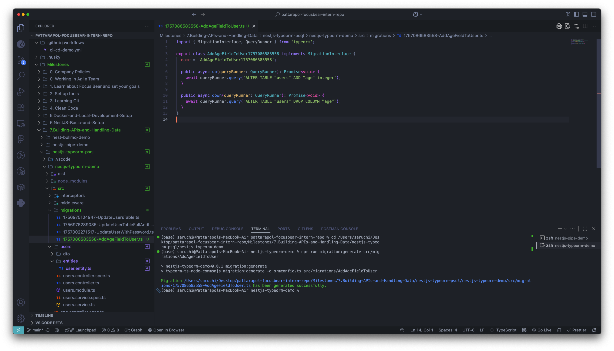

# TypeORM Migrations & Seeding Reflection

## 📋 Task Overview

This task involved learning and implementing database schema management and data seeding using TypeORM migrations in a NestJS application. We successfully:

1. **Created and applied migrations** to manage database schema changes
2. **Implemented database seeding** to populate initial/test data
3. **Tested rollback functionality** to revert database changes
4. **Demonstrated version-controlled database management**

---

## 🛠️ Implementation

### 1. Database Migration System

#### Migration Generation and Application

We added a new `age` field to the User entity and generated a corresponding migration:

**Entity Update (user.entity.ts):**

```typescript
@Entity({ name: "users" })
export class User {
  @PrimaryGeneratedColumn()
  id: number;

  @Column({ unique: true })
  username: string;

  @Column({ nullable: true })
  firstName: string;

  @Column({ nullable: true })
  lastName: string;

  @Column({ nullable: true })
  age: number; // ← New field added

  @Exclude()
  @Column({ nullable: true })
  password: string;
}
```

**Generated Migration (1757086583558-AddAgeFieldToUser.ts):**

```typescript
export class AddAgeFieldToUser1757086583558 implements MigrationInterface {
  name = "AddAgeFieldToUser1757086583558";

  public async up(queryRunner: QueryRunner): Promise<void> {
    await queryRunner.query(`ALTER TABLE "users" ADD "age" integer`);
  }

  public async down(queryRunner: QueryRunner): Promise<void> {
    await queryRunner.query(`ALTER TABLE "users" DROP COLUMN "age"`);
  }
}
```

**Key Commands Used:**

```bash
# Generate migration based on entity changes
npm run migration:generate src/migrations/AddAgeFieldToUser

# Apply pending migrations
npm run migration:run

# Rollback the last migration
npm run migration:revert
```

### 2. Database Seeding System

#### Seeding Service Implementation

We created a comprehensive seeding service to manage sample data:

**DatabaseSeederService (database-seeder.service.ts):**

```typescript
@Injectable()
export class DatabaseSeederService {
  constructor(
    @InjectRepository(User)
    private readonly userRepository: Repository<User>
  ) {}

  async seedUsers(): Promise<void> {
    // Prevent duplicate seeding
    const existingUsers = await this.userRepository.count();

    if (existingUsers > 0) {
      console.log("👥 Users already exist, skipping user seeding...");
      return;
    }

    console.log("🌱 Seeding users...");

    // Sample users data
    const usersData = [
      {
        username: "john_doe",
        firstName: "John",
        lastName: "Doe",
        age: 28,
        password: "password123",
      },
      {
        username: "jane_smith",
        firstName: "Jane",
        lastName: "Smith",
        age: 32,
        password: "password456",
      },
      // ... more sample users
    ];

    // Create and save users
    for (const userData of usersData) {
      const user = this.userRepository.create(userData);
      await this.userRepository.save(user);
      console.log(`✅ Created user: ${userData.username}`);
    }

    console.log("🎉 User seeding completed!");
  }

  async seedAll(): Promise<void> {
    console.log("🚀 Starting database seeding...");
    try {
      await this.seedUsers();
      console.log("✨ All seeding completed successfully!");
    } catch (error) {
      console.error("❌ Seeding failed:", error);
      throw error;
    }
  }

  async clearUsers(): Promise<void> {
    console.log("🧹 Clearing users...");
    await this.userRepository.clear();
    console.log("✅ Users cleared");
  }
}
```

#### CLI Seeding Script

We created a command-line interface for seeding operations:

**Seeding Script (scripts/seed.ts):**

```typescript
import { NestFactory } from "@nestjs/core";
import { AppModule } from "../src/app.module";
import { DatabaseSeederService } from "../src/database/database-seeder.service";

async function bootstrap() {
  console.log("🚀 Starting seeding process...");

  const app = await NestFactory.createApplicationContext(AppModule);
  const seederService = app.get(DatabaseSeederService);

  try {
    const args = process.argv.slice(2);
    const command = args[0] || "seed";

    switch (command) {
      case "seed":
        await seederService.seedAll();
        break;
      case "clear":
        await seederService.clearUsers();
        break;
      case "fresh":
        await seederService.clearUsers();
        await seederService.seedAll();
        break;
      default:
        console.log("Available commands:");
        console.log("  npm run seed        - Seed database with sample data");
        console.log("  npm run seed:clear  - Clear all users");
        console.log("  npm run seed:fresh  - Clear users and seed fresh data");
        break;
    }
  } catch (error) {
    console.error("❌ Seeding failed:", error);
    process.exit(1);
  }

  await app.close();
}

void bootstrap();
```

**Package.json Scripts Added:**

```json
{
  "scripts": {
    "seed": "ts-node scripts/seed.ts seed",
    "seed:clear": "ts-node scripts/seed.ts clear",
    "seed:fresh": "ts-node scripts/seed.ts fresh"
  }
}
```

### 3. Module Configuration

We updated the AppModule to support seeding by importing the User repository:

```typescript
@Module({
  imports: [
    ConfigModule.forRoot({ isGlobal: true }),
    TypeOrmModule.forRootAsync({...}),
    TypeOrmModule.forFeature([User]), // ← Added for seeding support
    UsersModule,
  ],
  controllers: [AppController],
  providers: [AppService, DatabaseSeederService], // ← Added seeder service
})
export class AppModule implements NestModule {
  // ...middleware configuration
}
```

---

## 📸 Screenshot Evidence

### Migration Process

- **Screenshot: user-entity-modified.png** - Shows the User entity with the new `age` field added
  
- **Screenshot: migration-generate.png** - Demonstrates the migration generation command and output
  
- **Screenshot: migration-run-successful.png** - Shows successful migration execution with SQL queries
  

### Seeding Process

- **Screenshot: output-all-seeded-users.png** - Displays successful seeding of 4 sample users
  
- **Screenshot: output-user-after-migration-2nd-time.png** - API response showing users with age field populated
  

### Rollback Process

- **Screenshot: migration-revert-successful.png** - Shows successful migration rollback execution
  
- **Screenshot: output-user-after-revert.png** - API response showing users without age field after rollback
  

---

## 🎓 Reflection Questions

### 1. What is the purpose of database migrations in TypeORM?

Database migrations in TypeORM serve several critical purposes:

- **Version Control for Database Schema**: Migrations provide a systematic way to track and version database schema changes alongside code changes
- **Team Collaboration**: Enable multiple developers to synchronize database schema changes consistently across different environments
- **Environment Consistency**: Ensure development, staging, and production databases maintain identical schemas
- **Automated Deployment**: Allow automated application of schema changes during deployment processes
- **Rollback Capability**: Provide a safe mechanism to revert problematic schema changes
- **Documentation**: Serve as a historical record of all database structure modifications

### 2. How do migrations differ from seeding?

**Migrations** and **Seeding** serve distinctly different purposes:

| Aspect          | Migrations                                      | Seeding                                                 |
| --------------- | ----------------------------------------------- | ------------------------------------------------------- |
| **Purpose**     | Change database structure (schema)              | Add initial data to tables                              |
| **Content**     | DDL operations (CREATE, ALTER, DROP)            | DML operations (INSERT, UPDATE)                         |
| **Timing**      | Applied during deployment/setup                 | Run after schema is ready                               |
| **Frequency**   | One-time per migration                          | Can be run multiple times                               |
| **Environment** | All environments (dev, staging, prod)           | Mainly dev/staging/demo                                 |
| **Rollback**    | Automatic via `down()` method                   | Manual data cleanup required                            |
| **Examples**    | Add columns, create indexes, modify constraints | Create admin users, sample data, configuration settings |

### 3. Why is it important to version-control database schema changes?

Version-controlling database schema changes is crucial for several reasons:

**Team Collaboration & Consistency**:

- Ensures all team members work with identical database schemas
- Prevents "works on my machine" issues related to database structure
- Enables seamless onboarding of new developers

**Deployment Safety**:

- Provides a clear audit trail of all schema modifications
- Enables automated, repeatable deployments across environments
- Reduces human error in manual schema updates

**Change Management**:

- Links database changes directly to code changes that require them
- Allows for code review of database modifications
- Maintains historical context for why changes were made

**Rollback & Recovery**:

- Enables safe rollback of problematic changes
- Provides reference points for troubleshooting schema-related issues
- Supports disaster recovery scenarios

### 4. How can you roll back a migration if an issue occurs?

TypeORM provides several mechanisms for handling migration rollbacks:

**Automatic Rollback via Down Method**:

```bash
# Roll back the last executed migration
npm run migration:revert
```

**Manual Rollback Process**:

1. **Identify the problematic migration** using migration status commands
2. **Review the `down()` method** to understand what will be reverted
3. **Execute the rollback** using TypeORM CLI commands
4. **Verify the rollback** by checking database schema and data integrity
5. **Update entity files** to match the reverted schema

**Best Practices for Safe Rollbacks**:

- **Always backup data** before rolling back migrations that might affect data
- **Test rollbacks** in development/staging environments first
- **Write comprehensive `down()` methods** that properly reverse all `up()` operations
- **Consider data preservation** when rolling back migrations that created columns with data
- **Coordinate with team** before rolling back shared database changes

**Rollback Limitations**:

- **Data loss risk**: Rolling back migrations that created columns will lose data in those columns
- **Dependency issues**: Cannot rollback migrations that other migrations depend on
- **Production considerations**: Rollbacks in production may require maintenance windows

---

## 🚀 Key Learnings & Best Practices

### Migration Best Practices

1. **Always generate migrations** rather than manually creating them
2. **Review generated SQL** before applying migrations to production
3. **Test rollbacks** in development environments before deployment
4. **Keep migrations small and focused** on single logical changes
5. **Backup production data** before applying potentially destructive migrations

### Seeding Best Practices

1. **Check for existing data** before seeding to avoid duplicates
2. **Use environment-specific seeding** (different data for dev vs prod)
3. **Make seeding idempotent** so it can be run multiple times safely
4. **Separate seeding by entity type** for better organization
5. **Include realistic test data** that reflects production scenarios

### Development Workflow

1. **Modify entity** → **Generate migration** → **Apply migration** → **Test changes**
2. **Create seeds** for new entities to facilitate development and testing
3. **Always commit migrations** alongside the code changes that require them
4. **Document breaking changes** that require manual intervention

---

## 📊 Results Achieved

✅ **Successfully implemented** a complete migration and seeding system
✅ **Created 4 sample users** with realistic data for development/testing
✅ **Demonstrated rollback functionality** and its effects on API responses
✅ **Established automated seeding scripts** for consistent development environments
✅ **Documented the complete process** with code examples and screenshots
✅ **Validated functionality** through API testing at each stage

This implementation provides a solid foundation for managing database schema evolution and maintaining consistent development environments across the team.
