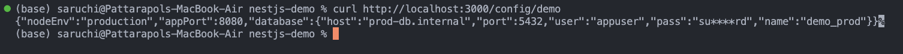

# Implementation of Demo project

1. Create new project and install depedencies

```bash
nest new nestjs-env-config-demo
cd nestjs-env-config-demo
# Install config & validation libs
npm i @nestjs/config joi
```

2. Create multiple .env file

.env.example

```
# App
NODE_ENV=development
APP_PORT=3000

# Database (example)
DB_HOST=localhost
DB_PORT=5432
DB_USER=postgres
DB_PASS=postgres
DB_NAME=demo
```

.env.development

```
NODE_ENV=development
APP_PORT=3000

DB_HOST=localhost
DB_PORT=5432
DB_USER=postgres
DB_PASS=postgres
DB_NAME=demo_dev

```

.env.test

```
NODE_ENV=test
APP_PORT=3001

DB_HOST=localhost
DB_PORT=5432
DB_USER=postgres
DB_PASS=postgres
DB_NAME=demo_test

```

.env.production

```
NODE_ENV=production
APP_PORT=8080

DB_HOST=prod-db.internal
DB_PORT=5432
DB_USER=appuser
DB_PASS=superSecretProdPassword
DB_NAME=demo_prod

```

3. Custom Configuration

```ts
export default () => ({
  nodeEnv: process.env.NODE_ENV ?? "development",
  app: {
    port: parseInt(process.env.APP_PORT ?? "3000", 10),
  },
  db: {
    host: process.env.DB_HOST,
    port: parseInt(process.env.DB_PORT ?? "5432", 10),
    user: process.env.DB_USER,
    pass: process.env.DB_PASS,
    name: process.env.DB_NAME,
  },
});
```

4. Configuration Controller to test

```ts
import { Controller, Get } from "@nestjs/common";
import { ConfigService } from "@nestjs/config";

function mask(value?: string) {
  if (!value) return "";
  if (value.length <= 4) return "****";
  return value.slice(0, 2) + "****" + value.slice(-2);
}

@Controller("config")
export class ConfigController {
  constructor(private readonly config: ConfigService) {}

  @Get("demo")
  demo() {
    const nodeEnv = this.config.get<string>("nodeEnv");
    const port = this.config.get<number>("app.port");

    const dbHost = this.config.get<string>("db.host");
    const dbPort = this.config.get<number>("db.port");
    const dbUser = this.config.get<string>("db.user");
    const dbPass = this.config.get<string>("db.pass");
    const dbName = this.config.get<string>("db.name");

    // Return non-sensitive overview (mask secrets)
    return {
      nodeEnv,
      appPort: port,
      database: {
        host: dbHost,
        port: dbPort,
        user: dbUser,
        pass: mask(dbPass),
        name: dbName,
      },
    };
  }
}
```

5. Config include validation on AppModule

```ts
@Module({
  imports: [
    ConfigModule.forRoot({
      isGlobal: true,
      load: [configuration],
      validationSchema: Joi.object({
        NODE_ENV: Joi.string()
          .valid("development", "production", "test")
          .default("development"),
        APP_PORT: Joi.number().default(3000),
        DB_HOST: Joi.string().required(),
        DB_PORT: Joi.number().default(5432),
        DB_USER: Joi.string().required(),
        DB_PASS: Joi.string().required(),
        DB_NAME: Joi.string().required(),
      }),
      envFilePath: [
        `.env.${process.env.NODE_ENV}.local`,
        `.env.${process.env.NODE_ENV}`,
        `.env.local`,
        `.env`,
      ],
      expandVariables: true,
    }),
  ],
  controllers: [AppController, ConfigController],
  providers: [AppService],
})
export class AppModule {}
```

6. Update .gitignore to ignore .env file

```
node_modules/
.env
.env.*.local
.env.local
```

# Screenshots

## Valid Run

- Successful starting server for all test
  

- `NODE_ENV=development npm run start:dev`
  
- `NODE_ENV=test npm run start:dev`
  
- `NODE_ENV=production npm run start:dev`
  

## Invalid Run

- `NODE_ENV=invalidENV npm run start:dev`
  

## Reflection

### How does @nestjs/config help manage environment variables?

@nestjs/config provides a centralized way to load, access, and organize environment variables in a NestJS app. It supports loading values from .env files, injecting them through ConfigService, and even structuring them into grouped configuration objects. This makes the configuration consistent and easy to manage across different modules.

### Why should secrets (e.g., API keys, database passwords) never be stored in source code?

Secrets must not be stored in code because they can be accidentally exposed through version control, shared repositories, or logs. Keeping them in environment variables (or secret managers) ensures they are separate from the application code, easier to rotate, and safer to manage per environment.

### How can you validate environment variables before the app starts?

Validation can be done with a schema (e.g., using Joi) in ConfigModule.forRoot. This ensures that required variables are present and correctly formatted. If something is missing or invalid, the application will fail fast at startup rather than breaking later during execution.

### How can you separate configuration for different environments (e.g., local vs. production)?

Different .env files can be created (e.g., .env.development, .env.test, .env.production), and loaded based on NODE_ENV. Local overrides (.env.local) can also be used for machine-specific settings. In production, secrets should come from environment variables or secret stores provided by the deployment platform.
