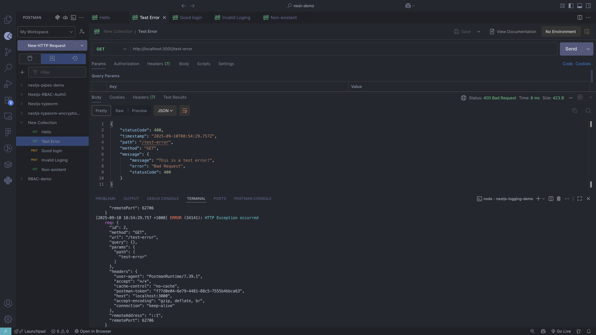

# NestJS Logging & Error Handling Demo

## 📖 Documentation

### Project Overview

This demo project demonstrates structured logging and global error handling in NestJS using `nestjs-pino` for logging and custom exception filters for consistent API error responses. The application includes a mock authentication system to showcase how logging and error handling integrate with real-world scenarios.

### Key Features

- **Structured Logging**: Using `nestjs-pino` with pretty formatting for development
- **Global Exception Handling**: Custom HTTP exception filter for consistent error responses
- **Mock Authentication**: Login endpoint demonstrating logging of successful and failed attempts
- **Test Endpoints**: Dedicated endpoints for testing various scenarios

### Dependencies

```json
{
  "nestjs-pino": "^4.4.0",
  "pino": "^9.9.4",
  "pino-http": "^10.5.0",
  "pino-pretty": "^13.1.1"
}
```

### 1. Pino Logger Configuration

The logging system is configured in `src/app.module.ts`:

```typescript
import { Module } from "@nestjs/common";
import { APP_FILTER } from "@nestjs/core";
import { AppController } from "./app.controller";
import { AppService } from "./app.service";
import { LoggerModule } from "nestjs-pino";
import { HttpExceptionFilter } from "./http-exception.filter";

@Module({
  imports: [
    LoggerModule.forRoot({
      pinoHttp: {
        transport: {
          target: "pino-pretty",
          options: { translateTime: "SYS:standard" },
        },
      },
    }),
  ],
  controllers: [AppController],
  providers: [
    AppService,
    {
      provide: APP_FILTER,
      useClass: HttpExceptionFilter,
    },
  ],
})
export class AppModule {}
```

**Key Configuration Points:**

- `pino-pretty` transport for human-readable logs in development
- `translateTime: 'SYS:standard'` for readable timestamps
- Global registration of the custom exception filter

### 2. Application Bootstrap with Logger

In `src/main.ts`, the Pino logger is integrated as the default NestJS logger:

```typescript
import { NestFactory } from "@nestjs/core";
import { AppModule } from "./app.module";
import { Logger } from "nestjs-pino";

async function bootstrap() {
  const app = await NestFactory.create(AppModule, {
    bufferLogs: true,
  });

  const logger = app.get(Logger);
  app.useLogger(logger);

  await app.listen(process.env.PORT ?? 3000);
}
void bootstrap();
```

**Key Features:**

- `bufferLogs: true` ensures logs are captured during application startup
- Replaces default NestJS logger with Pino logger for consistent formatting

### 3. Custom Exception Filter

The `HttpExceptionFilter` in `src/http-exception.filter.ts` provides consistent error responses:

```typescript
import {
  ExceptionFilter,
  Catch,
  ArgumentsHost,
  HttpException,
  HttpStatus,
} from "@nestjs/common";
import { Request, Response } from "express";
import { PinoLogger } from "nestjs-pino";

@Catch()
export class HttpExceptionFilter implements ExceptionFilter {
  constructor(private readonly logger: PinoLogger) {}

  catch(exception: unknown, host: ArgumentsHost): void {
    const ctx = host.switchToHttp();
    const response = ctx.getResponse<Response>();
    const request = ctx.getRequest<Request>();

    const status =
      exception instanceof HttpException
        ? exception.getStatus()
        : HttpStatus.INTERNAL_SERVER_ERROR;

    const message =
      exception instanceof HttpException
        ? exception.getResponse()
        : "Internal server error";

    // Log the exception
    this.logger.error(
      {
        statusCode: status,
        path: request.url,
        method: request.method,
        message:
          typeof message === "string" ? message : JSON.stringify(message),
        stack: exception instanceof Error ? exception.stack : undefined,
      },
      "HTTP Exception occurred"
    );

    // Send formatted error response
    response.status(status).json({
      statusCode: status,
      timestamp: new Date().toISOString(),
      path: request.url,
      method: request.method,
      message: typeof message === "string" ? message : message,
    });
  }
}
```

**Key Features:**

- Catches all exceptions globally using `@Catch()` decorator
- Logs structured error information including stack traces
- Returns consistent JSON error responses with timestamp and request context

### 4. Controller Implementation with Logging

The `AppController` demonstrates various logging scenarios:

```typescript
import {
  Body,
  Controller,
  Get,
  Post,
  BadRequestException,
} from "@nestjs/common";
import { AppService } from "./app.service";
import { PinoLogger } from "nestjs-pino";
import { LoginDto } from "./login.dto";

@Controller()
export class AppController {
  constructor(
    private readonly appService: AppService,
    private readonly logger: PinoLogger
  ) {}

  @Get()
  getHello(): string {
    this.logger.info("Hello world called!");
    return this.appService.getHello();
  }

  @Post("login")
  login(@Body() body: LoginDto) {
    const username = body.username;
    this.logger.info({ username }, "Login API called");
    return this.appService.mockLogin(body.username, body.password);
  }

  @Get("test-error")
  testError() {
    this.logger.info("Test error endpoint called");
    throw new BadRequestException("This is a test error!");
  }
}
```

### 5. Mock Login Feature with Advanced Logging

The `AppService` includes a comprehensive mock login system:

```typescript
import { BadRequestException, Injectable, Logger } from "@nestjs/common";

@Injectable()
export class AppService {
  private readonly logger = new Logger(AppService.name);

  getHello(): string {
    return "Hello World!";
  }

  mockLogin(username: string, password: string) {
    if (typeof password !== "string") {
      const type = typeof password;
      this.logger.warn(
        {
          passwordType: type,
        },
        `Entered Password is not type of string`
      );
      throw new BadRequestException("Password must be a string");
    }

    if (username === "admin" && password === "password") {
      this.logger.log({ username }, "User login successful");
      return {
        success: true,
        message: "Login successful!",
        username: username,
      };
    } else {
      this.logger.warn({ username }, "Invalid login attempt");
      return "Invalid username or password";
    }
  }
}
```

**Mock Login Logic:**

- **Valid Credentials**: `username: "admin"`, `password: "password"`
- **Type Validation**: Ensures password is a string type
- **Security Logging**: Logs successful logins and failed attempts with structured data
- **Error Handling**: Throws exceptions for invalid data types

### 6. Available Endpoints

| Method | Endpoint      | Description                                  |
| ------ | ------------- | -------------------------------------------- |
| GET    | `/`           | Simple hello world endpoint                  |
| POST   | `/login`      | Mock authentication endpoint                 |
| GET    | `/test-error` | Deliberately throws an exception for testing |

## 🧪 Test Cases

### 1. Hello Endpoint Test


**Test**: GET request to `/` endpoint  
**Result**: Successfully returns "Hello World!" response with proper logging of the request.

### 2. Test Error Endpoint



**Test**: GET request to `/test-error` endpoint  
**Result**: Returns structured error response with 400 status code, timestamp, and request context.


**Console Output**: Shows the custom exception filter logging the error details with structured information including stack trace.

### 3. Valid Login Test


**Test**: POST request to `/login` with valid credentials (`admin`/`password`)  
**Result**: Returns success response with user information and logs successful authentication.

### 4. Invalid Login Test


**Test**: POST request to `/login` with invalid credentials  
**Result**: Returns failure message indicating invalid credentials.


**Console Output**: Shows warning logs for failed login attempts with structured username information for security monitoring.

### 5. Non-Existent Endpoint Test


**Test**: GET request to `/nonexistent` endpoint  
**Result**: Returns 404 error with structured response format from the custom exception filter, demonstrating global error handling for unhandled routes.

## 🤔 Reflection

### Benefits of Using nestjs-pino for Logging

1. **Performance**: Pino is one of the fastest JSON loggers for Node.js, crucial for high-throughput applications like Focus Bear's backend.

2. **Structured Logging**: JSON format makes logs easily searchable and parseable by log aggregation tools (ELK stack, Grafana, etc.).

3. **Contextual Information**: The ability to add structured metadata (`{ username }`, `{ statusCode }`) provides rich context for debugging.

4. **Production Ready**: Unlike console.log, Pino handles log levels, formatting, and can be easily configured for different environments.

### Global Exception Handling Benefits

1. **API Consistency**: All errors follow the same response format, improving client-side error handling predictability.

2. **Centralized Logging**: All exceptions are logged in one place with consistent structure, making monitoring and alerting easier.

3. **Security**: Sensitive error details can be filtered out in production while maintaining detailed logs for developers.

4. **Request Context**: Each error includes request information (method, path, timestamp) for better debugging.

### Logging Interceptor vs Exception Filter

**Logging Interceptor**:

- Executes before and after request processing
- Used for logging successful requests and performance metrics
- Can modify request/response data
- Example: Request duration logging, user activity tracking

**Exception Filter**:

- Only executes when exceptions occur
- Focused on error handling and logging
- Cannot prevent exceptions, only handle them
- Example: Error formatting, error notification systems

In our demo, we use PinoLogger directly in controllers/services for business logic logging, while the exception filter handles error scenarios.

### Structured Logging for Debugging

Our implementation demonstrates several structured logging patterns:

1. **Request Context**: `{ username }` in login attempts
2. **Error Context**: Status codes, request paths, stack traces
3. **Type Information**: `{ passwordType: type }` for validation errors
4. **Consistent Message Format**: Human-readable descriptions with structured data

**Example from our demo**:

```typescript
this.logger.warn(
  {
    username,
    attemptTime: new Date(),
    ipAddress: request.ip,
  },
  "Invalid login attempt"
);
```

This approach enables:

- **Quick Filtering**: Find all failed logins for specific users
- **Pattern Recognition**: Identify brute force attacks or system issues
- **Performance Analysis**: Track response times and error rates
- **Audit Trails**: Maintain detailed logs for compliance and security

### Real-World Application for Focus Bear

In Focus Bear's backend, this logging and error handling pattern would be essential for:

1. **User Authentication Monitoring**: Track login patterns and security threats
2. **API Performance**: Monitor response times and error rates
3. **Feature Usage Analytics**: Log how users interact with productivity features
4. **System Health**: Early detection of issues through structured error logs
5. **Compliance**: Maintain audit trails for data access and modifications

The structured approach demonstrated in this demo provides the foundation for building robust, monitorable, and maintainable backend services.
