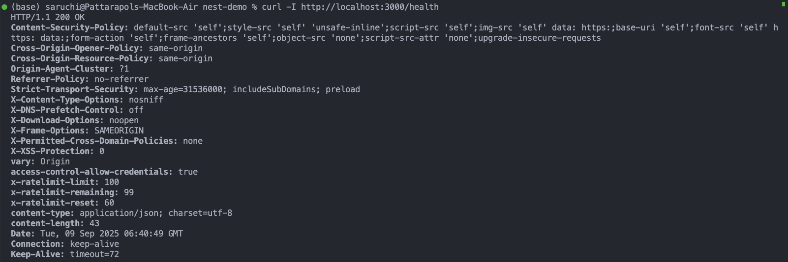
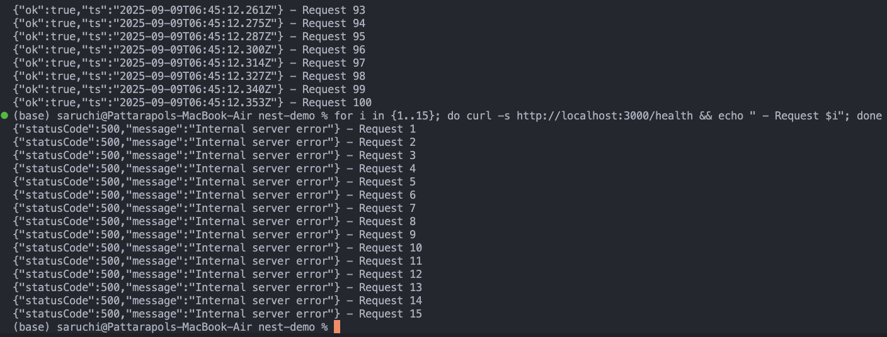
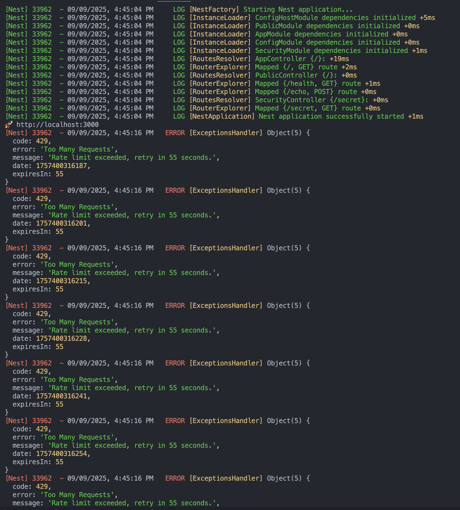
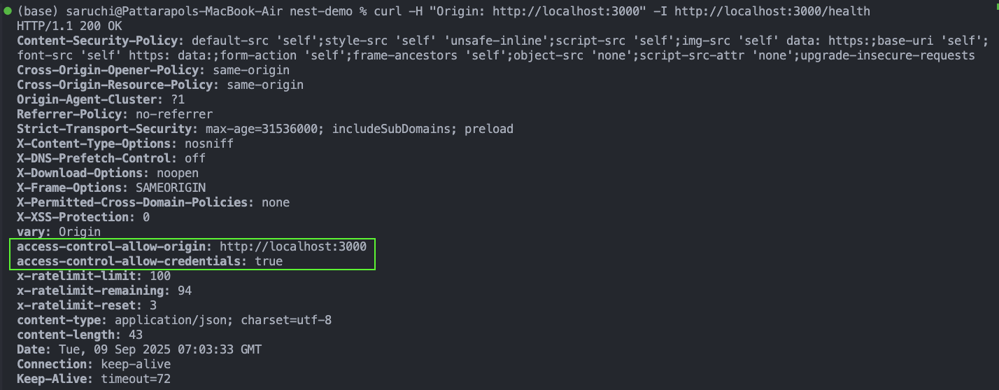
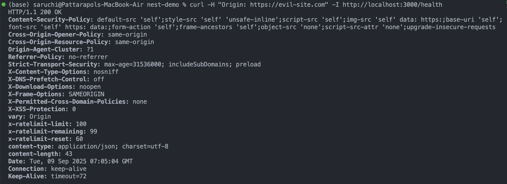
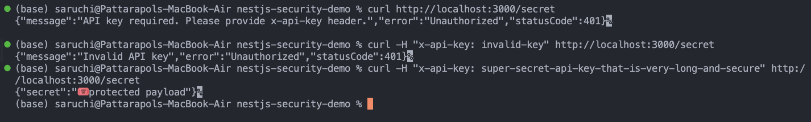
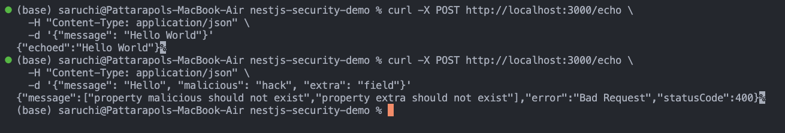

# Security Best Practices in NestJS - Reflection

## 🎯 Project Overview

This NestJS security demo showcases essential security practices for protecting web applications from common vulnerabilities. Built with the Fastify adapter, the project demonstrates multiple layers of security protection including HTTP headers, rate limiting, input validation, CORS protection, and API key authentication.

### Architecture

The application follows a modular structure with two main modules:

- **Public Module**: Exposes `/health` and `/echo` endpoints for general access
- **Security Module**: Provides a protected `/secret` endpoint requiring API key authentication

## 🛡️ Security Features Implementation

### 1. HTTP Security Headers (@fastify/helmet)

**Purpose**: Prevents XSS, clickjacking, and other client-side attacks through secure HTTP headers.

```typescript
await app.register(fastifyHelmet, {
  contentSecurityPolicy: {
    directives: {
      defaultSrc: ["'self'"], // Only load resources from same origin
      styleSrc: ["'self'", "'unsafe-inline'"],
      scriptSrc: ["'self'"], // Block external scripts
      imgSrc: ["'self'", "data:", "https:"],
    },
  },
  hsts: {
    maxAge: 31536000, // 1 year HSTS
    includeSubDomains: true,
    preload: true,
  },
});
```

**Key Headers Implemented**:

- **Content-Security-Policy**: Prevents XSS by controlling resource loading
- **Strict-Transport-Security**: Forces HTTPS connections
- **X-Frame-Options**: Prevents clickjacking attacks
- **X-Content-Type-Options**: Prevents MIME type confusion

### 2. Rate Limiting Protection

**Purpose**: Prevents brute force attacks, DDoS attempts, and API abuse.

```typescript
await app.register(fastifyRateLimit, {
  max: 100, // 100 requests per window
  timeWindow: "1 minute", // Per IP address
  addHeaders: {
    "x-ratelimit-limit": true,
    "x-ratelimit-remaining": true,
    "x-ratelimit-reset": true,
  },
  errorResponseBuilder: function (request, context) {
    return {
      code: 429,
      error: "Too Many Requests",
      message: `Rate limit exceeded, retry in ${Math.round(
        context.ttl / 1000
      )} seconds.`,
    };
  },
});
```

### 3. Input Validation & Sanitization

**Purpose**: Prevents injection attacks and ensures data integrity.

```typescript
// Global validation pipe
app.useGlobalPipes(
  new ValidationPipe({
    whitelist: true, // Remove unknown properties
    forbidNonWhitelisted: true, // Reject requests with extra fields
    transform: true, // Auto-transform data types
  })
);

// DTO with validation
class EchoDto {
  @IsString()
  @Length(1, 200)
  message: string;
}
```

### 4. CORS Protection

**Purpose**: Prevents unauthorized cross-origin requests and CSRF attacks.

```typescript
const corsOrigins = configService.get<string>("CORS_ORIGINS")?.split(",") || [];
app.enableCors({
  origin: (origin, cb) => {
    if (!origin) return cb(null, true); // Allow curl/Postman
    const isAllowed = corsOrigins.includes(origin);
    return cb(null, isAllowed);
  },
  credentials: true,
});
```

### 5. API Key Authentication

**Purpose**: Protects sensitive endpoints with token-based authentication.

```typescript
@Injectable()
export class ApiKeyGuard implements CanActivate {
  constructor(private readonly cfg: ConfigService) {}

  canActivate(context: ExecutionContext): boolean {
    const req = context.switchToHttp().getRequest<FastifyRequest>();
    const provided = req.headers["x-api-key"] as string;
    const expected = this.cfg.get<string>("API_KEY");

    if (!provided) {
      throw new UnauthorizedException(
        "API key required. Please provide x-api-key header."
      );
    }

    if (provided !== expected) {
      throw new UnauthorizedException("Invalid API key");
    }

    return true;
  }
}
```

### 6. Environment Configuration Security

**Purpose**: Validates configuration at startup and enforces security requirements.

```typescript
ConfigModule.forRoot({
  isGlobal: true,
  validationSchema: Joi.object({
    NODE_ENV: Joi.string().valid('development', 'production', 'test'),
    PORT: Joi.number().port().default(3000),
    CORS_ORIGINS: Joi.string()
      .required()
      .pattern(/^https?:\/\/[^,]+(,https?:\/\/[^,]+)*$/),
    API_KEY: Joi.string().min(32).required(),
  }),
}),
```

## 🧪 Security Testing Results

### Test 1: HTTP Security Headers

**Command**: `curl -I http://localhost:3000/health`

**Screenshot**: `HTTP-security-headers.png`


**Results**: Successfully demonstrates all security headers are properly set:

- ✅ Content-Security-Policy protecting against XSS
- ✅ Strict-Transport-Security forcing HTTPS
- ✅ X-Frame-Options preventing clickjacking
- ✅ Rate limit headers showing current limits

**Why it works**: Helmet middleware automatically adds these headers to every response, providing client-side attack protection.

### Test 2: Rate Limiting Protection

**Command**: Multiple rapid requests using loop

**Screenshots**:

- `rate-limit-test-command.png` - Terminal showing 429 errors after limit exceeded
  
- `rate-limit-server-console.png` - Server logs showing rate limit enforcement
  

**Results**: After 100 requests per minute, server correctly returns 429 status with helpful error message including retry time.

**Why it works**: Fastify rate limiting middleware tracks requests per IP address and blocks excessive requests, preventing abuse and DDoS attacks.

### Test 3: CORS Protection

**Commands**:

- `curl -H "Origin: http://localhost:3000" -I http://localhost:3000/health`
- `curl -H "Origin: https://evil-site.com" -I http://localhost:3000/health`

**Screenshots**:

- `cors-test-allow-origin.png` - Shows access-control-allow-origin header for allowed domain
  
- `cors-test-block-origin.png` - Shows missing CORS headers for blocked domain
  

**Results**:

- ✅ Allowed origins receive proper CORS headers
- ✅ Unauthorized origins are denied CORS headers (browser will block)

**Why it works**: CORS middleware validates the Origin header against environment-configured allowed origins, preventing unauthorized cross-origin requests.

### Test 4: API Key Authentication

**Commands**:

- `curl http://localhost:3000/secret` (no key)
- `curl -H "x-api-key: invalid" http://localhost:3000/secret` (wrong key)
- `curl -H "x-api-key: [valid-key]" http://localhost:3000/secret` (correct key)

**Screenshot**: `api-key-authentication-test.png`


**Results**:

- ✅ Missing API key returns 401 with clear error message
- ✅ Invalid API key returns 401 unauthorized
- ✅ Valid API key grants access to protected resource

**Why it works**: Custom guard validates the x-api-key header against environment configuration before allowing access to protected routes.

### Test 5: Input Validation

**Command**: `curl -X POST http://localhost:3000/echo -H "Content-Type: application/json" -d '{"message": "test", "malicious": "extra"}'`

**Screenshot**: `test-input-validation.png`


**Results**: ✅ ValidationPipe correctly rejects unknown properties and returns detailed error message

**Why it works**: Global ValidationPipe with whitelist option strips unknown fields and forbidNonWhitelisted throws errors for extra properties, preventing injection attacks.

## 📝 Reflection Questions

### What are the most common security vulnerabilities in a NestJS backend?

The most critical vulnerabilities include:

1. **Injection Attacks**: SQL injection, NoSQL injection, and command injection through unvalidated user input
2. **Cross-Site Scripting (XSS)**: Malicious scripts executed in browsers through unsanitized output
3. **Cross-Site Request Forgery (CSRF)**: Unauthorized requests made on behalf of authenticated users
4. **Insecure Authentication**: Weak password policies, session management issues, and improper token handling
5. **Security Misconfiguration**: Default configurations, unnecessary services, and verbose error messages
6. **Broken Access Control**: Improper authorization checks allowing unauthorized resource access
7. **Sensitive Data Exposure**: Unencrypted data transmission and storage of sensitive information
8. **Using Components with Known Vulnerabilities**: Outdated dependencies with security flaws

### How does @fastify/helmet improve application security?

@fastify/helmet enhances security by automatically setting crucial HTTP security headers:

1. **Content Security Policy (CSP)**: Prevents XSS attacks by controlling which resources browsers can load. Our implementation blocks external scripts and only allows trusted sources.

2. **HTTP Strict Transport Security (HSTS)**: Forces browsers to use HTTPS connections for one year, preventing SSL stripping attacks and man-in-the-middle vulnerabilities.

3. **X-Frame-Options**: Prevents clickjacking attacks by controlling whether the site can be embedded in frames on other domains.

4. **X-Content-Type-Options**: Prevents MIME type sniffing attacks by ensuring browsers respect declared content types.

5. **Additional Headers**: Includes protections against DNS prefetching, download options, and cross-domain policies.

These headers work at the browser level, providing defense-in-depth security that protects users even if other security measures fail.

### Why is rate limiting important for preventing abuse?

Rate limiting is crucial for several security reasons:

1. **Brute Force Protection**: Prevents attackers from rapidly testing multiple passwords or API keys against authentication endpoints.

2. **DDoS Mitigation**: Limits the number of requests per IP, preventing single sources from overwhelming server resources.

3. **API Abuse Prevention**: Stops automated scraping, data harvesting, and other forms of resource abuse that can impact legitimate users.

4. **Resource Conservation**: Protects server CPU, memory, and bandwidth from being exhausted by malicious or poorly designed clients.

5. **Cost Control**: In cloud environments, prevents unexpected bills from traffic spikes or attacks.

Our implementation provides informative error messages with retry timing, helping legitimate users while deterring attackers.

### How can sensitive configuration values be protected in a production environment?

Several strategies ensure secure configuration management:

1. **Secret Management Services**: Use dedicated services like AWS Secrets Manager, Azure Key Vault, or HashiCorp Vault instead of environment files.

2. **Environment Separation**: Never store production secrets in development or staging environments. Use different keys for each environment.

3. **Configuration Validation**: Implement Joi schemas to validate configuration at startup, ensuring required secrets are present and meet security requirements (minimum length, format).

4. **Access Controls**: Limit access to configuration files and secret management systems to only necessary personnel and services.

5. **Rotation Policies**: Regularly rotate API keys, database passwords, and other sensitive credentials.

6. **Encryption at Rest**: Encrypt configuration files and use encrypted storage for sensitive data.

7. **Audit Logging**: Log access to sensitive configuration values for security monitoring.

8. **Infrastructure as Code**: Use tools like Terraform or Kubernetes secrets to manage configuration declaratively with version control.

Our demo uses Joi validation to enforce a minimum 32-character API key length and proper URL formats for CORS origins, providing a foundation for production security requirements.

## 🚀 Production Recommendations

For production deployment, consider these additional security measures:

1. **Implement comprehensive logging and monitoring**
2. **Use HTTPS with proper SSL/TLS certificates**
3. **Set up intrusion detection systems**
4. **Regular security audits and dependency updates**
5. **Implement proper session management for user authentication**
6. **Add database query parameterization to prevent SQL injection**
7. **Use WAF (Web Application Firewall) for additional protection**
8. **Implement proper error handling that doesn't leak sensitive information**

This security demo provides a solid foundation for building secure NestJS applications that protect against common web vulnerabilities while maintaining good performance and user experience.
