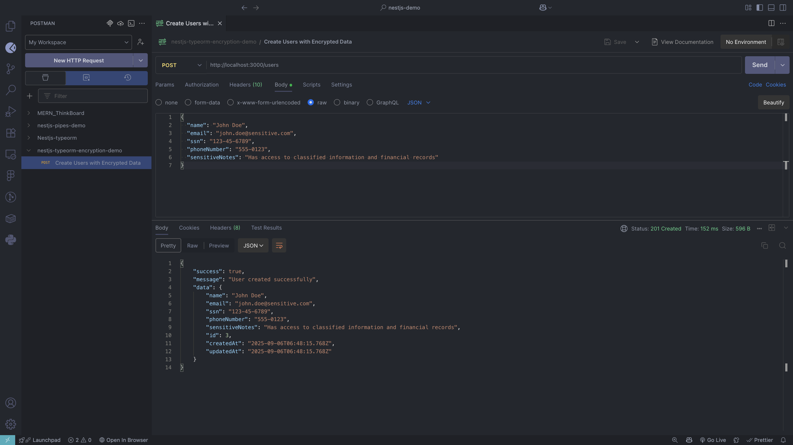

# 🔐 TypeORM-Encrypted Data Encryption Demo

**Project**: NestJS + TypeORM + PostgreSQL Field-Level Encryption  
**Date**: September 7, 2025  
**Objective**: Demonstrate double encryption strategy using typeorm-encrypted for sensitive data protection

---

## 📋 Table of Contents

1. [Project Overview](#-project-overview)
2. [Implementation Details](#-implementation-details)
3. [Test Cases & Screenshots](#-test-cases--screenshots)
4. [Key Findings](#-key-findings)
5. [Reflection](#-reflection)

---

## 🎯 Project Overview

This demo project demonstrates **field-level encryption** using `typeorm-encrypted` in a NestJS application with PostgreSQL. The project showcases how to implement **double encryption** - database-level encryption at rest plus application-level field encryption for sensitive data.

### **Architecture**

```
Client (Postman) ↔ NestJS API ↔ typeorm-encrypted ↔ PostgreSQL Database
                                        ↕
                              AES-256-CBC Encryption
```

### **Key Technologies**

- **NestJS**: Node.js framework for building scalable server-side applications
- **TypeORM**: Object-Relational Mapping library for TypeScript
- **typeorm-encrypted**: Library for transparent field-level encryption
- **PostgreSQL**: Database with encryption at rest
- **Docker**: Containerized database setup

---

## 🏗️ Implementation Details

### **1. Encryption Configuration**

The encryption setup uses AES-256-CBC algorithm with a secure key management approach:

```typescript
// src/entities/user.entity.ts
import { EncryptionTransformer } from "typeorm-encrypted";

// Initialize encryption transformer with environment-based key
const encryptionTransformer = new EncryptionTransformer({
  key: process.env.ENCRYPTION_KEY || "fallback-key...",
  algorithm: "aes-256-cbc",
  ivLength: 16,
});
```

**Security Features:**

- **Algorithm**: AES-256-CBC (Advanced Encryption Standard, 256-bit key)
- **Key Management**: Environment variable storage
- **Initialization Vector**: 16-byte random IV for each encryption operation
- **Fallback Protection**: Secure fallback key for development

### **2. Entity Definition with Selective Encryption**

```typescript
@Entity("users")
export class User {
  @PrimaryGeneratedColumn()
  id: number;

  // ❌ Plain text field - searchable, not sensitive
  @Column({ length: 100 })
  name: string;

  // ✅ Encrypted field - sensitive data
  @Column({
    length: 500, // Increased size for encrypted data
    transformer: encryptionTransformer,
  })
  email: string;

  // ✅ Encrypted field - highly sensitive
  @Column({
    length: 200,
    nullable: true,
    transformer: encryptionTransformer,
  })
  ssn: string;

  // ❌ Plain text field - for performance comparison
  @Column({ length: 50, nullable: true })
  phoneNumber: string;

  // ✅ Encrypted field - confidential notes
  @Column({
    type: "text",
    nullable: true,
    transformer: encryptionTransformer,
  })
  sensitiveNotes: string;

  @CreateDateColumn()
  createdAt: Date;

  @UpdateDateColumn()
  updatedAt: Date;
}
```

### **3. Service Implementation**

```typescript
// src/users/users.service.ts
@Injectable()
export class UsersService {
  constructor(
    @InjectRepository(User)
    private usersRepository: Repository<User>
  ) {}

  // Standard service - encryption/decryption is automatic
  async create(createUserDto: CreateUserDto): Promise<User> {
    const user = this.usersRepository.create(createUserDto);
    return this.usersRepository.save(user); // Encryption happens here
  }

  async findAll(): Promise<User[]> {
    return this.usersRepository.find(); // Decryption happens here
  }

  // Special method to demonstrate raw encrypted values
  async getRawDatabaseValues(): Promise<any[]> {
    const queryRunner =
      this.usersRepository.manager.connection.createQueryRunner();
    const rawResults = await queryRunner.query(
      'SELECT * FROM users ORDER BY "createdAt" DESC'
    );
    await queryRunner.release();
    return rawResults;
  }
}
```

### **4. API Endpoints**

```typescript
// src/users/users.controller.ts
@Controller("users")
export class UsersController {
  @Post()
  async create(@Body() createUserDto: CreateUserDto) {
    // Creates user with automatic encryption of sensitive fields
  }

  @Get()
  async findAll() {
    // Returns users with decrypted data for API consumers
  }

  @Get("raw")
  async getRawDatabaseValues() {
    // Special endpoint to show encrypted database values
  }
}
```

### **5. Docker Configuration**

```yaml
# docker-compose.yml
services:
  postgres:
    image: postgres:15
    environment:
      POSTGRES_DB: encryption_demo
      POSTGRES_USER: demo_user
      POSTGRES_PASSWORD: demo_password
    ports:
      - "5433:5432" # Avoiding conflict with local PostgreSQL
```

### **6. Environment Configuration**

```bash
# .env
# Database Configuration
DB_HOST=localhost
DB_PORT=5433
DB_USERNAME=demo_user
DB_PASSWORD=demo_password
DB_NAME=encryption_demo

# Encryption Key (32-character hex string for AES-256)
ENCRYPTION_KEY=2b5f7c8e9a1d3f6b8c4e7a2d5f8b1c4e7a2d5f8b1c4e7a2d5f8b1c4e7a2d5f8b

# Application
PORT=3000
NODE_ENV=development
```

---

## 🧪 Test Cases & Screenshots

### **Test Case 1: Creating Users with Encrypted Data**

**Endpoint**: `POST /users`  
**Purpose**: Demonstrate user creation with mixed plain/encrypted fields

**Request Body**:

```json
{
  "name": "John Doe",
  "email": "john.doe@sensitive.com",
  "ssn": "123-45-6789",
  "phoneNumber": "555-0123",
  "sensitiveNotes": "Has access to classified information and financial records"
}
```

**Screenshot**: `create-user-encrypted.png`

**Result**: ✅ User created successfully with transparent encryption

---

### **Test Case 2: Viewing Decrypted Data**

**Endpoint**: `GET /users`  
**Purpose**: Show normal API response with decrypted data

**Screenshot**: `view-decrypt-data.png`  

**Key Observations**:

- All fields appear as normal, readable text
- Email: `"john.doe@sensitive.com"` (decrypted automatically)
- SSN: `"123-45-6789"` (decrypted automatically)
- Phone: `"555-0123"` (never encrypted, plain text)
- Notes: Full readable text (decrypted automatically)

---

### **Test Case 3: Viewing Encrypted Database Values**

**Endpoint**: `GET /users/raw`  
**Purpose**: Demonstrate actual encrypted storage in database

**Screenshot**: `view-encrypt-data.png`  


**Key Observations**:

- Name: `"John Doe"` (plain text as expected)
- Email: `"p0ERfqusWBYfYsZcFoUSHVP8oy/fCbmbwiBGq5Y2R5gIIdUs2+BvDM8TkXlH42XT"` (encrypted!)
- SSN: `"dehp75bdVEN2pONnUUluBt8BZMYBV53BOKfh6MKM0GY="` (encrypted!)
- Phone: `"555-0123"` (plain text as expected)
- Notes: `"qIO5nrcfMK3aE10If+H1U9drycMEBOC6TH0H30pCLlKFkK4Tc4GFDw..."` (encrypted!)

---

### **Test Case 4: Side-by-Side Comparison**

**Purpose**: Visual comparison of decrypted vs encrypted data

**Screenshot**: `view-encypt-decrypt-side-by-side.png`  

**Demonstrates**:

- **Left Panel** (Decrypted): Clean, readable data for application use
- **Right Panel** (Encrypted): Scrambled data as stored in database
- **Security Impact**: Even with database access, sensitive data remains protected

---

### **Test Case 5: Individual User Retrieval**

**Endpoint**: `GET /users/1`  
**Purpose**: Verify encryption works for single record operations

**Screenshot**: `view-single-decrypt-data.png`  

**Result**: ✅ Individual user data properly decrypted

---

## 🔍 Key Findings

### **Encryption Field Analysis**

| Field            | Encrypted | Database Storage | API Response | Security Level           |
| ---------------- | --------- | ---------------- | ------------ | ------------------------ |
| `name`           | ❌        | Plain text       | Plain text   | **Low** - Searchable     |
| `email`          | ✅        | Base64 encrypted | Decrypted    | **High** - Protected     |
| `ssn`            | ✅        | Base64 encrypted | Decrypted    | **Critical** - Protected |
| `phoneNumber`    | ❌        | Plain text       | Plain text   | **Low** - Searchable     |
| `sensitiveNotes` | ✅        | Base64 encrypted | Decrypted    | **High** - Protected     |

### **Performance Impact**

**Advantages**:

- Transparent operation - no code changes needed for encryption/decryption
- Selective encryption - only sensitive fields have performance overhead
- Automatic key management through TypeORM transformers

**Trade-offs**:

- Encrypted fields cannot be searched directly in database
- Slightly larger storage requirements for encrypted data
- Encryption/decryption overhead on each database operation

### **Security Benefits Demonstrated**

1. **Defense in Depth**: Database breach doesn't expose sensitive data
2. **Selective Protection**: Performance optimization by encrypting only necessary fields
3. **Transparent Integration**: Application logic remains clean and readable
4. **Key Separation**: Encryption key separate from database credentials

---

## 📝 Reflection

### **Why Does Focus Bear Double Encrypt Sensitive Data?**

The demonstration clearly shows why double encryption (database + application level) provides superior security:

1. **Database Compromise Scenario**: Even if an attacker gains full database access, they only see scrambled text for sensitive fields like emails and SSNs
2. **Layered Security**: Database encryption at rest protects against storage theft, while application-level encryption protects against database breaches
3. **Selective Protection**: Not all data needs encryption - balancing security with performance and searchability
4. **Key Separation**: The application encryption key is separate from database access, adding another security layer

### **How Does typeorm-encrypted Integrate with TypeORM Entities?**

The integration is remarkably seamless:

1. **Transformer Pattern**: Uses TypeORM's transformer feature to automatically encrypt/decrypt during save/load operations
2. **Transparent Operation**: Business logic code remains unchanged - encryption happens at the data layer
3. **Type Safety**: Full TypeScript support with no runtime type changes
4. **Automatic Processing**: No manual encryption calls needed in service or controller layers

### **Best Practices for Securely Managing Encryption Keys**

Based on the implementation:

1. **Environment Variables**: Keys stored outside of source code in environment variables
2. **Key Rotation**: Environment-based storage enables easy key rotation without code changes
3. **Fallback Strategy**: Secure fallback keys for development environments
4. **Production Security**: In production, keys should be stored in dedicated key management services (AWS KMS, Azure Key Vault, etc.)
5. **Access Control**: Limit access to encryption keys to only necessary services and personnel

### **Trade-offs: Database Level vs Application Level Encryption**

**Database Level Encryption**:

- ✅ Protects entire database at rest
- ✅ Transparent to applications
- ❌ Admin users can still read all data
- ❌ No selective field protection

**Application Level Encryption (typeorm-encrypted)**:

- ✅ Selective field protection
- ✅ Protection against database admin access
- ✅ Fine-grained security control
- ❌ Performance overhead for encrypted fields
- ❌ Cannot search encrypted fields directly
- ❌ More complex key management

**Double Encryption Strategy (Best Approach)**:

- ✅ Maximum security - protects against multiple attack vectors
- ✅ Selective application of encryption based on data sensitivity
- ✅ Defense in depth strategy
- ❌ Higher complexity in implementation and key management

---

## 🎯 Conclusion

This demonstration successfully showcased how `typeorm-encrypted` provides robust field-level encryption while maintaining clean application code. The double encryption strategy offers superior protection against various attack scenarios, making it an excellent choice for applications handling sensitive data.

**Key Takeaways**:

- Field-level encryption can be implemented transparently with TypeORM
- Selective encryption balances security needs with performance requirements
- Proper key management is crucial for encryption effectiveness
- Visual comparison clearly shows the security benefits of encrypted vs plain text storage

The screenshots provide clear evidence of the encryption working as intended, demonstrating both the user experience (clean decrypted data) and the security benefits (encrypted database storage).
