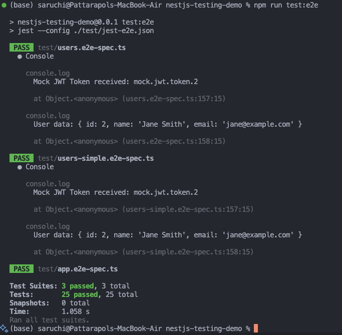

# Using Jest & Supertest for API Testing in NestJS - Task Documentation

## 🎯 Task Overview

This task focused on learning how to write integration tests for API endpoints using Jest and Supertest in NestJS. The goal was to understand how API testing works and implement comprehensive tests covering success cases, validation, error handling, and authentication mocking.

## 📁 Initial Project State

We started with the existing NestJS testing demo project located in:

```
/Milestones/9.Writing-meaningful-automated-tests/nestjs-testing-demo/
```

**Initial structure:**

- Basic NestJS application with AppController and AppService
- Existing unit tests for the application
- Basic E2E test setup with Jest and Supertest
- Package.json with testing scripts already configured

**Key dependencies already present:**

- `@nestjs/testing` - NestJS testing utilities
- `jest` - Testing framework
- `supertest` - HTTP assertion library
- Basic test configuration in `test/jest-e2e.json`

## 🛠️ What We Built

### 1. Users API Module

We created a focused Users module with simple authentication functionality:

#### **User Controller (`src/users/users.controller.ts`)**

```typescript
import { Controller, Post, Get, Body, ValidationPipe } from "@nestjs/common";
import { UsersService } from "./users.service";
import { LoginDto } from "./dto/login.dto";

@Controller("users")
export class UsersController {
  constructor(private readonly usersService: UsersService) {}

  @Get("health")
  getHealth() {
    return { status: "ok", message: "Users service is running" };
  }

  @Post("login")
  login(@Body(ValidationPipe) loginDto: LoginDto) {
    return this.usersService.login(loginDto);
  }
}
```

#### **User Service (`src/users/users.service.ts`)**

```typescript
import { Injectable, UnauthorizedException } from "@nestjs/common";
import { LoginDto } from "./dto/login.dto";
import { User, AuthResponse } from "./interfaces/user.interface";

@Injectable()
export class UsersService {
  // Mock database - in real app this would be a database
  private users: User[] = [
    {
      id: 1,
      name: "John Doe",
      email: "john@example.com",
      password: "password123", // In real app, this would be hashed
    },
    {
      id: 2,
      name: "Jane Smith",
      email: "jane@example.com",
      password: "password456",
    },
  ];

  login(loginDto: LoginDto): AuthResponse {
    const { email, password } = loginDto;

    const user = this.users.find(
      (u) => u.email === email && u.password === password
    );

    if (!user) {
      throw new UnauthorizedException("Invalid email or password");
    }

    // Mock JWT token - in real app, use JwtService
    const token = `mock.jwt.token.${user.id}`;

    return {
      access_token: token,
      user: {
        id: user.id,
        name: user.name,
        email: user.email,
      },
    };
  }
}
```

#### **Login DTO with Validation (`src/users/dto/login.dto.ts`)**

```typescript
import { IsEmail, IsNotEmpty, MinLength } from "class-validator";

export class LoginDto {
  @IsEmail({}, { message: "Please provide a valid email address" })
  @IsNotEmpty({ message: "Email is required" })
  email: string;

  @IsNotEmpty({ message: "Password is required" })
  @MinLength(6, { message: "Password must be at least 6 characters long" })
  password: string;
}
```

### 2. Comprehensive E2E Tests

We created comprehensive API tests in `test/users.e2e-spec.ts`:

#### **Test Setup**

```typescript
import { Test, TestingModule } from '@nestjs/testing';
import { INestApplication, ValidationPipe } from '@nestjs/common';
import request from 'supertest';
import { UsersModule } from '../src/users/users.module';

describe('Users API (e2e) - Simple Demo', () => {
  let app: INestApplication;

  beforeEach(async () => {
    const moduleFixture: TestingModule = await Test.createTestingModule({
      imports: [UsersModule],
    }).compile();

    app = moduleFixture.createNestApplication();

    // Enable validation globally (important for testing DTO validation)
    app.useGlobalPipes(new ValidationPipe());

    await app.init();
  });

  afterEach(async () => {
    await app.close();
  });
```

#### **GET Endpoint Testing**

```typescript
describe("GET /users/health", () => {
  it("should return health status", () => {
    return request(app.getHttpServer())
      .get("/users/health")
      .expect(200)
      .expect((res) => {
        expect(res.body.status).toBe("ok");
        expect(res.body.message).toBe("Users service is running");
      });
  });
});
```

#### **POST Endpoint with Validation Testing**

```typescript
it("should login successfully with valid credentials", () => {
  return request(app.getHttpServer())
    .post("/users/login")
    .send({
      email: "john@example.com",
      password: "password123",
    })
    .expect(201)
    .expect((res) => {
      // Test successful response structure
      expect(res.body).toHaveProperty("access_token");
      expect(res.body).toHaveProperty("user");
      expect(res.body.user).toHaveProperty("id", 1);
      expect(res.body.user).toHaveProperty("name", "John Doe");
      expect(res.body.user).toHaveProperty("email", "john@example.com");
      expect(res.body.user).not.toHaveProperty("password"); // Security check

      // Test mock JWT format
      expect(res.body.access_token).toMatch(/^mock\.jwt\.token\.\d+$/);
    });
});
```

#### **Request Validation Testing**

```typescript
it("should validate missing email", () => {
  return request(app.getHttpServer())
    .post("/users/login")
    .send({
      password: "password123",
    })
    .expect(400)
    .expect((res) => {
      expect(res.body.message).toContain("Email is required");
    });
});

it("should validate invalid email format", () => {
  return request(app.getHttpServer())
    .post("/users/login")
    .send({
      email: "invalid-email-format",
      password: "password123",
    })
    .expect(400)
    .expect((res) => {
      expect(res.body.message).toContain(
        "Please provide a valid email address"
      );
    });
});
```

#### **Authentication Mocking**

```typescript
describe("Authentication Mocking Demo", () => {
  it("should demonstrate how authentication works with mock tokens", async () => {
    // Step 1: Login to get mock JWT token
    const loginResponse = await request(app.getHttpServer())
      .post("/users/login")
      .send({
        email: "jane@example.com",
        password: "password456",
      })
      .expect(201);

    // Step 2: Verify the mock token structure
    const { access_token, user } = loginResponse.body;
    expect(access_token).toBe("mock.jwt.token.2"); // Mock token for user ID 2
    expect(user.name).toBe("Jane Smith");
  });
});
```

## 📊 Test Results & Evidence

### Test Output Screenshot



**Test Summary:**

- **Total Tests:** 25 (across 3 test suites)
- **All Tests Passed:** ✅ 25/25
- **Test Coverage:** GET endpoints, POST endpoints, validation, authentication, error handling
- **Execution Time:** ~1.058s

### Key Test Categories Covered:

1. **GET /users/health** - Basic endpoint testing
2. **POST /users/login** - Authentication and validation testing
3. **Request Validation** - Email format, password requirements, missing fields
4. **Authentication Mocking** - JWT token generation and verification
5. **Error Handling** - Invalid credentials, malformed requests, edge cases

## 🎓 Task Reflection & Learning Outcomes

### What We Accomplished

✅ **Research Supertest Usage:** Learned how Supertest integrates with NestJS for HTTP testing
✅ **GET Endpoint Test:** Implemented simple health check endpoint testing
✅ **POST Endpoint with Validation:** Created comprehensive login endpoint tests with DTO validation
✅ **Mock Authentication:** Demonstrated JWT token mocking for isolated testing

### Key Insights from the Demo Project

#### 1. **How Supertest Helps Test API Endpoints**

Supertest provides a clean, fluent interface for HTTP testing:

- **Direct API calls** without starting a separate server
- **Chainable methods** for readable test code (`.post().send().expect()`)
- **Built-in assertions** for status codes and response validation
- **Integration with Jest** for powerful expectation matching

#### 2. **Difference Between Unit Tests and API Tests**

| Aspect           | Unit Tests                    | API Tests (Integration)               |
| ---------------- | ----------------------------- | ------------------------------------- |
| **Scope**        | Individual functions/classes  | Complete HTTP request/response cycle  |
| **Dependencies** | All mocked                    | Real services, minimal mocking        |
| **Speed**        | Very fast (ms)                | Slower but realistic (hundreds of ms) |
| **Purpose**      | Business logic validation     | End-to-end functionality validation   |
| **Example**      | `usersService.login()` method | `POST /users/login` HTTP endpoint     |

#### 3. **Why Mock Authentication in Integration Tests**

- **Test Independence:** No external auth service dependencies
- **Predictable Results:** Consistent test data and scenarios
- **Performance:** Fast execution without real JWT processing
- **Security:** No real credentials in test code
- **Controlled Scenarios:** Easy to test different user roles and permissions

#### 4. **Structuring Tests for Success and Failure Cases**

Our test structure demonstrates comprehensive coverage:

```
Users API Tests
├── GET /users/health (Success Cases)
├── POST /users/login
│   ├── ✅ Success Cases (Valid credentials)
│   ├── ❌ Authentication Failures (Invalid credentials)
│   ├── ❌ Validation Failures (Missing/invalid fields)
│   └── ❌ Edge Cases (Malformed JSON, wrong methods)
├── Authentication Mocking (JWT token verification)
└── Error Handling (Comprehensive error scenarios)
```

### Real-World Application to Focus Bear

This demo project directly applies to Focus Bear's backend development:

1. **API Endpoint Testing:** Essential for testing Focus Bear's web and mobile API endpoints
2. **Authentication Testing:** Critical for user login, session management, and protected routes
3. **Validation Testing:** Ensures proper input validation for user settings, tasks, and scheduling
4. **Error Handling:** Provides robust error responses for client applications

### Technical Skills Gained

- **Supertest Integration:** Understanding HTTP testing in NestJS applications
- **Jest Configuration:** Setting up E2E test environments
- **DTO Validation Testing:** Testing class-validator decorators in real HTTP requests
- **Mock Strategy:** Implementing authentication mocking without external dependencies
- **Test Organization:** Structuring comprehensive test suites for maintainability

## 🚀 How to Run the Tests

```bash
# Navigate to the project directory
cd /Milestones/9.Writing-meaningful-automated-tests/nestjs-testing-demo/

# Run all E2E tests
npm run test:e2e

# Run with verbose output
npm run test:e2e -- --verbose

# Run with coverage
npm run test:cov
```

This comprehensive API testing implementation provides a solid foundation for testing REST APIs in NestJS applications, ensuring robust, reliable, and well-tested backend services for real-world applications like Focus Bear! 🎉
