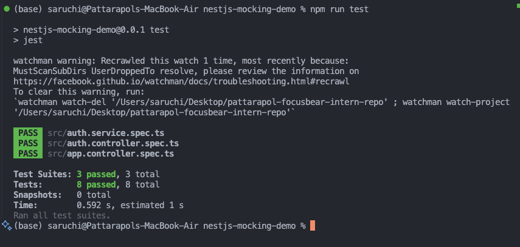

# NestJS Mocking Dependencies & Database Interactions

## 🎯 Task Overview

This document covers the implementation of a NestJS demo project to learn how to mock dependencies and database interactions in unit tests. The goal was to understand mocking patterns essential for Focus Bear's backend testing strategy.

## 📋 Task Requirements Completed

✅ Research how to mock dependencies using jest.mock() and NestJS's @nestjs/testing utilities  
✅ Mock a service inside a controller test  
✅ Mock a database repository (TypeORM Repository) in a service test  
✅ Explore when to use jest.spyOn() vs jest.fn() in mocks

## 🏗️ Project Implementation

### Initial State

Started with a fresh NestJS project using the NestJS CLI. The project was initialized with:

- Basic NestJS structure (`app.module.ts`, `app.controller.ts`, `app.service.ts`)
- Jest testing configuration
- TypeScript setup with strict typing
- ESLint and Prettier configuration

### Architecture Implemented

Created a simple authentication system with the following components:

```
src/
├── auth.controller.ts          # POST /auth/login endpoint
├── auth.controller.spec.ts     # Controller tests (mocks AuthService)
├── auth.service.ts             # Authentication business logic
├── auth.service.spec.ts        # Service tests (mocks dependencies)
├── auth.module.ts              # Module configuration
├── user.entity.ts              # Simple User entity
├── user.repository.ts          # Repository interface for mocking
├── password-hasher.service.ts  # Password validation service
└── profile-client.service.ts   # External API client service
```

## 🧪 Implementation Details

### 1. User Entity and Repository Interface

**User Entity (`user.entity.ts`):**

```typescript
export class User {
  id: number;
  username: string;
  passwordHash: string;

  constructor(id: number, username: string, passwordHash: string) {
    this.id = id;
    this.username = username;
    this.passwordHash = passwordHash;
  }
}
```

**Repository Interface (`user.repository.ts`):**

```typescript
export interface UserRepository {
  findByUsername(username: string): Promise<User | null>;
}

export const USER_REPOSITORY = "USER_REPOSITORY";
```

### 2. Authentication Service with Dependencies

**AuthService (`auth.service.ts`):**

```typescript
@Injectable()
export class AuthService {
  constructor(
    @Inject(USER_REPOSITORY)
    private readonly userRepository: UserRepository,
    private readonly passwordHasher: PasswordHasher,
    private readonly profileClient: ProfileClient
  ) {}

  async login(loginDto: LoginDto): Promise<LoginResult> {
    // Find user
    const user = await this.userRepository.findByUsername(username);
    if (!user) {
      throw new UnauthorizedException("Invalid credentials");
    }

    // Validate password
    const isValidPassword = this.passwordHasher.validatePassword(
      password,
      user.passwordHash
    );
    if (!isValidPassword) {
      throw new UnauthorizedException("Invalid credentials");
    }

    // Fetch profile (external API call)
    const profile = await this.profileClient.fetchUserProfile(user.id);

    return { userId: user.id, username: user.username, profile };
  }
}
```

### 3. Simple Authentication Controller

**AuthController (`auth.controller.ts`):**

```typescript
@Controller("auth")
export class AuthController {
  constructor(private readonly authService: AuthService) {}

  @Post("login")
  async login(@Body() loginDto: LoginDto): Promise<LoginResult> {
    return this.authService.login(loginDto);
  }
}
```

## 🧪 Testing Implementation

### 1. Mocking a Service in Controller Test

**Key Pattern: Mock the service dependency in controller tests**

```typescript
// auth.controller.spec.ts
describe('AuthController', () => {
  let controller: AuthController;
  let mockAuthService: { login: jest.Mock };

  beforeEach(async () => {
    // Create mock AuthService using jest.fn()
    mockAuthService = {
      login: jest.fn(),
    };

    const module: TestingModule = await Test.createTestingModule({
      controllers: [AuthController],
      providers: [
        {
          provide: AuthService,
          useValue: mockAuthService, // Inject mock service
        },
      ],
    }).compile();

    controller = module.get<AuthController>(AuthController);
  });

  it('should return login result on successful authentication', async () => {
    // Arrange
    const expectedResult: LoginResult = {
      userId: 1,
      username: 'john',
      profile: { userId: 1, data: 'profile data' },
    };
    mockAuthService.login.mockResolvedValue(expectedResult);

    // Act
    const result = await controller.login(loginDto);

    // Assert
    expect(result).toEqual(expectedResult);
    expect(mockAuthService.login).toHaveBeenCalledWith(loginDto);
  });
```

### 2. Mocking Database Repository in Service Test

**Key Pattern: Mock repository and external dependencies**

```typescript
// auth.service.spec.ts
describe('AuthService', () => {
  let service: AuthService;
  let mockUserRepository: jest.Mocked<UserRepository>;
  let mockPasswordHasher: jest.Mocked<PasswordHasher>;
  let mockProfileClient: jest.Mocked<ProfileClient>;

  beforeEach(async () => {
    // Create mock implementations using jest.fn()
    mockUserRepository = {
      findByUsername: jest.fn(),
    };

    mockPasswordHasher = {
      validatePassword: jest.fn(),
      hashPassword: jest.fn(),
    };

    mockProfileClient = {
      fetchUserProfile: jest.fn(),
    };

    const module: TestingModule = await Test.createTestingModule({
      providers: [
        AuthService,
        {
          provide: USER_REPOSITORY,
          useValue: mockUserRepository, // Mock repository
        },
        {
          provide: PasswordHasher,
          useValue: mockPasswordHasher, // Mock service
        },
        {
          provide: ProfileClient,
          useValue: mockProfileClient, // Mock external API
        },
      ],
    }).compile();

    service = module.get<AuthService>(AuthService);
  });
```

### 3. jest.fn() vs jest.spyOn() Usage

**jest.fn() - Creating fresh mock functions:**

```typescript
// Most common pattern for mocking dependencies
mockUserRepository = {
  findByUsername: jest.fn(), // Fresh mock function
};

// Usage in tests
mockUserRepository.findByUsername.mockResolvedValue(mockUser);
expect(mockUserRepository.findByUsername).toHaveBeenCalledWith("john");
```

**jest.spyOn() - Spying on existing methods:**

```typescript
// Spy on an existing mock method to track detailed call information
const validatePasswordSpy = jest
  .spyOn(mockPasswordHasher, "validatePassword")
  .mockReturnValue(true);

// Can verify specific call details
expect(validatePasswordSpy).toHaveBeenCalledWith(
  "password123",
  "hashed_password123"
);
expect(validatePasswordSpy).toHaveBeenCalledTimes(1);

// Important: restore the spy after use
validatePasswordSpy.mockRestore();
```

### 4. Comprehensive Test Scenarios

**Happy Path Test:**

```typescript
it("should successfully login with valid credentials", async () => {
  // Arrange
  const mockProfile = { userId: 1, profileData: "test data" };
  mockUserRepository.findByUsername.mockResolvedValue(mockUser);
  mockPasswordHasher.validatePassword.mockReturnValue(true);
  mockProfileClient.fetchUserProfile.mockResolvedValue(mockProfile);

  // Act
  const result = await service.login(loginDto);

  // Assert
  expect(result).toEqual({
    userId: 1,
    username: "john",
    profile: mockProfile,
  });
  expect(mockUserRepository.findByUsername).toHaveBeenCalledWith("john");
  expect(mockPasswordHasher.validatePassword).toHaveBeenCalledWith(
    "password123",
    "hashed_password123"
  );
  expect(mockProfileClient.fetchUserProfile).toHaveBeenCalledWith(1);
});
```

**Error Scenario Tests:**

```typescript
it("should throw UnauthorizedException when user not found", async () => {
  // Arrange
  mockUserRepository.findByUsername.mockResolvedValue(null);

  // Act & Assert
  await expect(service.login(loginDto)).rejects.toThrow(UnauthorizedException);
  expect(mockUserRepository.findByUsername).toHaveBeenCalledWith("john");
  expect(mockPasswordHasher.validatePassword).not.toHaveBeenCalled();
  expect(mockProfileClient.fetchUserProfile).not.toHaveBeenCalled();
});
```

## 📊 Test Results



**Test Execution Summary:**

- ✅ 3 test suites passed
- ✅ 8 tests passed
- ✅ All tests completed in ~0.6 seconds
- ✅ No test failures or errors

The test suite covers:

- `auth.service.spec.ts` - Service unit tests with mocked dependencies
- `auth.controller.spec.ts` - Controller tests with mocked service
- `app.controller.spec.ts` - Default NestJS controller test

## 🎯 Reflection

### Why is mocking important in unit tests?

**Speed and Performance:**
Mocking eliminates external dependencies like database connections, API calls, and file system operations. Our tests run in milliseconds instead of seconds, making them suitable for continuous integration.

**Reliability and Predictability:**
Real dependencies can fail for reasons unrelated to the code being tested (network issues, database downtime, external API changes). Mocks provide consistent, controlled responses that make tests reliable.

**Isolation:**
Each unit test focuses on a single component's logic without being affected by the behavior of its dependencies. This makes it easier to identify the exact source of failures.

**Coverage of Edge Cases:**
Mocks allow us to easily test error scenarios that would be difficult or impossible to reproduce with real dependencies (database timeouts, network failures, specific error responses).

### How do you mock a NestJS provider (e.g., a service in a controller test)?

**NestJS Testing Module Pattern:**

1. Use `Test.createTestingModule()` to create an isolated testing environment
2. Use the `useValue` provider pattern to inject mock implementations
3. Create mock objects with `jest.fn()` for the methods you need to test

```typescript
const module: TestingModule = await Test.createTestingModule({
  controllers: [AuthController],
  providers: [
    {
      provide: AuthService,
      useValue: mockAuthService, // Mock replaces real service
    },
  ],
}).compile();
```

**Key Benefits:**

- NestJS's dependency injection system naturally supports mocking
- Mocks are injected at the provider level, ensuring clean isolation
- The testing module provides the same DI container behavior as production

### What are the benefits of mocking the database instead of using a real one?

**Performance Benefits:**

- Tests run 10-100x faster without database I/O
- No need to set up test databases or reset state between tests
- Parallel test execution without database locking issues

**Predictability Benefits:**

- Complete control over data returned by repository methods
- No flaky tests due to database state inconsistencies
- Deterministic test outcomes regardless of database contents

**Practical Benefits:**

- Tests can run in any environment without database setup
- Easy to test edge cases (empty results, connection errors, specific data scenarios)
- No need for database migrations or test data seeding in unit tests

**Example from our implementation:**

```typescript
// Can easily test "user not found" scenario
mockUserRepository.findByUsername.mockResolvedValue(null);

// Can test successful lookup with specific data
mockUserRepository.findByUsername.mockResolvedValue(mockUser);
```

### How do you decide what to mock vs. what to test directly?

**Mock External Dependencies:**

- Database repositories (UserRepository in our example)
- External APIs (ProfileClient in our example)
- File system operations
- Network calls
- Third-party services

**Test Directly:**

- Pure functions with no dependencies
- Simple data transformations
- Business logic calculations
- Domain model methods

**Decision Framework:**

1. **If it crosses a boundary** (network, file system, database) → Mock it
2. **If it's owned by your team and pure logic** → Test it directly
3. **If it's complex setup** → Mock it for unit tests, test integration separately
4. **If it's unreliable or slow** → Mock it

**Example from our project:**

- ✅ Mock: `UserRepository.findByUsername()` - database call
- ✅ Mock: `ProfileClient.fetchUserProfile()` - external API
- ✅ Test directly: Password validation logic (if it was pure)
- ✅ Test directly: Login result formatting

### Key Learnings Applied to Focus Bear

1. **Service Layer Testing:** Mock repositories to test business logic in isolation
2. **Controller Testing:** Mock services to test HTTP handling and data flow
3. **External API Mocking:** Mock third-party services to prevent external dependencies in tests
4. **Error Scenario Coverage:** Use mocks to easily test error handling paths

This mocking strategy ensures Focus Bear's backend tests are fast, reliable, and comprehensive while maintaining good separation between unit and integration testing concerns.
