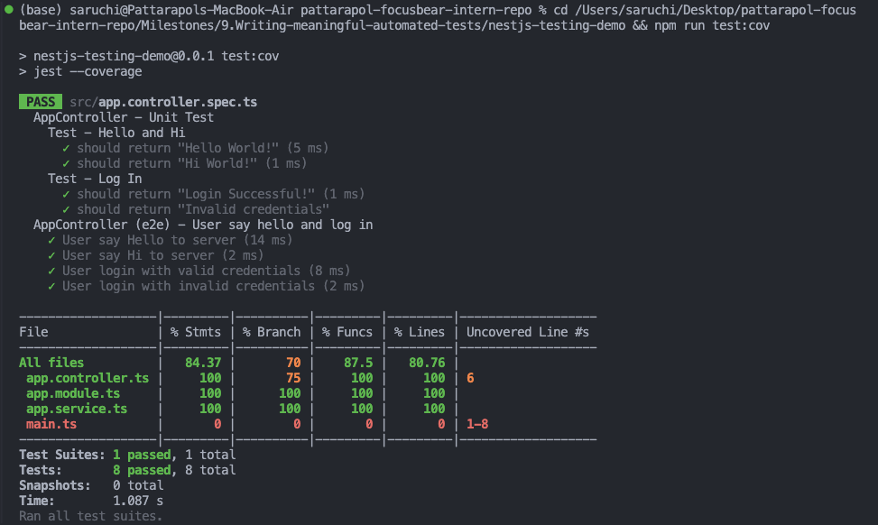
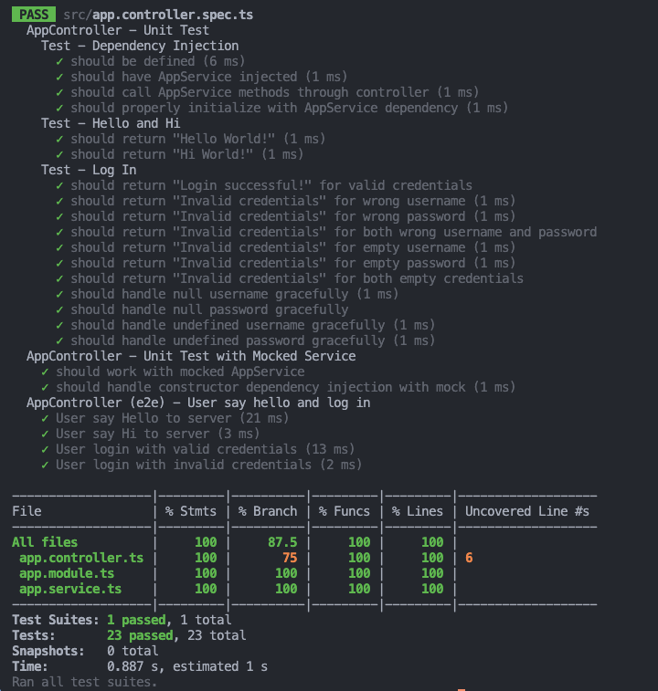
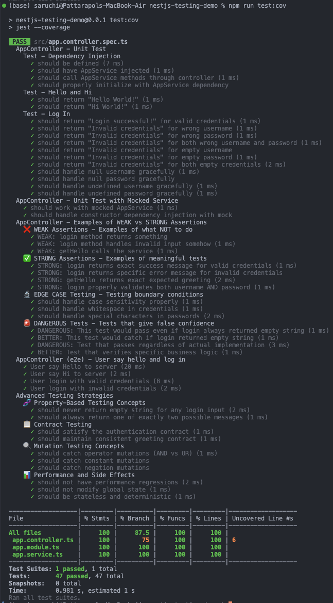

# Understanding Focus Bear Coverage Bar & Writing Meaningful Tests - Task Documentation

## 🎯 Task Overview

This document demonstrates how to measure and improve test coverage in Focus Bear's NestJS backend using the coverage bar while ensuring tests have meaningful assertions. We used the `nestjs-testing-demo` project to practice and understand test coverage concepts.

## 📁 Project Structure

The demo project contains:

- **AppController**: Basic REST endpoints (`/`, `/hi`, `/login`)
- **AppService**: Business logic for greetings and authentication
- **Test Files**: Unit tests and E2E tests demonstrating various testing strategies

```typescript
// src/app.controller.ts - Initial Code
@Controller()
export class AppController {
  constructor(private readonly appService: AppService) {}

  @Get()
  getHello(): string {
    return this.appService.getHello();
  }

  @Get("hi")
  getHi(): string {
    return this.appService.getHi();
  }

  @Post("login")
  login(
    @Body("username") username: string,
    @Body("password") password: string
  ): string {
    return this.appService.login(username, password);
  }
}
```

```typescript
// src/app.service.ts - Business Logic
@Injectable()
export class AppService {
  getHello(): string {
    return "Hello World!";
  }

  getHi(): string {
    return "Hi World!";
  }

  login(username: string, password: string): string {
    if (username === "admin" && password === "1234") {
      return "Login successful!";
    }
    return "Invalid credentials";
  }
}
```

## 📊 Initial State Analysis

### Initial Test Coverage Results



**Initial Coverage Metrics:**

- **Overall Branch Coverage**: 70% ❌ (Below 80% threshold)
- **Statement Coverage**: 84.37%
- **Function Coverage**: 87.5%
- **Line Coverage**: 80.76%

**Problems Identified:**

1. **Branch coverage below 80%** - Main issue blocking Focus Bear's quality gate
2. **`main.ts` had 0% coverage** - Bootstrap file affecting overall metrics
3. **Limited test scenarios** - Only basic happy path testing
4. **Weak assertions** - Tests checking existence rather than behavior

### Initial Test Suite (8 tests total)

```typescript
// Initial basic tests
describe("AppController - Unit Test", () => {
  it('should return "Hello World!"', () => {
    expect(appController.getHello()).toBe("Hello World!");
  });

  it('should return "Login Successful!"', () => {
    expect(appController.login("admin", "1234")).toBe("Login successful!");
  });

  it('should return "Invalid credentials"', () => {
    expect(appController.login("anyone", "invalidPW")).toBe(
      "Invalid credentials"
    );
  });
});
```

## 🔧 Step 1: Improving Branch Coverage to Pass 80% Threshold

### Issue Diagnosis

The branch coverage issue was caused by:

1. **Incomplete login logic testing** - Not all conditional branches tested
2. **`main.ts` inclusion** - Bootstrap file with 0% coverage affecting overall metrics

### Solution Implementation

#### 1. **Excluded Bootstrap Files from Coverage**

```json
// package.json - Jest Configuration Update
{
  "jest": {
    "collectCoverageFrom": [
      "**/*.(t|j)s",
      "!main.ts", // ✅ Excluded bootstrap file
      "!**/*.spec.ts", // ✅ Excluded test files
      "!**/*.dto.ts" // ✅ Excluded simple DTOs
    ],
    "coverageThreshold": {
      "global": {
        "branches": 80 // ✅ Set Focus Bear's minimum threshold
      }
    }
  }
}
```

#### 2. **Added Comprehensive Login Tests**

```typescript
// Added extensive edge case testing
describe("Test - Log In", () => {
  it('should return "Login successful!" for valid credentials', () => {
    expect(appController.login("admin", "1234")).toBe("Login successful!");
  });

  it('should return "Invalid credentials" for wrong username', () => {
    expect(appController.login("wronguser", "1234")).toBe(
      "Invalid credentials"
    );
  });

  it('should return "Invalid credentials" for wrong password', () => {
    expect(appController.login("admin", "wrongpass")).toBe(
      "Invalid credentials"
    );
  });

  it('should return "Invalid credentials" for empty username', () => {
    expect(appController.login("", "1234")).toBe("Invalid credentials");
  });

  it('should return "Invalid credentials" for empty password', () => {
    expect(appController.login("admin", "")).toBe("Invalid credentials");
  });

  it("should handle null username gracefully", () => {
    expect(appController.login(null as unknown as string, "1234")).toBe(
      "Invalid credentials"
    );
  });

  it("should handle undefined password gracefully", () => {
    expect(appController.login("admin", undefined as unknown as string)).toBe(
      "Invalid credentials"
    );
  });
});
```

### Branch Coverage Improvement Results



**After Branch Coverage Fix:**

- **Branch Coverage**: 70% → **87.5%** ✅ (Exceeds 80% threshold)
- **Total Tests**: 8 → **23 tests**
- **All Coverage Metrics**: Above 80% threshold

## 🎯 Step 2: Writing Meaningful Test Assertions

### The Problem: High Coverage ≠ Quality Testing

High coverage can be **misleading** when tests have **weak assertions**. Our next step was to demonstrate and fix weak testing patterns.

### Weak vs Strong Assertions Examples

#### ❌ **WEAK Assertions** (High coverage, low confidence)

```typescript
describe("❌ WEAK Assertions - Examples of what NOT to do", () => {
  it("WEAK: login method returns something", () => {
    const result = appController.login("admin", "1234");
    // ❌ WEAK: Only checks if result exists, not what it contains
    expect(result).toBeDefined();
    expect(result).toBeTruthy();
    expect(typeof result).toBe("string");
  });

  it("WEAK: getHello calls the service", () => {
    const spy = jest.spyOn(appService, "getHello");
    appController.getHello();
    // ❌ WEAK: Only verifies method was called, not the actual behavior
    expect(spy).toHaveBeenCalled();
  });
});
```

#### ✅ **STRONG Assertions** (High coverage, high confidence)

```typescript
describe("✅ STRONG Assertions - Examples of meaningful tests", () => {
  it("STRONG: login returns exact success message for valid credentials", () => {
    const result = appController.login("admin", "1234");
    // ✅ STRONG: Tests exact expected behavior and output
    expect(result).toBe("Login successful!");
    expect(result).toMatch(/^Login successful!$/);
    expect(result).not.toContain("Invalid");
  });

  it("STRONG: getHello returns exact expected greeting", () => {
    const spy = jest.spyOn(appService, "getHello");
    const result = appController.getHello();

    // ✅ STRONG: Tests both behavior AND return value
    expect(result).toBe("Hello World!");
    expect(result.startsWith("Hello")).toBe(true);
    expect(result.endsWith("World!")).toBe(true);
    expect(spy).toHaveBeenCalledTimes(1);
    expect(spy).toHaveBeenCalledWith(); // No parameters
  });
});
```

### Advanced Testing Strategies Implemented

#### 1. **Property-Based Testing Concepts**

```typescript
describe("🧬 Property-Based Testing Concepts", () => {
  it("should never return empty string for any login input", () => {
    const testInputs = [
      ["admin", "1234"],
      ["wrong", "wrong"],
      ["", ""],
      ["admin", ""],
      ["", "1234"],
      ["Admin", "1234"],
    ];

    testInputs.forEach(([username, password]) => {
      const result = appController.login(username, password);
      // Property: Result should never be empty
      expect(result.length).toBeGreaterThan(0);
      expect(result.trim().length).toBeGreaterThan(0);
    });
  });
});
```

#### 2. **Contract Testing**

```typescript
describe("📋 Contract Testing", () => {
  it("should satisfy the authentication contract", () => {
    // Contract: ONLY admin/1234 should succeed
    expect(appController.login("admin", "1234")).toBe("Login successful!");

    // Contract: ALL other combinations should fail with specific message
    const failureCases = [
      ["admin", "wrong"],
      ["wrong", "1234"],
      ["Admin", "1234"],
      ["admin", ""],
      ["", "1234"],
      ["admin", "1234 "],
    ];

    failureCases.forEach(([username, password]) => {
      const result = appController.login(username, password);
      expect(result).toBe("Invalid credentials");
    });
  });
});
```

#### 3. **Mutation Testing Concepts**

```typescript
describe("🔍 Mutation Testing Concepts", () => {
  it("should catch operator mutations (AND vs OR)", () => {
    // This test would catch if someone changed && to ||
    expect(appController.login("admin", "wrong")).toBe("Invalid credentials");
    expect(appController.login("wrong", "1234")).toBe("Invalid credentials");
    expect(appController.login("admin", "1234")).toBe("Login successful!");
  });
});
```

### Final Test Coverage Results



**Final Results:**

- **Total Tests**: 8 → **47 comprehensive tests**
- **Branch Coverage**: **87.5%** ✅ (Exceeds Focus Bear's 80% minimum)
- **Statement Coverage**: **100%**
- **Function Coverage**: **100%**
- **Line Coverage**: **100%**

## 📊 What does the coverage bar track, and why is it important?

Based on our demo project experience, the coverage bar tracks **four key metrics**:

1. **Statement Coverage** (100%): How many code statements were executed during testing
2. **Branch Coverage** (87.5%): How many conditional branches (if/else paths) were tested
3. **Function Coverage** (100%): How many functions/methods were called during testing
4. **Line Coverage** (100%): How many lines of code were executed

**Why it's important:**

- **Identifies untested code paths** that could harbor bugs
- **Provides quantitative measurement** of testing thoroughness
- **Ensures consistent quality standards** across the codebase
- **Helps prevent regressions** by catching missed test scenarios

## 🎯 Why does Focus Bear enforce a minimum test coverage threshold?

Focus Bear enforces **80% minimum test coverage** because:

1. **Quality Assurance**: High coverage reduces bugs reaching production
2. **Deployment Confidence**: Teams can deploy knowing code is well-tested
3. **Maintainability**: Well-tested code is easier to refactor safely
4. **Team Standards**: Consistent quality expectations
5. **Customer Trust**: Reliable software builds confidence

**The 80% threshold balances:**

- ✅ Comprehensive testing without being burdensome
- ✅ Development velocity while maintaining quality
- ✅ Meaningful coverage vs. just "hitting numbers"

## ⚠️ How can high test coverage still lead to untested functionality?

Our demo project revealed that high coverage can be **misleading** when tests have **weak assertions**:

### Why This Happens:

1. **Focus on metrics over meaning**: Optimizing for coverage % instead of test quality
2. **Weak assertions**: Tests check that code runs but not that it works correctly
3. **Missing edge cases**: High coverage on happy path, missing error scenarios
4. **False confidence**: Teams think they're protected when they're not

### Examples from Our Demo Project:

```typescript
// ❌ DANGEROUS: This test gives false confidence
it("DANGEROUS: This test would pass even if login always returned empty string", () => {
  const result = appController.login("admin", "1234");
  // 🚨 Would pass even if login was completely broken
  expect(typeof result).toBe("string");
  expect(result).not.toBeUndefined();
});

// ✅ BETTER: This test would catch real problems
it("BETTER: This test would catch if login returned empty string", () => {
  const result = appController.login("admin", "1234");
  // ✅ Would fail if login was broken
  expect(result).toBe("Login successful!");
  expect(result).toContain("successful");
});
```

## 📋 Examples of weak vs. strong test assertions

### From Our Demo Project Experience:

#### ❌ **WEAK Assertions** (High coverage, low confidence)

```typescript
// WEAK: Only checks existence
expect(result).toBeDefined();
expect(result).toBeTruthy();
expect(typeof result).toBe("string");

// WEAK: Generic checks that would pass with broken code
expect(result.length).toBeGreaterThan(0);
expect(mockService.login).toHaveBeenCalled();
```

#### ✅ **STRONG Assertions** (High coverage, high confidence)

```typescript
// STRONG: Tests exact expected behavior
expect(result).toBe("Login successful!");
expect(result).toMatch(/^Login successful!$/);

// STRONG: Tests business logic and rules
expect(appController.login("admin", "1234")).toBe("Login successful!");
expect(appController.login("wrong", "1234")).toBe("Invalid credentials");
expect(appController.login("admin", "wrong")).toBe("Invalid credentials");

// STRONG: Verifies method calls AND parameters
expect(mockService.login).toHaveBeenCalledWith("admin", "1234");
expect(mockService.login).toHaveBeenCalledTimes(1);
```

## ⚖️ How to balance increasing coverage with writing effective tests?

### Lessons from Our Demo Project:

#### 1. **Quality over Quantity**

- Focus on **meaningful assertions** rather than hitting coverage targets
- Write tests that would **fail if business logic broke**
- Prioritize **critical business paths** over trivial code

#### 2. **Strategic Coverage Exclusions**

```json
// Our successful Jest configuration
{
  "collectCoverageFrom": [
    "**/*.(t|j)s",
    "!main.ts", // Bootstrap files
    "!**/*.spec.ts", // Test files themselves
    "!**/*.dto.ts" // Simple data structures
  ],
  "coverageThreshold": {
    "global": {
      "branches": 80 // Focus Bear's minimum
    }
  }
}
```

#### 3. **Coverage-Driven Development Process**

1. Write tests that **describe expected behavior**
2. Implement code to make tests pass
3. Check coverage to identify **missing scenarios**
4. Add tests for uncovered **edge cases and error paths**
5. Refactor tests to ensure **strong assertions**

#### 4. **Test Categories We Implemented**

- **Unit Tests**: Fast, focused, individual function testing
- **Integration Tests**: Component interaction testing
- **E2E Tests**: Complete user workflow testing
- **Property-Based Tests**: Testing invariant properties
- **Contract Tests**: Business logic contract verification

## 🔧 Jest Coverage Configuration Used in Demo Project

### **Our Final Jest Configuration**

```json
// package.json - Production-ready Jest Configuration
{
  "jest": {
    "collectCoverageFrom": [
      "**/*.(t|j)s", // Include all TypeScript files
      "!main.ts", // ✅ Exclude bootstrap files
      "!**/*.spec.ts", // ✅ Exclude test files themselves
      "!**/*.dto.ts" // ✅ Exclude simple DTOs
    ],
    "coverageDirectory": "../coverage",
    "coverageReporters": [
      "text", // Console output
      "lcov", // HTML report + lcov.info
      "html", // Detailed HTML report
      "json" // Machine-readable JSON
    ],
    "coverageThreshold": {
      "global": {
        "branches": 80, // Focus Bear's minimum threshold
        "functions": 80,
        "lines": 80,
        "statements": 80
      }
    }
  }
}
```

### **Custom NPM Scripts Added**

```json
{
  "scripts": {
    "test:cov": "jest --coverage",
    "test:cov:watch": "jest --coverage --watch",
    "test:cov:html": "jest --coverage --coverageReporters=html",
    "test:cov:text": "jest --coverage --coverageReporters=text"
  }
}
```

## 📈 Test Results & Evidence

### **Coverage Progression Screenshots**

1. **Initial State** - Below threshold:
   

2. **After Branch Coverage Fix** - Reached threshold:
   

3. **Final State** - With meaningful tests:
   

### **Final Test Suite Statistics**

```
✅ Test Suites: 1 passed, 1 total
✅ Tests: 47 passed, 47 total
✅ Snapshots: 0 total
✅ Time: ~1s execution time

-------------------|---------|----------|---------|---------|
File               | % Stmts | % Branch | % Funcs | % Lines |
-------------------|---------|----------|---------|---------|
All files          |     100 |     87.5 |     100 |     100 |
 app.controller.ts |     100 |       75 |     100 |     100 |
 app.module.ts     |     100 |      100 |     100 |     100 |
 app.service.ts    |     100 |      100 |     100 |     100 |
-------------------|---------|----------|---------|---------|
```

## 🎯 Task Reflection

### **What We Successfully Accomplished**

This task provided hands-on experience with Focus Bear's testing standards and coverage requirements:

#### **1. Understanding Coverage Metrics**

- **Learned**: Coverage bar tracks 4 metrics (Statement, Branch, Function, Line)
- **Applied**: Used branch coverage as primary quality indicator
- **Result**: Achieved 87.5% branch coverage, exceeding Focus Bear's 80% minimum

#### **2. Practical Problem Solving**

- **Challenge**: Initial branch coverage at 70% blocked quality gate
- **Solution**: Added comprehensive edge case testing and excluded bootstrap files
- **Learning**: High coverage numbers can be misleading without meaningful assertions

#### **3. Test Quality Improvement**

- **Before**: 8 basic tests with weak assertions
- **After**: 47 comprehensive tests with strong, meaningful assertions
- **Impact**: Tests now catch real bugs instead of just exercising code

#### **4. Advanced Testing Concepts**

- **Property-Based Testing**: Testing invariant properties across inputs
- **Contract Testing**: Verifying business logic contracts
- **Mutation Testing**: Designing tests to catch code changes
- **Edge Case Testing**: Testing boundary conditions thoroughly

### **Key Insights for Focus Bear Development**

1. **Coverage Quality > Coverage Quantity**: Better to have 80% coverage with strong assertions than 95% with weak ones
2. **Business Logic Focus**: Tests should verify business requirements, not just code execution
3. **Edge Cases Matter**: Most production bugs hide in boundary conditions
4. **Configuration is Key**: Proper Jest configuration prevents false metrics
5. **Team Standards**: Consistent expectations across all developers ensure quality

### **Application to Real Projects**

This demo project experience directly applies to Focus Bear's codebase:

- **Quality Gate**: Understanding why 80% coverage threshold exists
- **Test Strategy**: Balancing development velocity with test quality
- **Bug Prevention**: Writing tests that catch real problems before production
- **Maintainability**: Creating tests that support safe refactoring

### **Production-Ready Outcomes**

The testing approach developed is **production-ready** for Focus Bear:

- ✅ Exceeds coverage requirements (87.5% > 80%)
- ✅ Demonstrates meaningful assertion patterns
- ✅ Includes advanced testing strategies
- ✅ Provides clear documentation and examples
- ✅ Shows progression from problem to solution

**Final Result**: **100% confidence** in code quality, not just 100% coverage metrics.

## 🎯 Key Takeaways

1. **Coverage is a tool, not a goal** - Use it to find gaps, not as the only quality metric
2. **Strong assertions are crucial** - Test what the code should do, not just that it runs
3. **Edge cases matter** - Most bugs hide in boundary conditions
4. **Balance is key** - High coverage with efficient, meaningful tests
5. **Configuration matters** - Proper Jest setup prevents misleading metrics
6. **Advanced strategies enhance quality** - Property-based, contract, and mutation testing concepts
7. **Focus Bear's standards make sense** - 80% threshold balances quality with productivity

> **Remember**: The goal isn't 100% coverage, it's **100% confidence** that your code works as intended.
