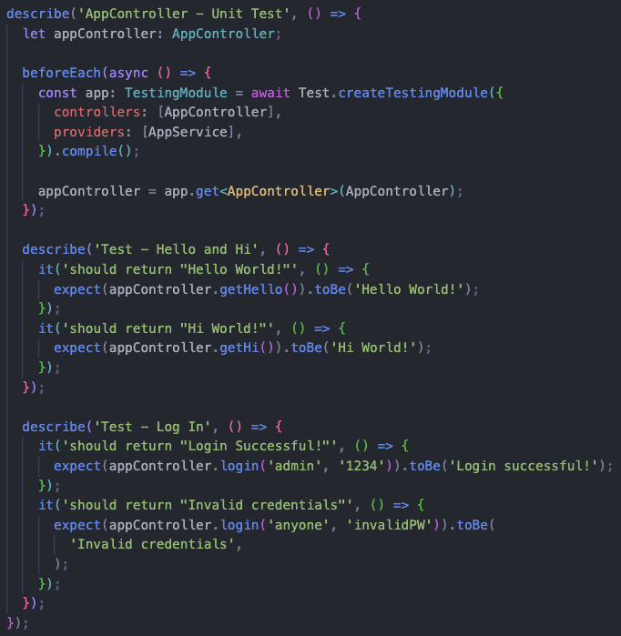
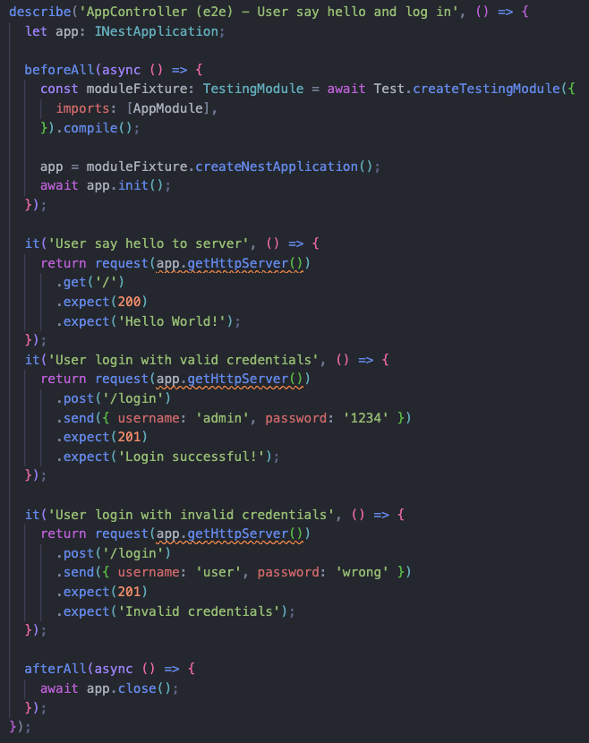
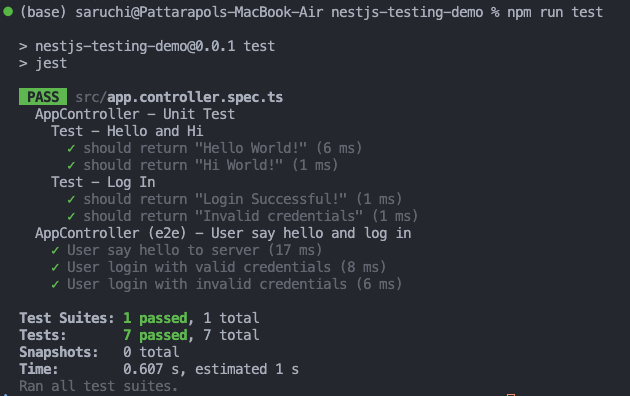

# Introduction to Testing in NestJS - Demo Project Documentation

## 🎯 Goal

Understand the different types of testing in NestJS and how they ensure application stability through practical implementation.

## 📋 Project Overview

This demo project demonstrates **Unit Testing** and **End-to-End (E2E) Testing** in NestJS using Jest and Supertest. The application implements a simple REST API with greeting endpoints and a basic authentication system.

---

## 1. 📖 Documentation: How This Demo Works

### Project Structure

```
nestjs-testing-demo/
├── src/
│   ├── app.controller.ts      # REST API endpoints
│   ├── app.controller.spec.ts # Unit & E2E tests
│   ├── app.service.ts         # Business logic
│   ├── app.module.ts          # Application module
│   └── main.ts               # Application entry point
├── test/                     # E2E test configuration
├── package.json             # Dependencies and scripts
└── README.md
```

### API Endpoints

#### 1. GET `/` - Hello World Endpoint

**Controller Code:**

```typescript
@Get()
getHello(): string {
  return this.appService.getHello();
}
```

**Service Implementation:**

```typescript
getHello(): string {
  return 'Hello World!';
}
```

- **Purpose:** Returns a simple greeting message
- **HTTP Method:** GET
- **Response:** `"Hello World!"`
- **Status Code:** 200

#### 2. GET `/hi` - Alternative Greeting

**Controller Code:**

```typescript
@Get('hi')
getHi(): string {
  return this.appService.getHi();
}
```

**Service Implementation:**

```typescript
getHi(): string {
  return 'Hi World!';
}
```

- **Purpose:** Returns an alternative greeting message
- **HTTP Method:** GET
- **Response:** `"Hi World!"`
- **Status Code:** 200

#### 3. POST `/login` - Authentication Endpoint

**Controller Code:**

```typescript
@Post('login')
login(
  @Body('username') username: string,
  @Body('password') password: string,
): string {
  return this.appService.login(username, password);
}
```

**Service Implementation:**

```typescript
login(username: string, password: string): string {
  if (username === 'admin' && password === '1234') {
    return 'Login successful!';
  }
  return 'Invalid credentials';
}
```

- **Purpose:** Authenticates users with hardcoded credentials
- **HTTP Method:** POST
- **Request Body:** `{ "username": "string", "password": "string" }`
- **Valid Credentials:** username: `"admin"`, password: `"1234"`
- **Success Response:** `"Login successful!"` (Status: 201)
- **Failure Response:** `"Invalid credentials"` (Status: 201)

---

## 2. 🧪 Testing Implementation

### Unit Tests

Unit tests verify individual components in isolation using mocked dependencies.

**Test Setup:**

```typescript
describe('AppController - Unit Test', () => {
  let appController: AppController;

  beforeEach(async () => {
    const app: TestingModule = await Test.createTestingModule({
      controllers: [AppController],
      providers: [AppService],
    }).compile();

    appController = app.get<AppController>(AppController);
  });
```

**Key Features:**

- Uses `@nestjs/testing` TestingModule
- Tests controller methods directly
- Fast execution (no HTTP server)
- Isolated component testing

**Test Cases:**

1. **Greeting Tests:**

   ```typescript
   it('should return "Hello World!"', () => {
     expect(appController.getHello()).toBe("Hello World!");
   });

   it('should return "Hi World!"', () => {
     expect(appController.getHi()).toBe("Hi World!");
   });
   ```

2. **Authentication Tests:**

   ```typescript
   it('should return "Login Successful!"', () => {
     expect(appController.login("admin", "1234")).toBe("Login successful!");
   });

   it('should return "Invalid credentials"', () => {
     expect(appController.login("anyone", "invalidPW")).toBe(
       "Invalid credentials"
     );
   });
   ```

### End-to-End (E2E) Tests

E2E tests verify the complete request-response cycle through HTTP calls.

**Test Setup:**

```typescript
describe('AppController (e2e) - User say hello and log in', () => {
  let app: INestApplication;

  beforeAll(async () => {
    const moduleFixture: TestingModule = await Test.createTestingModule({
      imports: [AppModule],
    }).compile();

    app = moduleFixture.createNestApplication();
    await app.init();
  });

  afterAll(async () => {
    await app.close();
  });
```

**Key Features:**

- Uses Supertest for HTTP testing
- Tests full application stack
- Verifies HTTP status codes and responses
- Simulates real client requests

**Test Cases:**

1. **GET Endpoint Test:**

   ```typescript
   it("User say hello to server", () => {
     return request(app.getHttpServer())
       .get("/")
       .expect(200)
       .expect("Hello World!");
   });
   ```

2. **POST Endpoint Tests:**

   ```typescript
   it("User login with valid credentials", () => {
     return request(app.getHttpServer())
       .post("/login")
       .send({ username: "admin", password: "1234" })
       .expect(201)
       .expect("Login successful!");
   });

   it("User login with invalid credentials", () => {
     return request(app.getHttpServer())
       .post("/login")
       .send({ username: "user", password: "wrong" })
       .expect(201)
       .expect("Invalid credentials");
   });
   ```

### Testing Tools Used

#### Jest

- **Role:** Primary testing framework
- **Features:** Test runner, assertion library, mocking capabilities
- **Configuration:** Built into NestJS by default

#### Supertest

- **Role:** HTTP assertion library
- **Features:** Makes HTTP requests and verifies responses
- **Usage:** E2E testing of REST APIs
- **Import:** `import request from 'supertest';`

#### @nestjs/testing

- **Role:** NestJS testing utilities
- **Features:** TestingModule for dependency injection testing
- **Key Components:**
  - `Test.createTestingModule()` - Creates test module
  - `TestingModule` - Test container for dependency injection
  - `INestApplication` - Application instance for E2E tests

### Code/nestjs-testing-demo/Screenshots

#### Code for unit test with Jest



#### Code for E2E test with Supertest



---

## 3. 📊 Test Results and Output



---

## 4. 🤔 Reflection

### Key Differences Between Testing Types

#### Unit Tests

- **Scope:** Individual components/methods
- **Speed:** Very fast (1-5ms)
- **Dependencies:** Mocked or isolated
- **Purpose:** Verify business logic correctness
- **Example:** Testing `login()` method with different inputs

#### Integration Tests

- **Scope:** Multiple components working together
- **Speed:** Moderate
- **Dependencies:** Real dependencies, limited external services
- **Purpose:** Verify component interactions
- **Note:** Not implemented in this demo, but would test controller-service integration

#### End-to-End (E2E) Tests

- **Scope:** Complete application workflow
- **Speed:** Slower (2-14ms in this demo)
- **Dependencies:** Full application stack
- **Purpose:** Verify user scenarios and HTTP interfaces
- **Example:** Testing complete login flow via HTTP POST

### Why Testing is Important for NestJS Backend

1. **Reliability Assurance**

   - Prevents regressions when adding new features
   - Ensures consistent behavior across different environments
   - Critical for Focus Bear's backend stability

2. **Documentation Through Tests**

   - Tests serve as executable documentation
   - Show expected behavior and usage patterns
   - Help new developers understand the codebase

3. **Confidence in Refactoring**

   - Safe code modifications with test coverage
   - Early detection of breaking changes
   - Faster development cycles

4. **Quality Assurance**
   - Validates business logic correctness
   - Ensures proper error handling
   - Maintains code quality standards

### How NestJS Uses @nestjs/testing to Simplify Testing

1. **Dependency Injection Testing**

   ```typescript
   const app: TestingModule = await Test.createTestingModule({
     controllers: [AppController],
     providers: [AppService],
   }).compile();
   ```

   - Provides TestingModule for DI container setup
   - Allows easy mocking and overriding of providers
   - Maintains the same DI patterns as production code

2. **Application Instance Creation**

   ```typescript
   app = moduleFixture.createNestApplication();
   await app.init();
   ```

   - Creates full NestJS application for E2E testing
   - Handles middleware, guards, and interceptors
   - Provides HTTP server for Supertest integration

3. **Simplified Module Testing**
   - Reuses existing module configuration
   - Supports partial module testing
   - Easy provider replacement for testing scenarios

### Challenges of Writing Tests for NestJS Applications

#### Encountered in This Demo:

1. **Import Configuration Issues**

   - **Problem:** `import * as request from 'supertest'` caused "request is not a function" error
   - **Solution:** Changed to `import request from 'supertest'`
   - **Lesson:** Understanding ES6 module imports is crucial

2. **Route Mapping Conflicts**

   - **Problem:** Multiple `@Get()` decorators caused route conflicts
   - **Solution:** Used specific routes like `@Get('hi')`
   - **Lesson:** Unique route definitions are essential

3. **Request Body Handling**

   - **Problem:** POST endpoint parameters weren't properly decorated
   - **Solution:** Added `@Body('username')` and `@Body('password')` decorators
   - **Lesson:** Proper parameter decorators are required for request data extraction

4. **HTTP Status Code Expectations**
   - **Problem:** Expected 200 for POST requests, but NestJS returns 201
   - **Solution:** Updated tests to expect 201 for POST endpoints
   - **Lesson:** Understanding HTTP standards and NestJS defaults

#### General NestJS Testing Challenges:

1. **Complex Dependency Injection**

   - Mock creation for deeply nested dependencies
   - Provider configuration complexity
   - Circular dependency issues

2. **Database Testing**

   - Test database setup and teardown
   - Data isolation between tests
   - Migration and seeding challenges

3. **Authentication and Authorization**

   - JWT token generation for tests
   - Guard and middleware testing
   - Role-based access control verification

4. **External Service Integration**
   - API mocking and stubbing
   - Network dependency management
   - Environment-specific configurations

### Best Practices Demonstrated

1. **Test Organization**

   - Clear describe blocks for different test types
   - Descriptive test names explaining the scenario
   - Proper setup and teardown procedures

2. **Comprehensive Coverage**

   - Both positive and negative test cases
   - Unit and E2E test combinations
   - Edge case validation

3. **Clean Test Code**
   - DRY principles in test setup
   - Clear assertions and expectations
   - Proper resource cleanup (`afterAll`)

### Recommendations for Scaling

1. **Add Integration Tests**

   - Test service-repository interactions
   - Validate database operations
   - Verify middleware functionality

2. **Implement Test Fixtures**

   - Standardize test data creation
   - Reusable mock objects
   - Database seeding utilities

3. **Coverage Analysis**

   - Use `npm run test:cov` for coverage reports
   - Aim for high coverage on critical paths
   - Identify untested code areas

4. **CI/CD Integration**
   - Automated test execution on commits
   - Prevent deployment of failing tests
   - Performance regression detection

---

## 🚀 Getting Started

### Prerequisites

- Node.js (v14 or higher)
- npm or yarn package manager

### Installation and Running Tests

```bash
# Clone the repository
cd nestjs-testing-demo

# Install dependencies
npm install

# Run all tests
npm run test

# Run tests in watch mode
npm run test:watch

# Run tests with coverage
npm run test:cov

# Run E2E tests specifically
npm run test:e2e
```

### Available Scripts

- `npm run test` - Run all tests once
- `npm run test:watch` - Run tests in watch mode
- `npm run test:cov` - Run tests with coverage report
- `npm run test:e2e` - Run E2E tests only
- `npm start:dev` - Start development server

---

## 📚 Conclusion

This demo successfully demonstrates the fundamentals of testing in NestJS, showcasing both unit and E2E testing approaches. The project highlights the importance of comprehensive testing strategies and provides practical examples of common testing scenarios in NestJS applications.

The combination of Jest and Supertest with NestJS's testing utilities creates a powerful testing ecosystem that ensures application reliability and maintainability - essential qualities for backend services like Focus Bear's platform.
