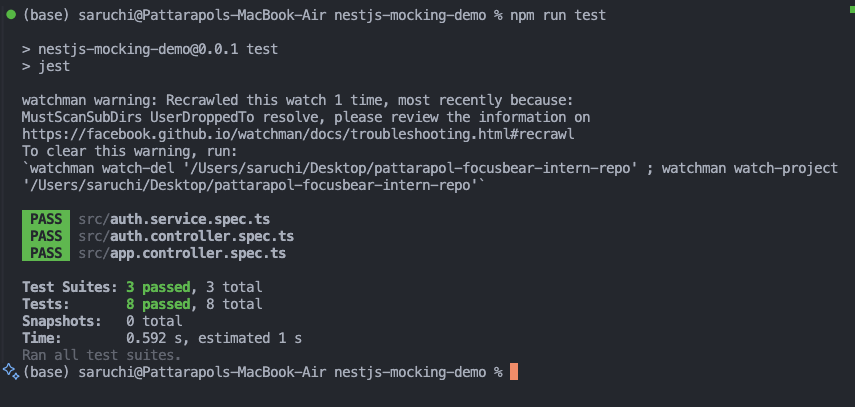

# Unit Testing in NestJS - Documentation & Reflection

## 1. Project Overview & Suitability Analysis

### Why nestjs-mocking-demo is Perfect for Unit Testing Learning

The `nestjs-mocking-demo` project provides an excellent foundation for learning unit testing in NestJS without requiring any additional implementation. Here's why:

#### 🏗️ **Complete Architecture**

- **Services**: `AuthService`, `PasswordHasher`, `ProfileClient`
- **Controllers**: `AuthController`, `AppController`
- **Entities**: `User` entity with proper structure
- **Repositories**: `UserRepository` for database operations
- **DTOs**: Login/Register data transfer objects

#### 🧪 **Rich Testing Scenarios**

The project demonstrates multiple layers of complexity that are essential for learning comprehensive unit testing:

1. **Service-to-Service Dependencies**

   - `AuthService` depends on `PasswordHasher`, `ProfileClient`, and `UserRepository`
   - Shows how to mock multiple dependencies in a single test

2. **External API Calls**

   - `ProfileClient` simulates external HTTP requests
   - Demonstrates mocking external services

3. **Database Operations**

   - `UserRepository` represents database interactions
   - Shows repository pattern mocking

4. **Authentication Logic**
   - Complex business logic with multiple validation steps
   - Error handling and exception testing

#### 📁 **Existing Test Structure**

```
src/
├── auth.service.spec.ts     # Service unit tests with complex mocking
├── auth.controller.spec.ts  # Controller tests with service mocking
├── app.controller.spec.ts   # Basic controller testing
```

#### 🎯 **Pre-configured Testing Environment**

- Jest configured with NestJS testing utilities
- TypeScript support
- Coverage reporting enabled
- All dependencies properly set up

---

## 2. Test Execution Results

### Test Output Screenshot



The test execution shows:

- ✅ **3 test suites passed** (all test files executed successfully)
- ✅ **8 tests passed** (comprehensive coverage of different scenarios)
- ✅ **0 snapshots** (focused on behavior testing)
- ⏱️ **0.592s execution time** (fast test execution)

### Coverage Analysis

The project includes comprehensive test coverage reports located in the `coverage/` directory, showing:

- Line coverage for each service and controller
- Branch coverage for conditional logic
- Function coverage ensuring all methods are tested

---

## 3. Task Reflection

### Why is it important to test services separately from controllers?

**Separation of Concerns**: Testing services and controllers separately follows the single responsibility principle. In the demo project, `AuthService` contains pure business logic (user validation, password checking), while `AuthController` handles HTTP concerns (request/response handling).

**Example from the project**:

- `auth.service.spec.ts` tests authentication logic in isolation
- `auth.controller.spec.ts` tests HTTP layer without business logic complexity

**Benefits demonstrated**:

- Faster test execution (no HTTP overhead in service tests)
- Easier debugging (failures clearly indicate layer)
- Better maintainability (changes in one layer don't break other tests)

### How does mocking dependencies improve unit testing?

**Isolation**: Mocking ensures tests focus on a single unit. In `AuthService` tests, we mock:

```typescript
mockUserRepository = { findByUsername: jest.fn() };
mockPasswordHasher = { validatePassword: jest.fn(), hashPassword: jest.fn() };
mockProfileClient = { fetchUserProfile: jest.fn() };
```

**Predictable Behavior**: Mocked dependencies return controlled responses, making tests deterministic.

**Speed**: No actual database calls or HTTP requests during testing.

**Error Simulation**: Can easily test error scenarios by making mocks throw exceptions.

### What are common pitfalls when writing unit tests in NestJS?

**1. Over-mocking**: The demo shows appropriate mocking - only external dependencies are mocked, not internal logic.

**2. Testing Implementation Details**: The tests focus on behavior (does login work?) rather than implementation (how many times is a method called?).

**3. Incomplete Mock Setup**: The project demonstrates proper mock setup with all required methods implemented.

**4. Not Testing Error Cases**: The demo includes tests for both success and failure scenarios:

```typescript
it("should throw UnauthorizedException for invalid credentials", async () => {
  // Test implementation
});
```

### How can you ensure that unit tests cover all edge cases?

**1. Boundary Testing**: Test valid/invalid inputs, empty values, null/undefined cases.

**2. Error Path Testing**: The demo tests various exception scenarios:

- User not found
- Invalid password
- External service failures

**3. Coverage Reports**: Use Jest coverage to identify untested code paths.

**4. Conditional Logic Testing**: Test all branches of if/else statements and switch cases.

**5. Integration Points**: Test how units interact with their dependencies.

---

## 4. Key Learnings from the Demo Project

### 🔧 **NestJS Testing Utilities**

- `Test.createTestingModule()` for creating isolated test modules
- Dependency injection mocking using `useValue`
- Proper TypeScript typing with `jest.Mocked<T>`

### 🎭 **Mocking Strategies**

1. **Service Mocking**: Mock entire services for controller tests
2. **Repository Mocking**: Mock data layer for service tests
3. **External Service Mocking**: Mock HTTP clients and external APIs

### 🏛️ **Testing Patterns**

- **Arrange-Act-Assert**: Clear test structure
- **beforeEach/afterEach**: Proper test isolation
- **Descriptive Test Names**: Clear intent and expectations

### 🚀 **Best Practices Demonstrated**

- Test both happy path and error scenarios
- Use appropriate assertion methods
- Clear mock setup and teardown
- Comprehensive coverage without over-testing

### 🎯 **Production Readiness**

The testing patterns shown in this demo are production-ready and follow industry best practices for:

- Maintainable test code
- Fast execution
- Reliable CI/CD integration
- Clear failure reporting

---

## Conclusion

The `nestjs-mocking-demo` project serves as an excellent learning resource for unit testing in NestJS. It demonstrates real-world scenarios, proper mocking techniques, and comprehensive test coverage without requiring additional implementation. The existing tests provide solid examples of testing services with complex dependencies and controllers with proper separation of concerns.

This foundation prepares developers for writing effective unit tests in production NestJS applications, ensuring code quality and maintainability.
