# Unit Testing with Jest - Documentation and Reflection #74

## 📖 Overview

This document covers the implementation of unit testing using Jest in a React TypeScript project. The goal was to learn the basics of unit testing, set up Jest, write simple tests, and understand the importance of automated testing in software development.

## 🛠️ What We Accomplished

### 1. Project Setup

We created a React project with Vite and TypeScript that includes:

- **Jest** for testing framework
- **ts-jest** for TypeScript support
- **@types/jest** for TypeScript definitions

### 2. Dependencies and Configuration

**Key Dependencies Added:**

```json
{
  "devDependencies": {
    "@types/jest": "^30.0.0",
    "jest": "^30.1.3",
    "ts-jest": "^29.4.1"
  }
}
```

**Jest Configuration (`jest.config.js`):**

```javascript
import { createDefaultPreset } from "ts-jest";

const tsJestTransformCfg = createDefaultPreset().transform;

/** @type {import("jest").Config} **/
export default {
  testEnvironment: "node",
  transform: {
    ...tsJestTransformCfg,
  },
};
```

**Note:** We encountered and resolved an ES module compatibility issue where the Jest config needed to use `import` syntax instead of `require()` due to the project being configured as an ES module with `"type": "module"` in package.json.

### 3. Implementation Details

#### Math Utility Function (`src/utils/math.ts`)

We created a simple utility function to demonstrate unit testing:

```typescript
export function add(a: number, b: number): number {
  return a + b;
}
```

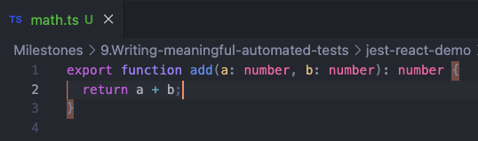

#### Unit Tests (`src/__test__/math.test.ts`)

We wrote comprehensive tests for the utility function:

```typescript
import { add } from "../utils/math";

describe("add", () => {
  it("adds two positive numbers", () => {
    expect(add(2, 3)).toBe(5);
  });

  it("handles zeros", () => {
    expect(add(0, 0)).toBe(0);
  });
});
```

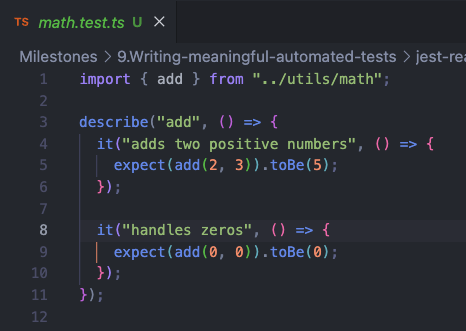

### 4. Running Tests

Tests can be executed using:

```bash
npm test
```

The test output shows successful execution:

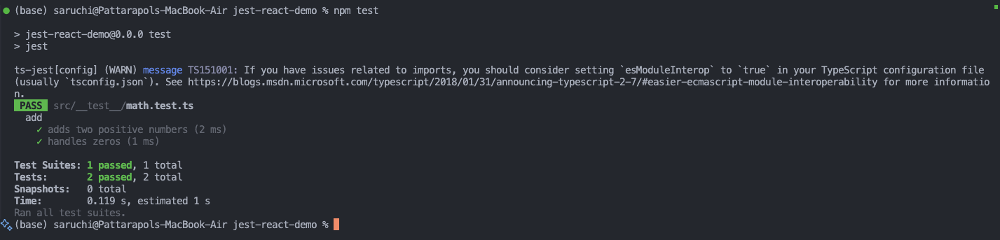

**Test Results:**

- ✅ 2 tests passed
- ✅ 1 test suite passed

## 🔧 Technical Challenges Encountered

### ES Module Compatibility Issue

**Problem:** Initially encountered a `ReferenceError: require is not defined in ES module scope` error.

**Root Cause:** The project was configured as an ES module (`"type": "module"` in package.json), but Jest configuration was using CommonJS syntax.

**Solution:** Converted Jest configuration from:

```javascript
const { createDefaultPreset } = require("ts-jest"); // ❌ CommonJS
```

To:

```javascript
import { createDefaultPreset } from "ts-jest"; // ✅ ES Module
```

## 🎯 Learning Outcomes

### What is Jest?

Jest is a JavaScript testing framework developed by Facebook that provides:

- **Zero configuration** setup for most projects
- **Built-in test runner** and assertion library
- **Mocking capabilities** for isolating units under test
- **Code coverage reports**
- **Snapshot testing** for UI components
- **Watch mode** for continuous testing during development

### Key Jest Concepts Applied:

- **`describe()`**: Groups related tests together
- **`it()` or `test()`**: Defines individual test cases
- **`expect()`**: Makes assertions about values
- **`.toBe()`**: Matcher for exact equality comparison

## 💭 Reflection

### Why is Automated Testing Important in Software Development?

1. **Regression Prevention**: Automated tests catch bugs when code changes, preventing features from breaking unexpectedly.

2. **Code Reliability**: Tests provide confidence that code behaves as expected under various conditions.

3. **Documentation**: Tests serve as living documentation, showing how functions should be used and what they should return.

4. **Refactoring Safety**: When refactoring code, tests ensure that functionality remains intact.

5. **Continuous Integration**: Automated tests enable CI/CD pipelines, allowing for frequent, reliable deployments.

6. **Cost Reduction**: Finding bugs early in development is significantly cheaper than fixing them in production.

### What Was Challenging When Writing the First Jest Test?

1. **Configuration Setup**: Setting up Jest in a TypeScript + ES Module environment required understanding module systems and resolving compatibility issues.

2. **Understanding Test Structure**: Learning the syntax and structure of Jest tests, including `describe`, `it`, and `expect` patterns.

3. **ES Module vs CommonJS**: Navigating the differences between module systems and ensuring Jest configuration matched the project setup.

4. **TypeScript Integration**: Configuring ts-jest to properly handle TypeScript files and type checking during tests.

### Focus Bear Context Application

In the context of Focus Bear's development:

- **Feature Stability**: Unit tests ensure that productivity features like website blocking, break reminders, and habit tracking work consistently across updates.

- **User Trust**: Automated testing helps maintain the reliability that users depend on for their daily productivity routines.

- **Team Collaboration**: Tests provide clear expectations for how functions should behave, making it easier for team members to understand and modify code.

- **Rapid Development**: With proper test coverage, developers can confidently add new features and fix bugs without worrying about breaking existing functionality.

## 🚀 Next Steps

1. **Expand Test Coverage**: Add tests for edge cases (negative numbers, floating-point precision, etc.)
2. **Component Testing**: Implement tests for React components using React Testing Library
3. **Integration Tests**: Test interactions between multiple components
4. **Mock Implementation**: Learn to mock external dependencies and API calls
5. **Test-Driven Development**: Practice writing tests before implementation

## 📝 Conclusion

This exercise successfully demonstrated the fundamentals of unit testing with Jest in a React TypeScript environment. The hands-on experience of setting up Jest, resolving configuration issues, and writing meaningful tests provides a solid foundation for implementing comprehensive testing strategies in real-world applications like Focus Bear.

The importance of automated testing cannot be overstated - it's an essential practice for maintaining code quality, preventing regressions, and enabling confident development in production applications.

---

# React Component Testing with Jest & React Testing Library - Implementation #75

## 📖 Overview

Building upon our previous Jest setup, we extended the project to include React component testing using Jest and React Testing Library. This implementation demonstrates how to test interactive UI components, simulating user interactions and verifying component behavior.

## 🛠️ What We Updated in the Demo React Project

### 1. Enhanced Jest Configuration

**Updated Jest Configuration (`jest.config.js`):**

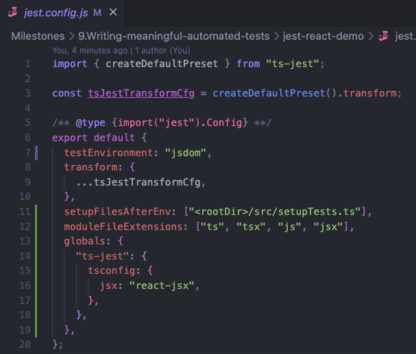

```javascript
import { createDefaultPreset } from "ts-jest";

const tsJestTransformCfg = createDefaultPreset().transform;

/** @type {import("jest").Config} **/
export default {
  testEnvironment: "jsdom", // Changed from "node" to "jsdom"
  transform: {
    ...tsJestTransformCfg,
  },
  setupFilesAfterEnv: ["<rootDir>/src/setupTests.ts"], // Added setup file
  moduleFileExtensions: ["ts", "tsx", "js", "jsx"], // Added tsx, jsx support
  globals: {
    "ts-jest": {
      tsconfig: {
        jsx: "react-jsx", // Enable JSX support
      },
    },
  },
};
```

**Key Changes:**

- Changed `testEnvironment` from `"node"` to `"jsdom"` to enable DOM testing
- Added `setupFilesAfterEnv` to configure React Testing Library
- Added support for JSX files with `jsx: "react-jsx"`

### 2. React Testing Library Setup

**Setup File (`src/setupTests.ts`):**

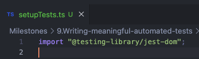

```typescript
import "@testing-library/jest-dom";
```

This setup file extends Jest's `expect` with additional DOM-specific matchers like `toBeInTheDocument()` and `toHaveTextContent()`.

### 3. Additional Dependencies

**New Dependencies Added:**

```bash
npm install --save-dev jest-environment-jsdom
```

This package provides the JSDOM environment required for testing React components.

### 4. Interactive React Component Implementation

#### MessageButton Component (`src/MessageButton.tsx`)

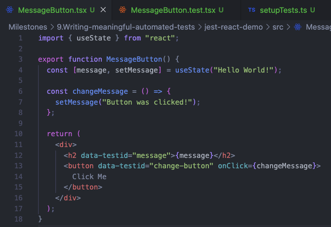

```typescript
import { useState } from "react";

export function MessageButton() {
  const [message, setMessage] = useState("Hello World!");

  const changeMessage = () => {
    setMessage("Button was clicked!");
  };

  return (
    <div>
      <h2 data-testid="message">{message}</h2>
      <button data-testid="change-button" onClick={changeMessage}>
        Click Me
      </button>
    </div>
  );
}
```

**Component Features:**

- **State Management**: Uses `useState` hook to manage the message state
- **User Interaction**: Button click handler that changes the message
- **Test Accessibility**: `data-testid` attributes for reliable test targeting

### 5. Comprehensive Component Tests

#### Component Tests (`src/__test__/MessageButton.test.tsx`)

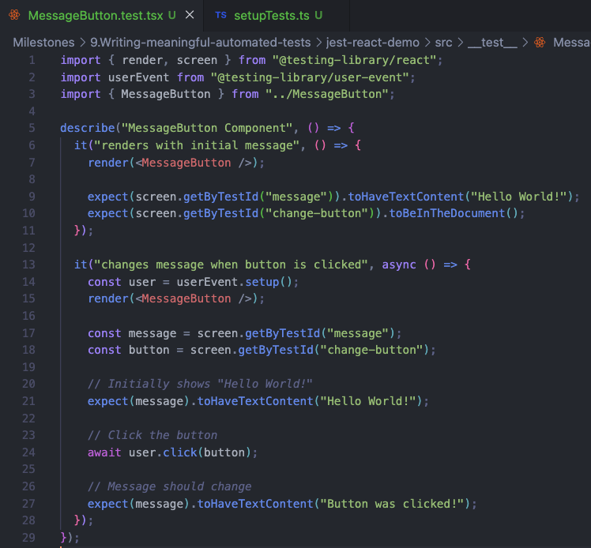

```typescript
import { render, screen } from "@testing-library/react";
import userEvent from "@testing-library/user-event";
import { MessageButton } from "../MessageButton";

describe("MessageButton Component", () => {
  it("renders with initial message", () => {
    render(<MessageButton />);

    expect(screen.getByTestId("message")).toHaveTextContent("Hello World!");
    expect(screen.getByTestId("change-button")).toBeInTheDocument();
  });

  it("changes message when button is clicked", async () => {
    const user = userEvent.setup();
    render(<MessageButton />);

    const message = screen.getByTestId("message");
    const button = screen.getByTestId("change-button");

    // Initially shows "Hello World!"
    expect(message).toHaveTextContent("Hello World!");

    // Click the button
    await user.click(button);

    // Message should change
    expect(message).toHaveTextContent("Button was clicked!");
  });
});
```

**Test Coverage:**

- **Rendering Test**: Verifies component renders with correct initial state
- **User Interaction Test**: Simulates button click and verifies state change

### 6. Updated App Integration

**App Component Integration (`src/App.tsx`):**

```typescript
import { MessageButton } from "./MessageButton";

// ... existing code ...

<div className="card">
  <h2>React Component Testing Demo</h2>
  <MessageButton />
</div>;
```

## 🧪 Test Output

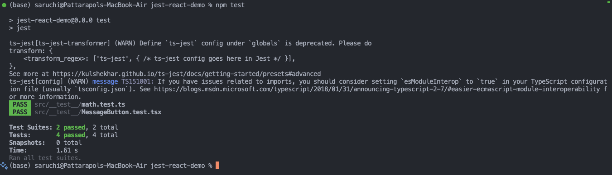

**Test Results:**

- ✅ 4 tests passed (2 math tests + 2 component tests)
- ✅ 2 test suites passed
- ✅ All tests completed successfully

## 🔧 Technical Challenges Encountered

### 1. JSDOM Environment Setup

**Problem:** `Test environment jest-environment-jsdom cannot be found`

**Solution:** Install the required dependency:

```bash
npm install --save-dev jest-environment-jsdom
```

### 2. JSX Support in Tests

**Problem:** TypeScript couldn't compile JSX in test files

**Solution:** Configure Jest to handle JSX properly:

```javascript
globals: {
  "ts-jest": {
    tsconfig: {
      jsx: "react-jsx",
    },
  },
},
```

## 💭 Reflection on React Component Testing

### What are the benefits of using React Testing Library instead of testing implementation details?

1. **User-Centric Testing**: React Testing Library focuses on testing what users actually see and interact with, rather than internal component implementation details.

2. **Maintainable Tests**: Tests are less likely to break when refactoring component internals, as long as the user experience remains the same.

3. **Accessibility by Default**: The library encourages using accessible queries (like `getByRole`, `getByLabelText`) which promotes better accessibility practices.

4. **Realistic Testing**: Tests interact with components the same way users do - by clicking buttons, typing in inputs, and reading displayed text.

5. **Implementation Agnostic**: Whether you use class components, functional components, hooks, or state management libraries, the tests remain focused on behavior.

### What challenges did you encounter when simulating user interaction?

1. **Asynchronous Nature**: User interactions are asynchronous in React Testing Library, requiring proper use of `async/await` and `userEvent.setup()`.

2. **Event Timing**: Understanding that DOM updates happen asynchronously after user events, requiring careful timing in test assertions.

3. **Setup Requirements**: Configuring the testing environment properly to support DOM manipulation and JSX compilation.

4. **Query Selection**: Learning to choose the right queries (`getByTestId`, `getByRole`, `getByText`) for reliable element selection.

### Focus Bear Application Context

In the context of Focus Bear's development, this React component testing approach would be invaluable for:

1. **Productivity Features**: Testing habit tracker checkboxes, break reminder dialogs, and website blocking toggles to ensure they respond correctly to user interactions.

2. **Settings UI**: Verifying that configuration panels update state correctly when users modify their productivity settings.

3. **Timer Components**: Testing pomodoro timers, break countdowns, and focus session displays to ensure accurate time representation and user controls.

4. **Notification Systems**: Testing popup notifications, alert dialogs, and reminder components to ensure they display appropriate messages and respond to user dismissal.

## 🚀 Key Learning Outcomes

### React Testing Library Core Concepts Applied:

- **`render()`**: Renders React components into a virtual DOM for testing
- **`screen`**: Provides queries to find elements in the rendered component
- **`userEvent`**: Simulates realistic user interactions like clicks, typing, and form submissions
- **`getByTestId()`**: Finds elements by their `data-testid` attribute
- **`toHaveTextContent()`**: Asserts that an element contains specific text
- **`toBeInTheDocument()`**: Verifies that an element is present in the DOM

### Best Practices Demonstrated:

1. **Use `data-testid` for Reliable Queries**: Provides stable selectors that won't break due to UI changes
2. **Test User Behavior, Not Implementation**: Focus on what users see and do
3. **Async User Interactions**: Properly handle asynchronous user events
4. **Descriptive Test Names**: Clear test descriptions that explain the expected behavior

## 📝 Conclusion

This React component testing implementation successfully demonstrates how to test interactive UI components using Jest and React Testing Library. The approach emphasizes testing user behavior rather than implementation details, resulting in more maintainable and meaningful tests.

The integration of React Testing Library with our existing Jest setup provides a comprehensive testing foundation that can handle both utility functions and complex UI interactions. This is essential for maintaining the reliability and user experience of applications like Focus Bear, where UI responsiveness and accuracy are critical for user productivity.

The hands-on experience of configuring JSDOM, handling JSX compilation, and simulating user interactions provides practical knowledge that directly applies to testing real-world React applications with complex user workflows.

---

# Mocking API Calls in Jest - Advanced Testing Implementation #76

## 📖 Overview

Building upon our React component testing foundation, this implementation demonstrates how to mock API calls in Jest to test asynchronous code. This is crucial for testing components that interact with external APIs without making real network requests, ensuring tests are fast, reliable, and controllable.

## 🛠️ What We Updated in the Demo React Project

### 1. New UserProfile Component Implementation

We created a new React component that fetches user data from a public API and handles various states (loading, success, error).

**UserProfile Component (`src/UserProfile.tsx`):**

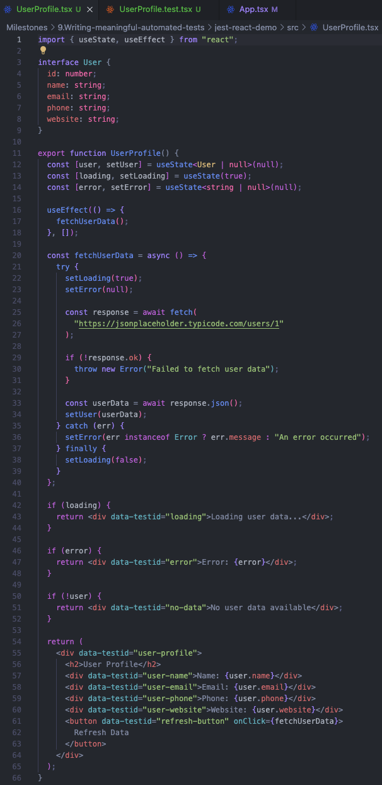

```typescript
import { useState, useEffect } from "react";

interface User {
  id: number;
  name: string;
  email: string;
  phone: string;
  website: string;
}

export function UserProfile() {
  const [user, setUser] = useState<User | null>(null);
  const [loading, setLoading] = useState(true);
  const [error, setError] = useState<string | null>(null);

  useEffect(() => {
    fetchUserData();
  }, []);

  const fetchUserData = async () => {
    try {
      setLoading(true);
      setError(null);

      const response = await fetch(
        "https://jsonplaceholder.typicode.com/users/1"
      );

      if (!response.ok) {
        throw new Error("Failed to fetch user data");
      }

      const userData = await response.json();
      setUser(userData);
    } catch (err) {
      setError(err instanceof Error ? err.message : "An error occurred");
    } finally {
      setLoading(false);
    }
  };

  if (loading) {
    return <div data-testid="loading">Loading user data...</div>;
  }

  if (error) {
    return <div data-testid="error">Error: {error}</div>;
  }

  if (!user) {
    return <div data-testid="no-data">No user data available</div>;
  }

  return (
    <div data-testid="user-profile">
      <h2>User Profile</h2>
      <div data-testid="user-name">Name: {user.name}</div>
      <div data-testid="user-email">Email: {user.email}</div>
      <div data-testid="user-phone">Phone: {user.phone}</div>
      <div data-testid="user-website">Website: {user.website}</div>
      <button data-testid="refresh-button" onClick={fetchUserData}>
        Refresh Data
      </button>
    </div>
  );
}
```

**Key Component Features:**

- **TypeScript Interface**: Defines the expected user data structure from the API
- **State Management**: Manages `user`, `loading`, and `error` states independently
- **API Integration**: Uses the JSONPlaceholder API for realistic testing scenarios
- **Error Handling**: Comprehensive error handling for network failures and HTTP errors
- **Refresh Functionality**: Allows users to manually refresh data
- **Test-Friendly Design**: Uses `data-testid` attributes for reliable test targeting

### 2. App Component Integration

**Updated App Component (`src/App.tsx`):**

```typescript
import "./App.css";
import { MessageButton } from "./MessageButton";
import { UserProfile } from "./UserProfile";

function App() {
  return (
    <>
      <div className="card">
        <h1>React Component Testing Demo</h1>
        <MessageButton />
        <hr />
        <UserProfile />
      </div>
    </>
  );
}
```

Added the new `UserProfile` component to demonstrate API mocking alongside existing component testing.

### 3. Comprehensive API Mocking Tests

**UserProfile Tests (`src/__test__/UserProfile.test.tsx`):**

```typescript
import { render, screen, waitFor } from "@testing-library/react";
import userEvent from "@testing-library/user-event";
import "@testing-library/jest-dom";
import { UserProfile } from "../UserProfile";

// Mock the global fetch function
const mockFetch = jest.fn() as jest.MockedFunction<typeof fetch>;
global.fetch = mockFetch;

// Mock user data that matches the API response structure
const mockUserData = {
  id: 1,
  name: "John Doe",
  email: "john.doe@example.com",
  phone: "123-456-7890",
  website: "johndoe.com",
};

describe("UserProfile Component", () => {
  beforeEach(() => {
    // Clear all mocks before each test
    mockFetch.mockClear();
  });

  it("shows loading state initially", () => {
    // Setup: Mock fetch to return a pending promise (never resolves)
    mockFetch.mockImplementation(() => new Promise(() => {}));

    render(<UserProfile />);

    expect(screen.getByTestId("loading")).toBeInTheDocument();
    expect(screen.getByTestId("loading")).toHaveTextContent(
      "Loading user data..."
    );
  });

  it("displays user data when API call succeeds", async () => {
    // Setup: Mock successful API response
    mockFetch.mockResolvedValueOnce({
      ok: true,
      json: async () => mockUserData,
    } as Response);

    render(<UserProfile />);

    // Initially shows loading
    expect(screen.getByTestId("loading")).toBeInTheDocument();

    // Wait for loading to finish and data to appear
    await waitFor(() => {
      expect(screen.getByTestId("user-profile")).toBeInTheDocument();
    });

    // Verify user data is displayed correctly
    expect(screen.getByTestId("user-name")).toHaveTextContent("Name: John Doe");
    expect(screen.getByTestId("user-email")).toHaveTextContent(
      "Email: john.doe@example.com"
    );
    expect(screen.getByTestId("user-phone")).toHaveTextContent(
      "Phone: 123-456-7890"
    );
    expect(screen.getByTestId("user-website")).toHaveTextContent(
      "Website: johndoe.com"
    );

    // Verify fetch was called with correct URL
    expect(mockFetch).toHaveBeenCalledTimes(1);
    expect(mockFetch).toHaveBeenCalledWith(
      "https://jsonplaceholder.typicode.com/users/1"
    );
  });

  it("shows error message when API call fails", async () => {
    // Setup: Mock failed API response
    mockFetch.mockResolvedValueOnce({
      ok: false,
      status: 404,
    } as Response);

    render(<UserProfile />);

    // Wait for error to appear
    await waitFor(() => {
      expect(screen.getByTestId("error")).toBeInTheDocument();
    });

    expect(screen.getByTestId("error")).toHaveTextContent(
      "Error: Failed to fetch user data"
    );
    expect(mockFetch).toHaveBeenCalledTimes(1);
  });

  it("shows error message when network request fails", async () => {
    // Setup: Mock network error
    mockFetch.mockRejectedValueOnce(new Error("Network error"));

    render(<UserProfile />);

    // Wait for error to appear
    await waitFor(() => {
      expect(screen.getByTestId("error")).toBeInTheDocument();
    });

    expect(screen.getByTestId("error")).toHaveTextContent(
      "Error: Network error"
    );
  });

  it("can refresh data when refresh button is clicked", async () => {
    // Setup: Mock successful API response
    mockFetch.mockResolvedValue({
      ok: true,
      json: async () => mockUserData,
    } as Response);

    render(<UserProfile />);

    // Wait for initial data to load
    await waitFor(() => {
      expect(screen.getByTestId("user-profile")).toBeInTheDocument();
    });

    // Click refresh button
    const refreshButton = screen.getByTestId("refresh-button");
    await userEvent.click(refreshButton);

    // Verify fetch was called twice (initial load + refresh)
    expect(mockFetch).toHaveBeenCalledTimes(2);
    expect(mockFetch).toHaveBeenCalledWith(
      "https://jsonplaceholder.typicode.com/users/1"
    );
  });

  it("handles multiple rapid API calls correctly", async () => {
    // Setup: Mock successful API response
    mockFetch.mockResolvedValue({
      ok: true,
      json: async () => mockUserData,
    } as Response);

    render(<UserProfile />);

    // Wait for initial data to load
    await waitFor(() => {
      expect(screen.getByTestId("user-profile")).toBeInTheDocument();
    });

    // Click refresh button
    const refreshButton = screen.getByTestId("refresh-button");
    await userEvent.click(refreshButton);

    // Should handle the refresh gracefully
    await waitFor(() => {
      expect(screen.getByTestId("user-profile")).toBeInTheDocument();
    });

    // Should have made API calls (initial + refresh)
    expect(mockFetch).toHaveBeenCalledTimes(2);
  });
});
```

## 🧪 Test Output

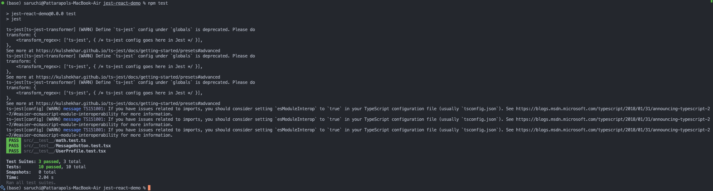

**Test Results:**

- ✅ 10 tests passed (2 math + 2 message button + 6 API mocking tests)
- ✅ 3 test suites passed
- ✅ All test scenarios covered successfully

## 🔧 Key API Mocking Concepts Implemented

### 1. Global Fetch Mocking

```typescript
// Mock the global fetch function
const mockFetch = jest.fn() as jest.MockedFunction<typeof fetch>;
global.fetch = mockFetch;
```

**Purpose**: Replaces the browser's native `fetch` function with a controllable Jest mock function.

### 2. Mock Response Scenarios

**Successful Response:**

```typescript
mockFetch.mockResolvedValueOnce({
  ok: true,
  json: async () => mockUserData,
} as Response);
```

**HTTP Error Response:**

```typescript
mockFetch.mockResolvedValueOnce({
  ok: false,
  status: 404,
} as Response);
```

**Network Error:**

```typescript
mockFetch.mockRejectedValueOnce(new Error("Network error"));
```

**Pending/Loading State:**

```typescript
mockFetch.mockImplementation(() => new Promise(() => {}));
```

### 3. Test Cleanup and Isolation

```typescript
beforeEach(() => {
  mockFetch.mockClear();
});
```

Ensures each test starts with a clean mock state, preventing test interference.

### 4. Asynchronous Testing Patterns

```typescript
await waitFor(() => {
  expect(screen.getByTestId("user-profile")).toBeInTheDocument();
});
```

Uses `waitFor` to handle asynchronous operations and state updates properly.

## 💭 Reflection on API Mocking

### Why is it important to mock API calls in tests?

1. **Speed and Performance**: Mocked API calls execute instantly, making tests run much faster than real network requests. This is crucial for maintaining fast feedback loops during development.

2. **Reliability and Determinism**: Tests don't depend on external services, network conditions, or API availability. Mocked tests produce consistent results regardless of external factors.

3. **Cost and Rate Limiting**: Avoids hitting API rate limits or incurring costs from paid APIs during testing. This is particularly important in CI/CD pipelines that run tests frequently.

4. **Isolation and Focus**: Tests focus on the component's behavior rather than the API's functionality. We're testing our code's logic, not the external service.

5. **Error Scenario Testing**: Easy to simulate various error conditions (network failures, HTTP errors, timeouts) that would be difficult or impossible to reproduce with real APIs.

6. **Offline Development**: Developers can run tests without internet connectivity, enabling productive development in any environment.

### What are some common pitfalls when testing asynchronous code?

1. **Race Conditions**: Forgetting to use `await` or `waitFor()` can lead to assertions running before asynchronous operations complete, causing flaky tests.

   **Example Pitfall:**

   ```typescript
   // ❌ Wrong - assertion runs immediately
   render(<UserProfile />);
   expect(screen.getByTestId("user-profile")).toBeInTheDocument();

   // ✅ Correct - wait for async operation
   render(<UserProfile />);
   await waitFor(() => {
     expect(screen.getByTestId("user-profile")).toBeInTheDocument();
   });
   ```

2. **Mock State Pollution**: Not clearing mocks between tests can cause previous test configurations to affect subsequent tests, leading to unpredictable results.

   **Solution:**

   ```typescript
   beforeEach(() => {
     mockFetch.mockClear(); // Reset mock call history
   });
   ```

3. **Incomplete Response Mocking**: Forgetting to mock all parts of the Response object (like the `json()` method) can cause runtime errors in tests.

   **Example:**

   ```typescript
   // ❌ Incomplete mock
   mockFetch.mockResolvedValueOnce({ ok: true } as Response);

   // ✅ Complete mock
   mockFetch.mockResolvedValueOnce({
     ok: true,
     json: async () => mockUserData,
   } as Response);
   ```

4. **Timing Issues**: Not accounting for React's batching of state updates or useEffect timing can lead to assertions that run too early.

5. **Over-Mocking**: Mocking too much internal implementation instead of focusing on the external API boundary can make tests brittle and less meaningful.

### Focus Bear Application Context

In the context of Focus Bear's development, API mocking becomes essential for:

1. **Authentication Testing**: Mock login/logout API calls to test user authentication flows without requiring real credentials or external auth services.

2. **User Settings API**: Test settings synchronization across devices by mocking the settings API to verify that UI updates correctly reflect server responses.

3. **Analytics Integration**: Mock analytics API calls to test event tracking without sending test data to production analytics systems.

4. **Habit Tracking Data**: Test habit completion, streak calculations, and progress updates by mocking the habit tracking API with various data scenarios.

5. **Timer Synchronization**: Mock timer state synchronization APIs to test that focus sessions and breaks maintain consistency across browser sessions.

6. **Error Handling**: Test how the app handles network failures, server errors, and API rate limiting to ensure graceful degradation of functionality.

## 🚀 Advanced Testing Patterns Demonstrated

### 1. Multiple Mock Strategies

- **`mockResolvedValueOnce()`**: For single-use mock responses
- **`mockResolvedValue()`**: For reusable mock responses across multiple calls
- **`mockRejectedValueOnce()`**: For simulating promise rejections
- **`mockImplementation()`**: For custom mock logic and pending promises

### 2. Comprehensive State Testing

- **Loading State**: Testing initial loading indicators
- **Success State**: Verifying correct data display and UI updates
- **Error States**: Testing both HTTP errors and network failures
- **User Interactions**: Testing refresh functionality and multiple API calls

### 3. API Contract Verification

```typescript
expect(mockFetch).toHaveBeenCalledWith(
  "https://jsonplaceholder.typicode.com/users/1"
);
```

Ensures components call APIs with correct URLs and parameters.

### 4. Call Count Verification

```typescript
expect(mockFetch).toHaveBeenCalledTimes(2);
```

Verifies expected number of API calls, crucial for testing refresh functionality and preventing unnecessary network requests.

## 📝 Conclusion

This API mocking implementation successfully demonstrates advanced Jest testing techniques for asynchronous React components. The comprehensive test coverage includes all common scenarios: loading states, successful data fetching, error handling, and user interactions.

The implementation showcases industry best practices for testing components that integrate with external APIs, ensuring that tests are fast, reliable, and maintainable. The mocking strategies demonstrated here directly apply to real-world applications like Focus Bear, where reliable API integration testing is crucial for user experience and application stability.

The hands-on experience with Jest mocking functions, async testing patterns, and comprehensive error scenario coverage provides essential skills for developing robust, well-tested React applications that gracefully handle the complexities of modern web API integrations.

---

# Testing Redux with Jest - State Management Testing Implementation #77

## 📖 Overview

Building upon our React component testing foundation, this implementation demonstrates how to test Redux state management using Jest. We extended the existing demo project to include Redux Toolkit, created a comprehensive counter slice with both synchronous and asynchronous actions, and implemented thorough testing for reducers and Redux-connected components.

## 🛠️ What We Built on the Existing Demo React Project

### 1. Initial Project State

The demo project already had a solid foundation with:

- ✅ Jest configuration set up
- ✅ Testing environment configured (`setupTests.ts`)
- ✅ TypeScript support
- ✅ Basic project structure
- ✅ Working test examples for utilities and React components

This existing foundation made it ideal for extending with Redux functionality rather than starting from scratch.

### 2. Redux Dependencies Installation

**New Dependencies Added:**

```bash
npm install @reduxjs/toolkit react-redux
```

**Key Packages:**

- **`@reduxjs/toolkit`**: Modern Redux with simplified API, built-in best practices
- **`react-redux`**: Official React bindings for Redux

### 3. Redux Store Implementation

#### Redux Slice (`src/store/counterSlice.ts`)

```typescript
import { createSlice, createAsyncThunk } from "@reduxjs/toolkit";
import type { PayloadAction } from "@reduxjs/toolkit";

interface CounterState {
  value: number;
  loading: boolean;
  error: string | null;
}

const initialState: CounterState = {
  value: 0,
  loading: false,
  error: null,
};

// Async thunk for simulating an API call
export const incrementAsync = createAsyncThunk(
  "counter/incrementAsync",
  async (amount: number) => {
    // Simulate an API call delay
    await new Promise((resolve) => setTimeout(resolve, 1000));
    return amount;
  }
);

export const counterSlice = createSlice({
  name: "counter",
  initialState,
  reducers: {
    increment: (state) => {
      state.value += 1;
    },
    decrement: (state) => {
      state.value -= 1;
    },
    incrementByAmount: (state, action: PayloadAction<number>) => {
      state.value += action.payload;
    },
    reset: (state) => {
      state.value = 0;
      state.loading = false;
      state.error = null;
    },
  },
  extraReducers: (builder) => {
    builder
      .addCase(incrementAsync.pending, (state) => {
        state.loading = true;
        state.error = null;
      })
      .addCase(incrementAsync.fulfilled, (state, action) => {
        state.loading = false;
        state.value += action.payload;
      })
      .addCase(incrementAsync.rejected, (state, action) => {
        state.loading = false;
        state.error = action.error.message || "Failed to increment";
      });
  },
});

export const { increment, decrement, incrementByAmount, reset } =
  counterSlice.actions;

export default counterSlice.reducer;
```

**Key Features:**

- **TypeScript Interface**: Defines clear state structure with `value`, `loading`, and `error`
- **Synchronous Actions**: `increment`, `decrement`, `incrementByAmount`, `reset`
- **Asynchronous Action**: `incrementAsync` with 1-second delay simulation
- **Error Handling**: Comprehensive async state management (pending, fulfilled, rejected)
- **Immutable Updates**: Redux Toolkit's Immer integration for direct state mutations

#### Store Configuration (`src/store/store.ts`)

```typescript
import { configureStore } from "@reduxjs/toolkit";
import counterReducer from "./counterSlice";

export const store = configureStore({
  reducer: {
    counter: counterReducer,
  },
});

export type RootState = ReturnType<typeof store.getState>;
export type AppDispatch = typeof store.dispatch;
```

**TypeScript Integration:**

- **`RootState`**: Type for the entire application state
- **`AppDispatch`**: Type for dispatch function with async thunk support

### 4. React Redux Integration

#### Provider Setup (`src/main.tsx`)

```typescript
import { StrictMode } from "react";
import { createRoot } from "react-dom/client";
import { Provider } from "react-redux";
import { store } from "./store/store";
import "./index.css";
import App from "./App.tsx";

createRoot(document.getElementById("root")!).render(
  <StrictMode>
    <Provider store={store}>
      <App />
    </Provider>
  </StrictMode>
);
```

#### Counter Component (`src/Counter.tsx`)

```typescript
import { useSelector, useDispatch } from "react-redux";
import type { RootState, AppDispatch } from "./store/store";
import {
  increment,
  decrement,
  reset,
  incrementByAmount,
  incrementAsync,
} from "./store/counterSlice";

const Counter = () => {
  const {
    value: count,
    loading,
    error,
  } = useSelector((state: RootState) => state.counter);
  const dispatch = useDispatch<AppDispatch>();

  return (
    <div style={{ padding: "20px", textAlign: "center" }}>
      <h2>Redux Counter</h2>
      <p style={{ fontSize: "24px", margin: "20px 0" }}>
        Count: <span data-testid="counter-value">{count}</span>
      </p>
      {loading && (
        <p data-testid="loading-indicator" style={{ color: "blue" }}>
          Loading...
        </p>
      )}
      {error && (
        <p data-testid="error-message" style={{ color: "red" }}>
          Error: {error}
        </p>
      )}
      <div
        style={{
          display: "flex",
          gap: "10px",
          justifyContent: "center",
          flexWrap: "wrap",
        }}
      >
        <button
          data-testid="increment-btn"
          onClick={() => dispatch(increment())}
          style={{ padding: "10px 20px", fontSize: "16px" }}
          disabled={loading}
        >
          +1
        </button>
        <button
          data-testid="decrement-btn"
          onClick={() => dispatch(decrement())}
          style={{ padding: "10px 20px", fontSize: "16px" }}
          disabled={loading}
        >
          -1
        </button>
        <button
          data-testid="increment-by-5-btn"
          onClick={() => dispatch(incrementByAmount(5))}
          style={{ padding: "10px 20px", fontSize: "16px" }}
          disabled={loading}
        >
          +5
        </button>
        <button
          data-testid="increment-async-btn"
          onClick={() => dispatch(incrementAsync(3))}
          style={{ padding: "10px 20px", fontSize: "16px" }}
          disabled={loading}
        >
          +3 Async
        </button>
        <button
          data-testid="reset-btn"
          onClick={() => dispatch(reset())}
          style={{ padding: "10px 20px", fontSize: "16px" }}
          disabled={loading}
        >
          Reset
        </button>
      </div>
    </div>
  );
};

export default Counter;
```

**Component Features:**

- **Redux Hooks**: Uses `useSelector` to read state and `useDispatch` to trigger actions
- **TypeScript Integration**: Proper typing with `RootState` and `AppDispatch`
- **Loading States**: Displays loading indicator during async operations
- **Error Handling**: Shows error messages when async operations fail
- **User Interaction**: Five different buttons demonstrating various Redux actions
- **Disabled State**: Buttons are disabled during loading to prevent multiple requests

### 5. Comprehensive Redux Testing

#### Redux Slice Tests (`src/__test__/counterSlice.test.ts`)

```typescript
import counterReducer, {
  increment,
  decrement,
  incrementByAmount,
  reset,
  incrementAsync,
} from "../store/counterSlice";
import { configureStore } from "@reduxjs/toolkit";

describe("counter slice", () => {
  const initialState = { value: 0, loading: false, error: null };

  it("should return the initial state", () => {
    expect(counterReducer(undefined, { type: "unknown" })).toEqual(
      initialState
    );
  });

  it("should handle increment", () => {
    const actual = counterReducer(initialState, increment());
    expect(actual.value).toEqual(1);
    expect(actual.loading).toBe(false);
    expect(actual.error).toBe(null);
  });

  it("should handle decrement", () => {
    const actual = counterReducer(
      { value: 5, loading: false, error: null },
      decrement()
    );
    expect(actual.value).toEqual(4);
  });

  it("should handle incrementByAmount", () => {
    const actual = counterReducer(initialState, incrementByAmount(5));
    expect(actual.value).toEqual(5);
  });

  it("should handle reset", () => {
    const actual = counterReducer(
      { value: 10, loading: true, error: "Some error" },
      reset()
    );
    expect(actual.value).toEqual(0);
    expect(actual.loading).toBe(false);
    expect(actual.error).toBe(null);
  });

  it("should handle multiple increments", () => {
    let state = initialState;
    state = counterReducer(state, increment());
    state = counterReducer(state, increment());
    state = counterReducer(state, increment());
    expect(state.value).toEqual(3);
    expect(state.loading).toBe(false);
    expect(state.error).toBe(null);
  });

  describe("async actions", () => {
    it("should handle incrementAsync.pending", () => {
      const action = { type: incrementAsync.pending.type };
      const state = counterReducer(initialState, action);
      expect(state.loading).toBe(true);
      expect(state.error).toBe(null);
    });

    it("should handle incrementAsync.fulfilled", () => {
      const action = { type: incrementAsync.fulfilled.type, payload: 5 };
      const state = counterReducer(
        { value: 2, loading: true, error: null },
        action
      );
      expect(state.loading).toBe(false);
      expect(state.value).toBe(7);
    });

    it("should handle incrementAsync.rejected", () => {
      const action = {
        type: incrementAsync.rejected.type,
        error: { message: "Network error" },
      };
      const state = counterReducer(
        { value: 2, loading: true, error: null },
        action
      );
      expect(state.loading).toBe(false);
      expect(state.error).toBe("Network error");
      expect(state.value).toBe(2); // value shouldn't change on error
    });
  });

  describe("integration test with store", () => {
    it("should handle async increment action with real store", async () => {
      const store = configureStore({
        reducer: {
          counter: counterReducer,
        },
      });

      // Initial state
      expect(store.getState().counter.value).toBe(0);
      expect(store.getState().counter.loading).toBe(false);

      // Dispatch async action
      const promise = store.dispatch(incrementAsync(3));

      // Should be loading
      expect(store.getState().counter.loading).toBe(true);

      // Wait for completion
      await promise;

      // Should be completed
      expect(store.getState().counter.loading).toBe(false);
      expect(store.getState().counter.value).toBe(3);
    });
  });
});
```

**Test Coverage:**

- **Reducer Logic**: Tests all synchronous actions and state transitions
- **Initial State**: Verifies correct initial state structure
- **Async Action Lifecycle**: Tests pending, fulfilled, and rejected states
- **Error Handling**: Verifies error state management
- **Integration Testing**: Tests with real Redux store for async actions

#### Component Integration Tests (`src/__test__/Counter.test.tsx`)

```typescript
import { render, screen, fireEvent } from "@testing-library/react";
import { Provider } from "react-redux";
import { configureStore } from "@reduxjs/toolkit";
import Counter from "../Counter";
import counterReducer from "../store/counterSlice";

// Helper function to create a new store for testing
const createTestStore = (
  initialState = { counter: { value: 0, loading: false, error: null } }
) => {
  return configureStore({
    reducer: {
      counter: counterReducer,
    },
    preloadedState: initialState,
  });
};

// Helper function to render component with Redux store
const renderWithRedux = (
  component: React.ReactElement,
  initialState?: {
    counter: { value: number; loading?: boolean; error?: string | null };
  }
) => {
  const store = createTestStore(initialState);
  return {
    ...render(<Provider store={store}>{component}</Provider>),
    store,
  };
};

describe("Counter Component", () => {
  it("renders initial count value", () => {
    renderWithRedux(<Counter />);
    const counterValue = screen.getByTestId("counter-value");
    expect(counterValue.textContent).toBe("0");
  });

  it("renders with custom initial state", () => {
    renderWithRedux(<Counter />, { counter: { value: 5 } });
    const counterValue = screen.getByTestId("counter-value");
    expect(counterValue.textContent).toBe("5");
  });

  it("increments count when increment button is clicked", () => {
    renderWithRedux(<Counter />);

    const incrementBtn = screen.getByTestId("increment-btn");
    fireEvent.click(incrementBtn);

    const counterValue = screen.getByTestId("counter-value");
    expect(counterValue.textContent).toBe("1");
  });

  it("decrements count when decrement button is clicked", () => {
    renderWithRedux(<Counter />, { counter: { value: 5 } });

    const decrementBtn = screen.getByTestId("decrement-btn");
    fireEvent.click(decrementBtn);

    const counterValue = screen.getByTestId("counter-value");
    expect(counterValue.textContent).toBe("4");
  });

  it("increments by 5 when +5 button is clicked", () => {
    renderWithRedux(<Counter />);

    const incrementBy5Btn = screen.getByTestId("increment-by-5-btn");
    fireEvent.click(incrementBy5Btn);

    const counterValue = screen.getByTestId("counter-value");
    expect(counterValue.textContent).toBe("5");
  });

  it("resets count when reset button is clicked", () => {
    renderWithRedux(<Counter />, { counter: { value: 10 } });

    const resetBtn = screen.getByTestId("reset-btn");
    fireEvent.click(resetBtn);

    const counterValue = screen.getByTestId("counter-value");
    expect(counterValue.textContent).toBe("0");
  });

  it("handles multiple button clicks correctly", () => {
    renderWithRedux(<Counter />);

    const incrementBtn = screen.getByTestId("increment-btn");
    const incrementBy5Btn = screen.getByTestId("increment-by-5-btn");

    // Click increment 3 times (3) + click +5 once (5) = 8
    fireEvent.click(incrementBtn);
    fireEvent.click(incrementBtn);
    fireEvent.click(incrementBtn);
    fireEvent.click(incrementBy5Btn);

    const counterValue = screen.getByTestId("counter-value");
    expect(counterValue.textContent).toBe("8");
  });
});
```

**Testing Patterns:**

- **Custom Test Store**: Creates isolated Redux stores for each test
- **Redux Provider**: Wraps components with Redux context for testing
- **State Injection**: Tests with custom initial states
- **User Interactions**: Simulates button clicks and verifies state changes

## 📸 Screenshots

### 1. **Webpage - Before Interaction**

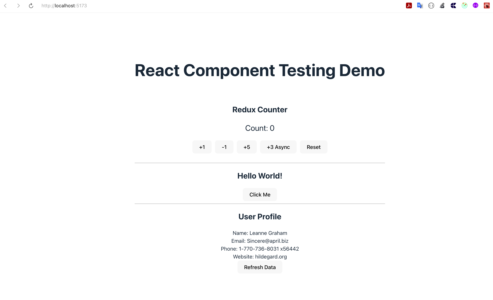

Shows the initial counter state with value "0" and all available action buttons.

### 2. **Webpage - After Interactions**

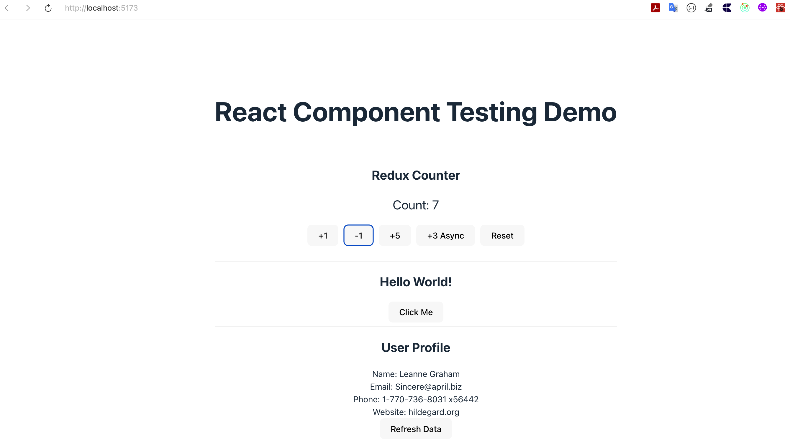

Demonstrates the counter after several button clicks, showing Redux state management in action.

### 3. **Test Output**

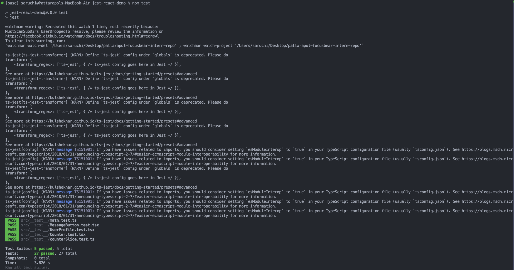

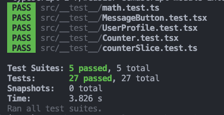

Complete test suite results showing all Redux tests passing successfully.

## 🔧 Technical Challenges Encountered

### 1. TypeScript Integration with Redux

**Problem:** Redux Toolkit types needed proper integration with React components.

**Solution:**

- Used `type` imports for `PayloadAction`
- Created proper `RootState` and `AppDispatch` types
- Used typed `useDispatch<AppDispatch>()` for async thunk support

### 2. Testing Async Redux Actions

**Challenge:** Testing the complete lifecycle of async thunks (pending → fulfilled → rejected).

**Solution:**

- Tested each action type separately
- Created integration tests with real store
- Used Jest's async/await patterns for promise-based actions

### 3. Component Testing with Redux

**Challenge:** Testing Redux-connected components required proper store setup.

**Solution:**

- Created helper functions `createTestStore()` and `renderWithRedux()`
- Used custom initial states for different test scenarios
- Ensured proper cleanup between tests

## 💭 Reflection

### What was the most challenging part of testing Redux?

1. **Async Action Complexity**: Testing async thunks required understanding the complete action lifecycle (pending, fulfilled, rejected). Unlike synchronous actions that immediately update state, async actions have multiple phases that need individual testing.

2. **Store Configuration**: Setting up proper test stores with the right initial states and ensuring isolation between tests was more complex than testing pure functions. Each test needed its own store instance to prevent test interference.

3. **TypeScript Integration**: Ensuring proper typing throughout the Redux setup, especially with async thunks and dispatch functions, required careful attention to type definitions and imports.

4. **Component-Redux Integration**: Testing components that depend on Redux state required understanding how to provide the Redux context in tests and how to simulate different state scenarios.

### How do Redux tests differ from React component tests?

1. **Testing Philosophy**:

   - **Redux Tests**: Focus on **pure function testing** - given a state and action, verify the expected new state
   - **Component Tests**: Focus on **user behavior** - given user interactions, verify the expected UI changes

2. **State Management**:

   - **Redux Tests**: Test state transitions in isolation using reducer functions directly
   - **Component Tests**: Test how components respond to state changes through the Redux store

3. **Complexity Levels**:

   - **Redux Tests**: Simpler, deterministic testing of business logic
   - **Component Tests**: More complex integration testing involving DOM, events, and React rendering

4. **Mock Requirements**:

   - **Redux Tests**: Minimal mocking, mostly testing pure functions
   - **Component Tests**: Extensive mocking of Redux store, user events, and sometimes async operations

5. **Test Setup**:
   - **Redux Tests**: Direct function calls with test data
   - **Component Tests**: Require proper Redux Provider setup, store configuration, and DOM rendering

### Focus Bear Application Context

In the context of Focus Bear's development, Redux testing becomes crucial for:

1. **Settings Management**: Testing how user preferences (break intervals, website blocking lists, notification settings) are stored and updated reliably across the application.

2. **Timer State**: Ensuring that focus session timers, break timers, and pomodoro cycles maintain accurate state even when the app is backgrounded or the user navigates between pages.

3. **Habit Tracking**: Testing the complex state logic for habit completion, streak calculations, and progress tracking to ensure users don't lose their progress data.

4. **Sync Functionality**: Testing how local state synchronizes with server state, including conflict resolution when users make changes on multiple devices.

5. **Offline Capability**: Testing how the app handles offline mode, queuing actions for later sync, and maintaining consistent state when connectivity is restored.

6. **Performance Monitoring**: Testing how state changes trigger UI updates efficiently, ensuring the app remains responsive during heavy usage.

## 🚀 Key Learning Outcomes

### Redux Toolkit Concepts Applied:

- **`createSlice()`**: Combines actions and reducers in a single, maintainable structure
- **`createAsyncThunk()`**: Handles async operations with automatic pending/fulfilled/rejected action generation
- **`extraReducers`**: Handles actions from async thunks and other slices
- **Immer Integration**: Allows direct state mutations that are converted to immutable updates
- **TypeScript Support**: Provides excellent type safety and developer experience

### Testing Best Practices Demonstrated:

1. **Test Isolation**: Each test uses fresh state and doesn't depend on other tests
2. **Comprehensive Coverage**: Tests both successful and error scenarios
3. **Integration Testing**: Combines unit tests with integration tests using real stores
4. **Helper Functions**: Reduces test boilerplate with reusable setup functions
5. **Async Testing**: Proper handling of promise-based operations in tests

### Redux Testing Patterns:

- **Pure Reducer Testing**: Direct testing of reducer functions with various actions
- **Action Creator Testing**: Verifying that action creators produce expected action objects
- **Async Thunk Testing**: Testing the complete lifecycle of async operations
- **Store Integration Testing**: Testing with actual Redux stores for realistic scenarios
- **Component Integration**: Testing Redux-connected components with proper store setup

## 📝 Conclusion

This Redux testing implementation successfully demonstrates comprehensive testing strategies for state management in React applications. The combination of Redux Toolkit's modern API with Jest's testing capabilities provides a robust foundation for testing complex application state.

The implementation covers all essential Redux testing scenarios: synchronous actions, asynchronous operations, error handling, and component integration. The testing patterns demonstrated here are directly applicable to production applications like Focus Bear, where reliable state management is crucial for user experience and data integrity.

The hands-on experience with Redux Toolkit, TypeScript integration, and comprehensive testing patterns provides essential skills for building scalable, well-tested React applications with complex state management requirements. The focus on both unit testing (reducers) and integration testing (components with Redux) ensures that the entire state management layer is thoroughly validated.

---
